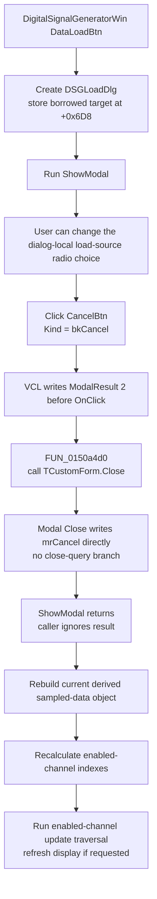

# Cancel the Digital Signal Generator load dialog

> Analysis status: Reviewed from the recovered Cancel handler, VCL `bkCancel` and modal-close paths, dialog creator and modal caller, OK load paths, post-dialog target refresh, and DFM resources.

## Control

| Property | Recovered value |
| --- | --- |
| Form | DSGLoadDlg (`TDSGLoadDlg`) |
| Form caption | Dialog |
| Component path | DSGLoadDlg.CancelBtn |
| Control class | TBitBtn |
| Button kind | `bkCancel` |
| Explicit caption | Not present in the recovered resource. |
| Explicit modal result | Not present in the recovered resource. |
| Handler name | CancelBtnClick |
| Handler address | 0150a4d0 |
| Graph node | `resource:dfm:DSGLoadDlg/DSGLoadDlg.CancelBtn` |
| Handler node | `function:0150a4d0` |
| Graph layer | UI |

## What happens when clicked

[`FUN_0150a4d0`](../../../DecompiledSources/Tina16/functions/000000000150A4D0__FUN_0150a4d0.c) contains only a call to the common VCL [`TCustomForm.Close`](../../../DecompiledSources/Tina16/functions/0000000000805200__FUN_00805200.c) path and a return. It does not read the load-source radio group, open a file dialog, load generator data, validate controls, copy a staged record, restore target state, or display an error.

The DFM identifies the button as `bkCancel`. The recovered VCL `TBitBtn` path maps this kind to modal result `2`, writes that result to the parent form, and then dispatches the custom `OnClick` handler. The handler's `Close` call sees that `DSGLoadDlg` is modal and writes the same result `2`. Recovered Delphi conventions and the canonical VCL close annotation identify this value as `mrCancel`.

## Modal close and validation boundary

[`FUN_01511fa0`](../../../DecompiledSources/Tina16/functions/0000000001511FA0__FUN_01511fa0.c), the `DigitalSignalGeneratorWin.DataLoadBtnClick` handler, creates this dialog and invokes virtual slot `+0x2D0`, the recovered `ShowModal` path. It stores the generator-window object in dialog field `+0x6D8` before entering the modal loop.

For a modal form, `TCustomForm.Close` does not enter its modeless close-query and close-action branch. It directly writes `mrCancel`. `DSGLoadDlg` also has no recovered `OnCloseQuery` or `OnClose` binding. Therefore, this Cancel command has no validation veto, save prompt, close-action selection, or form-specific cleanup callback. The nonzero modal result ends the modal loop.

## Staged state and target ownership

The dialog owns only the UI choice between **Load from file** and **Load from Tina generators**, plus its `TOpenDialog` component. Field `+0x6D8` is a borrowed reference to the calling `DigitalSignalGeneratorWin`; the modal caller writes that reference before `ShowModal`.

There is no private copy of generator data for later caller copy-back. The sibling [`OKBtnClick`](okbtn-845a682a61.md) operates directly on the borrowed target:

- **Load from file** configures the open dialog for `Digital data (*.dsg)|*.dsg`. After a file is selected, it copies the path into target field `+0xEE8` and calls the digital-data loader.
- **Load from Tina generators** calls the target's generator-data reconstruction path directly.

Cancel does not call either path. A changed radio selection remains dialog-local and does not change the target. Because accepted loading writes the target directly, there is no accepted-data record for the caller to copy and no old-data snapshot for Cancel to restore.

## Caller behavior after Cancel

The caller does not inspect the value returned by `ShowModal`. It always performs three target updates after the modal call returns, including when the result is `mrCancel`:

1. [`FUN_01513140`](../../../DecompiledSources/Tina16/functions/0000000001513140__FUN_01513140.c) releases and rebuilds the target's derived sampled-data object at `+0x880` from the current channel collection.
2. [`FUN_01506c70`](../../../DecompiledSources/Tina16/functions/0000000001506C70__FUN_01506c70.c) walks the channel collection and recalculates the compact index at channel offset `+0x94` for enabled entries.
3. [`FUN_010f6920`](../../../DecompiledSources/Tina16/functions/00000000010F6920__FUN_010f6920.c) visits enabled entries through the target's update callback and requests a display update if that traversal reports a change.

These calls rebuild derived state from the target that already existed before Cancel. They do not prove that new file or generator data was accepted. They are the only proven target-side work that survives the Cancel return path.

## Click flow

## No-op, cleanup, and error behavior

- Cancel does not open `OpenDlg`, read or write target filename field `+0xEE8`, invoke either load routine, or call a persistence writer.
- Repeated Cancel activation after the first accepted click is not part of the same modal session because `mrCancel` ends that modal loop.
- The handler does not free the dialog. The caller created it with the generator window as its component owner and has no explicit destructor call after `ShowModal`; final component cleanup remains with the owner and VCL lifetime path.
- The modal close branch bypasses close query and `OnClose`, so there is no form-level rollback or cleanup during this button event.
- The handler and caller have no local exception handler, retry, or user-facing error for Cancel. If one of the unconditional post-dialog rebuild calls fails, the dialog is already closed and derived target state can be only partly refreshed.
- File parsing and generator reconstruction errors belong to the sibling OK paths. Cancel does not enter them.

## Resource evidence

- `DSGLoadDlg` is centered on screen and has the generic recovered caption **Dialog**.
- `LoadRadioGroup` has exactly two items: **Load from file** and **Load from Tina generators**.
- `CancelBtn` is a 77-by-27 `TBitBtn` with `Kind = bkCancel` and `TabOrder = 1`.
- The DFM stores no explicit caption, hint, modal-result property, image reference, or embedded glyph for this button. Its standard presentation and modal-result mapping come from the VCL button kind.
- The sibling `OKBtn` is `bkOK` and owns the direct target load behavior. `HelpBtn` is `bkHelp` and has no recovered custom event.

## Handler evidence and annotation ownership

- The graph has one outgoing call from `function:0150a4d0` to `function:00805200` and one `OnClick` trigger from this resource.
- This Bead annotates only `FUN_0150a4d0`.
- `FUN_00805200` has its canonical Delphi VCL `TCustomForm.Close` annotation in `TIARA-diz.6.7.65`.
- `FUN_01511fa0` belongs to the separate `DigitalSignalGeneratorWin.DataLoadBtn` control. It and the three post-dialog update helpers are evidence-only here.

## Analysis limits

- The recovered source does not provide original Delphi names for dialog field `+0x6D8`, target fields, channel types, or the three derived refresh methods.
- The caller's lack of a modal-result test proves that post-dialog refresh runs after Cancel. It does not prove that those calls visibly change the display when current target data already produces the same derived state.
- The exact time when the owner later destroys the dialog component is outside this click path.
