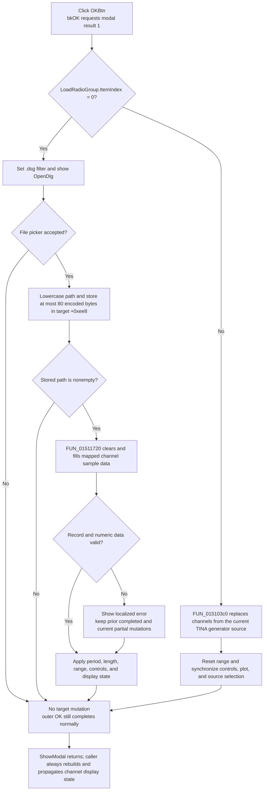

# Load digital signal-generator data

> Analysis status: Reviewed from the recovered handler, both load branches, the modal opener, and the Digital Signal Generator update path.

## Control

| Property | Recovered value |
| --- | --- |
| Form | DSGLoadDlg |
| Form caption | Dialog |
| Component path | DSGLoadDlg.OKBtn |
| Control class | TBitBtn |
| Kind | bkOK |
| Handler name | OKBtnClick |
| Handler address | 0150a2c0 |
| Graph node | `resource:dfm:DSGLoadDlg/DSGLoadDlg.OKBtn` |
| Handler node | `function:0150a2c0` |
| Graph layer | UI |

## What happens when clicked

The handler reads `LoadRadioGroup.ItemIndex`. The resource supplies two choices in this order:

1. **Load from file** (`ItemIndex = 0`)
2. **Load from Tina generators** (`ItemIndex = 1`)

Index `0` opens a file picker and loads one `.dsg` file into the active Digital Signal Generator window. Any nonzero index takes the TINA-generator branch. The resource has only index `1`, so this broader test does not add a third normal choice.

The dialog does not own a separate working copy. [`FUN_01511fa0`](../../../DecompiledSources/Tina16/functions/0000000001511FA0__FUN_01511fa0.c), the **Data Load** button handler in the Digital Signal Generator window, creates this modal dialog and stores the window reference at dialog field `+0x6d8`. `OKBtnClick` casts that reference to the expected window class and changes it directly. There is no accepted-result copy-back after `ShowModal`.

## Load from file

The file branch sets the open-dialog filter to `Digital data (*.dsg)|*.dsg`. It also assigns a default-extension value from `DAT_0150a484`; the literal value is not recovered. It does not copy the window's prior file name into the open dialog.

If the user accepts the file picker, the handler performs these operations:

1. Read `TOpenDialog.FileName`.
2. Convert ASCII letters `A` through `Z` in the Unicode path to lowercase.
3. Convert the Unicode path to the current short-string encoding, with an intermediate limit of 255 bytes.
4. Copy at most `0x50` bytes to Digital Signal Generator field `+0xee8`.
5. Call the `.dsg` loader only when the stored short string is not empty.

The last copy is a real limit. A path longer than 80 encoded bytes is truncated before the file is opened. The recovered handler does not reject or report that truncation.

The `.dsg` loader opens a Delphi text file. It reads period and length headers and maps recognized channel records to the window's existing channel collection. For each mapped channel, it clears the prior sample data before it validates and appends the new values. A valid record begins with the recovered `Default` line, followed by numeric sample data. The parser accepts later `.# Period` and `.# Length` headers and uses them to update the generator timing.

After parsing, [`FUN_0150fa70`](../../../DecompiledSources/Tina16/functions/000000000150FA70__FUN_0150fa70.c) applies the recovered length and period to the source model and numeric controls. It resets the visible time start to zero, calculates the visible end from length and period when the time-unit mode requires it, updates the graph axes and scroll position, reindexes enabled channels, redraws the data, and clamps existing cursor positions to the new range.

## Load from TINA generators

The second branch does not open a file. [`FUN_015103c0`](../../../DecompiledSources/Tina16/functions/00000000015103C0__FUN_015103c0.c) clears the Digital Signal Generator's current channel collection and copies the channel collection exposed by its current TINA generator source.

When the copied collection is not empty, it selects the first copied channel and synchronizes the corresponding source selection. It then:

- resets the displayed start to zero;
- calculates the end from the source period multiplied by its length;
- updates the period and length controls;
- updates the range record and plot state;
- rebuilds display data, reindexes enabled channels, and propagates the change.

This is an immediate replacement of the window's live data. It is not a file import and it does not wait for a later caller commit.

## Modal close and caller refresh

The resource gives the button `Kind = bkOK`. The recovered VCL kind table maps `bkOK` to modal result `1`. The inherited button path writes that result and dispatches the application click handler. `DSGLoadDlg` has no recovered `OnCloseQuery` event and `OKBtnClick` does not clear the modal result. A normal handler return therefore closes the modal dialog as accepted.

This rule also applies when the nested open dialog is canceled. That cancel makes no file-path or channel-data change, but the outer OK click still returns its normal accepted result.

The caller does not inspect the modal result. After `ShowModal` returns, it always rebuilds the display-series data, reindexes the active channels, and runs the downstream channel-update path. This same refresh runs after file-picker cancel and after the outer **Cancel** button. It does not create a copy-back transaction.

Later Digital Signal Generator execution reads the same live channel collection and timing model. For example, [`FUN_0151f2b0`](../../../DecompiledSources/Tina16/functions/000000000151F2B0__FUN_0151f2b0.c) checks those collections and uses the current source state when it starts generator output. The OK path does not save a preference or write a second persistent file.

## Click flow

## Error and partial-state behavior

- Canceling the nested file picker is a no-op for the target path and data. The outer dialog can still close with its normal OK result.
- An accepted path is stored before the file parser starts. A later parse error therefore leaves the new path in field `+0xee8`.
- The loader clears each mapped channel before it validates that channel's replacement data. A bad `Default` marker or a bad numeric value displays localized message `0x46b` or `0x46c` and stops the parse. The exact message text is not recovered.
- The explicit format-error paths do not roll back earlier channels or the current cleared or partly filled channel. They continue to the final timing and display apply call, then return normally. The modal dialog can close after that partial update.
- The loader starts with the current period and length after it accepts the file header. If later records fail, its final apply uses the last recovered values. A missing or invalid initial header can reach the final call without a proven initialized replacement value; the recovered code has no safe fallback branch for that case.
- The recovered file-I/O path has cleanup calls but no application exception handler or transaction. If an I/O or conversion exception escapes, the stored path and any earlier mutations have no visible rollback. A normal modal close and caller refresh are not proven for an escaping exception.
- The TINA-generator branch has no empty-source warning. It clears the destination collection before copying the source. If the result is empty, it skips first-channel selection but still updates range and display state from the source model.

## Cancel contrast

`CancelBtn` has kind `bkCancel` and a separate handler. That handler enters the common VCL close pipeline. It does not call either load function. Therefore, a direct outer Cancel does not replace the file path or channel data.

The opener still runs its unconditional post-modal display refresh after Cancel. This refresh uses the data that was already present; it is not a rollback. The canonical Cancel and shared VCL close annotations belong to the sibling Cancel control analysis and are not duplicated here.

## Handler and call-path evidence

- Primary handler: [FUN_0150a2c0](../../../DecompiledSources/Tina16/functions/000000000150A2C0__FUN_0150a2c0.c) selects the source, configures `TOpenDialog`, stores the accepted path, and dispatches one of the two load functions.
- File-name getter: [FUN_00724270](../../../DecompiledSources/Tina16/functions/0000000000724270__FUN_00724270.c) reads the open dialog's selected file name.
- Path conversion: [FUN_0043e1a0](../../../DecompiledSources/Tina16/functions/000000000043E1A0__FUN_0043e1a0.c) lowercases ASCII letters in the Unicode path; [FUN_00416910](../../../DecompiledSources/Tina16/functions/0000000000416910__FUN_00416910.c) converts it to a short string; [FUN_00415020](../../../DecompiledSources/Tina16/functions/0000000000415020__FUN_00415020.c) applies the 80-byte target limit.
- File loader: [FUN_01511720](../../../DecompiledSources/Tina16/functions/0000000001511720__FUN_01511720.c) reads the `.dsg` text, maps channel records, clears and fills sample collections, reports explicit format errors, and calls the final apply helper.
- Final file apply: [FUN_0150fa70](../../../DecompiledSources/Tina16/functions/000000000150FA70__FUN_0150fa70.c) updates length, period, controls, view range, axes, channel indexes, redraw state, and cursor limits.
- Current-generator loader: [FUN_015103c0](../../../DecompiledSources/Tina16/functions/00000000015103C0__FUN_015103c0.c) replaces the live channel collection and synchronizes selection, timing, controls, plot state, and output state from the current TINA generator source.
- Modal opener: [FUN_01511fa0](../../../DecompiledSources/Tina16/functions/0000000001511FA0__FUN_01511fa0.c) creates the dialog, stores the borrowed Digital Signal Generator window reference, calls the modal-show virtual method, and unconditionally runs the post-modal refresh calls.
- Post-modal refresh: [FUN_01513140](../../../DecompiledSources/Tina16/functions/0000000001513140__FUN_01513140.c) rebuilds display-series data, [FUN_01506c70](../../../DecompiledSources/Tina16/functions/0000000001506C70__FUN_01506c70.c) reindexes enabled channels, and [FUN_010f6920](../../../DecompiledSources/Tina16/functions/00000000010F6920__FUN_010f6920.c) propagates channel changes.
- VCL evidence: [FUN_0082bc30](../../../DecompiledSources/Tina16/functions/000000000082BC30__FUN_0082bc30.c) maps `bkOK` to modal result `1`; [FUN_0082b0e0](../../../DecompiledSources/Tina16/functions/000000000082B0E0__FUN_0082b0e0.c) and [FUN_00687f30](../../../DecompiledSources/Tina16/functions/0000000000687F30__FUN_00687f30.c) implement the inherited click and modal-result path.
- Recovered resources: [ui-evidence.json](../../../DecompiledSources/Tina16/resources/dfm/ui-evidence.json) supplies the two source choices, `bkOK`, `bkCancel`, `TOpenDialog`, and the event bindings.

## Resource evidence

- `LoadRadioGroup` contains **Load from file** and **Load from Tina generators** in that order.
- `OKBtn` has built-in kind `bkOK`. It has no separate caption, hint, action, image reference, or extracted glyph.
- `CancelBtn` has built-in kind `bkCancel`.
- `OpenDlg` is a nonvisual `TOpenDialog`. Its `.dsg` filter is assigned at click time, not stored in the DFM.
- No same-parent label candidate is available for `OKBtn`.

## Analysis limits

- Original field names at Digital Signal Generator offsets `+0x7d8`, `+0xee0`, and `+0xee8` are not recovered. Their collection, timing-source, and file-path roles come from repeated call-site data flow.
- The literal default-extension value at `DAT_0150a484` and localized error texts `0x46b` and `0x46c` are not recovered.
- The `.dsg` parser recognizes additional separator markers whose global literals are not decoded. This article describes only the header and record text visible in the recovered source.
- The canonical VCL button and close helpers are already annotated elsewhere. The article cites them but this control's fragment does not duplicate them.
- The later Data Load button article owns `FUN_01511fa0`; this fragment cites that caller but does not annotate it.
