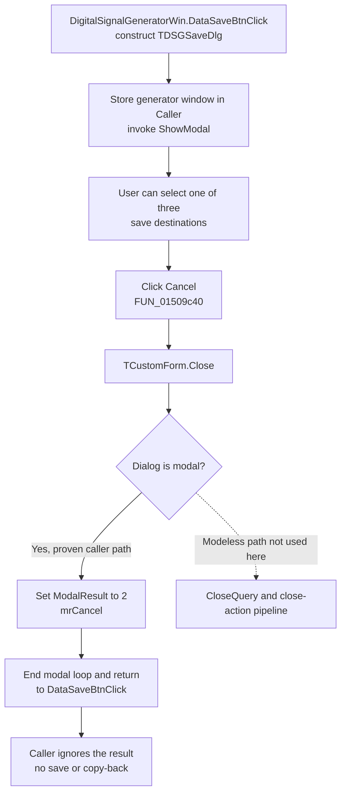

# Cancel the digital signal-generator save dialog

> Analysis status: Evidence-backed source review complete.

## Control

| Property | Recovered value |
| --- | --- |
| Form | DSGSaveDlg |
| Component path | DSGSaveDlg.CancelBtn |
| Control class | TBitBtn |
| Caption | Supplied by the built-in button kind. |
| Kind | bkCancel |
| Handler name | CancelBtnClick |
| Handler address | 01509c40 |
| Graph node | `resource:dfm:DSGSaveDlg/DSGSaveDlg.CancelBtn` |
| Handler node | `function:01509c40` |
| Graph layer | UI |

`TDSGSaveDlg` is a modal choice dialog opened from `DigitalSignalGeneratorWin.DataGroupBox.DataSaveBtn`. Its radio group offers `Save To file`, `Save To binary file`, and `Save To Tina generators`. Cancel has no separate caption, hint, image, or glyph in the recovered DFM stream; `bkCancel` supplies its standard presentation and identifies its intent.

## What happens when clicked

`TDSGSaveDlg.CancelBtnClick` contains one operation: it calls the shared VCL `TCustomForm.Close` implementation for the current dialog.

This dialog is modal. `DigitalSignalGeneratorWin.DataSaveBtnClick` constructs a new `TDSGSaveDlg`, stores the generator window in the dialog's recovered `Caller` field at `+0x6d8`, and invokes the virtual `ShowModal` slot. In this modal state, `TCustomForm.Close` uses its short modal branch and writes `2`, the recovered `mrCancel` value, to the form's modal-result field. It does not run the modeless close-query and close-action pipeline.

The modal loop ends and `DataSaveBtnClick` resumes. That caller does not inspect the modal result and performs no follow-up operation. It returns immediately.

## Staged save state and caller effects

The selected destination and the `TSaveDialog` are controls owned by this dialog. Cancel does not read the radio-group item index, open the save dialog, change the recovered file-name field in the generator window, or call a serializer.

The sibling OK handler shows the boundary:

- Choice `0` configures a `Digital data (*.dsg)|*.dsg` save dialog and can call the text digital-data writer after file acceptance.
- Choice `1` configures a `Digital data (*.dgb)|*.dgb` save dialog and can call the binary digital-data writer after file acceptance.
- The remaining choice calls the TINA-generator save path directly.

Cancel reaches none of these branches. There is no staged object copy-back and no partial file output from this click.

The opener passes `DigitalSignalGeneratorWin` as the form-constructor owner and also stores it in `Caller`. It does not explicitly destroy the dialog after `ShowModal` returns. Therefore, Cancel does not free the form or clear `Caller`; the owner retains lifecycle responsibility. A later DataSaveBtn click constructs another dialog instead of reusing a saved dialog pointer.

## Cancel flow

## Close, cleanup, and error behavior

- The proven modal branch does not call a close query. The DFM also has no recovered `OnCloseQuery` or `OnClose` binding for `TDSGSaveDlg`.
- Cancel does not validate the selected radio item. It also does not reset the controls before the modal loop ends.
- The handler has no local exception handler or error message. Its proven modal close branch is only a state write; file-dialog, serialization, and generator-save errors are outside this path.
- Construction or `ShowModal` can fail before the user can click Cancel. Those failures belong to the opener, not to this handler.
- No file, database, registry value, or INI value is written. No parent model field is changed by the Cancel handler.

## Recovered evidence

- [`FUN_01509c40`](../../../DecompiledSources/Tina16/functions/0000000001509C40__FUN_01509c40.c) is `TDSGSaveDlg.CancelBtnClick`. Its body contains only the call to the shared close routine.
- [`FUN_00805200`](../../../DecompiledSources/Tina16/functions/0000000000805200__FUN_00805200.c) is the canonical `TCustomForm.Close` path. Its modal branch writes result `2`; its close-query and close-action logic is in the separate modeless branch.
- [`FUN_01511f60`](../../../DecompiledSources/Tina16/functions/0000000001511F60__FUN_01511f60.c) is the DataSaveBtn opener. It constructs the recovered `TDSGSaveDlg` class, writes `Caller` at `+0x6d8`, calls `ShowModal`, and then returns without checking the result or destroying the form.
- [`FUN_007fc180`](../../../DecompiledSources/Tina16/functions/00000000007FC180__FUN_007fc180.c) is the shared Delphi form-construction path used by the opener with the generator window as owner.
- [`FUN_01509840`](../../../DecompiledSources/Tina16/functions/0000000001509840__FUN_01509840.c) is the sibling OK handler. It proves that destination selection, `TSaveDialog`, file-name update, and the three save outputs are accepted-path work that Cancel bypasses.
- [`FUN_01509c50`](../../../DecompiledSources/Tina16/functions/0000000001509C50__FUN_01509c50.c) initializes the recovered `Caller` field during form creation; the opener then explicitly sets the final caller value.
- [`ui-evidence.json`](../../../DecompiledSources/Tina16/resources/dfm/ui-evidence.json) supplies the form, `bkCancel` button, radio choices, save-dialog component, and event bindings.

## Analysis limits

The recovered source does not show a live execution of the dialog. The exact point at which the owner later destroys retained dialog instances is not present in this click path. The sibling OK implementation is used only to prove which save effects Cancel does not execute.
