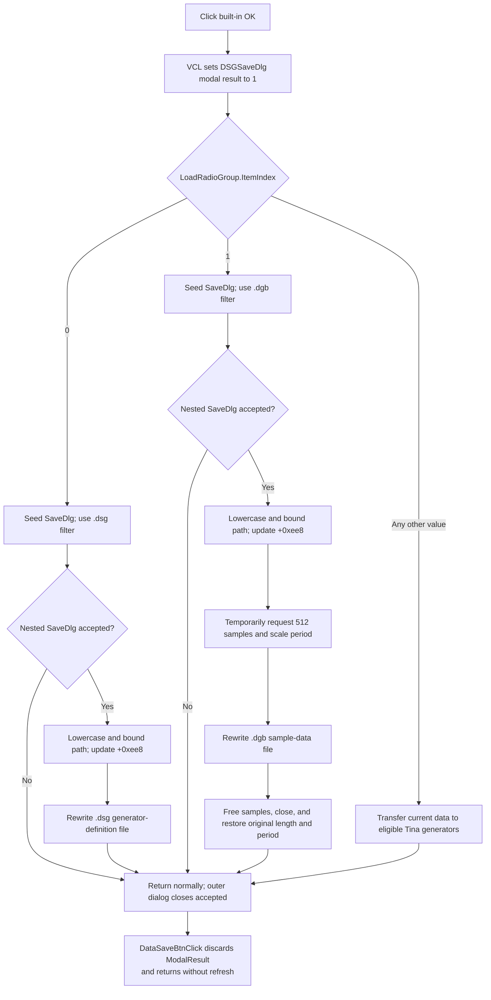

# Save digital-signal-generator data to the selected target

> Analysis status: Evidence-backed source review complete.

## Control

| Property | Recovered value |
| --- | --- |
| Form | DSGSaveDlg |
| Component path | DSGSaveDlg.OKBtn |
| Control class | TBitBtn |
| Caption | Supplied by the standard `bkOK` kind; no explicit caption is stored. |
| Kind | `bkOK` |
| Handler name | OKBtnClick |
| Handler address | 01509840 |
| Graph node | `resource:dfm:DSGSaveDlg/DSGSaveDlg.OKBtn` |
| Handler node | `function:01509840` |
| Graph layer | UI |

## What happens when clicked

`FUN_01509840` reads `LoadRadioGroup.ItemIndex` and performs the selected save operation immediately. It does not only copy settings to a staging object for a caller to commit later.

The recovered radio-group items are:

| Item index | Resource text | Immediate action |
| --- | --- | --- |
| `0` | Save To file | Ask for a `.dsg` path and write generator definitions. |
| `1` | Save To binary file | Ask for a `.dgb` path and write a generated sample-data section. |
| Any other value | Save To Tina generators | Transfer current digital-signal-generator data to matching Tina generator objects. |

The third branch is an `else`, not an exact comparison with index `2`. A missing selection that reports `-1`, or another unexpected index, also takes the Tina-generator branch. The handler has no required-selection validation or warning.

## Save To file: `.dsg`

For item `0`, the handler configures the form's `TSaveDialog` with filter `Digital data (*.dsg)|*.dsg`. It converts the target object's remembered ShortString path at `+0xee8` to Unicode, extracts its leaf filename, and uses that value to seed `SaveDialog.FileName`.

If the user cancels the nested save dialog, this branch performs no path update and no file write. If the user accepts it, the handler:

1. reads the selected full path;
2. lowercases only ASCII `A` through `Z` in the complete path;
3. converts it to the current ANSI code page and then caps the stored ShortString at `0x50` bytes;
4. writes that bounded path to target field `+0xee8`; and
5. calls `FUN_01510cb0` with the target object and that stored path.

The writer rewrites the target file. It writes the literal header `@ Digital Signal Generator file`, the current period and length, and the generator-definition records from the target's generator collection. It terminates records with `.# end of psg` and the file with `.@ end of file`. This branch saves generator definitions and their configured values; it does not emit the generated sample array used by the `.dgb` branch.

## Save To binary file: `.dgb`

For item `1`, the handler uses filter `Digital data (*.dgb)|*.dgb`. It applies the same remembered-leaf filename seed and the same accepted-path lowercase, ANSI conversion, `0x50`-byte bound, and `+0xee8` update. It then calls `FUN_01511240`.

The resource calls this a binary file. The recovered writer nevertheless uses the same text-file runtime and writes recognizable text headers, including `@ Digital Signal Generator file`, `.# Period`, `.# Length`, `.# Data`, and `.@ end of file`. This article therefore calls it the `.dgb` sample-data format and does not infer an opaque binary layout.

Before it generates the Data section, `FUN_01511240`:

- saves the current generator length and period;
- requests length `0x200` samples;
- reads the resulting length;
- scales the period by `old length / resulting length` so the represented total duration stays aligned; and
- obtains the generated sample array.

After the normal sample loop, it frees the sample buffer, writes the final marker, closes the file, and restores the original period and length. These are temporary live-model mutations during export, not caller copy-back.

## Save To Tina generators

For every item index other than `0` or `1`, `FUN_01509840` does not open `SaveDlg`. It calls `FUN_015103a0` with the target object. That wrapper passes the target's current digital-signal-generator model at `+0xee0` to `FUN_01504a80`.

The deeper routine finds eligible matching generator objects and copies current backing data to them when its recovered object, type, and buffer checks pass. It skips unmatched or unsupported entries. There is no confirmation, count result, status return, or rollback in the OK handler. This branch changes live generator data immediately and does not write a `.dsg` or `.dgb` file.

## Modal result, close, and caller ownership

The DFM gives `OKBtn` kind `bkOK`. The recovered VCL kind setter maps this kind to modal result `1`, and the VCL button-click path writes that result to the form before it dispatches `OnClick`. DSGSaveDlg has no recovered `OnCloseQuery` event and the handler has no close-veto flag. After a normal handler return, the modal dialog closes accepted.

This ordering matters for the nested `TSaveDialog`: canceling that file dialog prevents the file operation, but it does not undo the outer button's existing OK modal result. DSGSaveDlg still closes after the handler returns normally.

`FUN_01511f60` creates DSGSaveDlg with the Digital Signal Generator window as component owner, stores that same target at dialog field `+0x6d8`, and shows the form modally. It does not test the modal result, copy staged data back, or call any rebuild or refresh function after the modal call. All save and generator-transfer effects described above therefore occur inside `OKBtnClick`.

The nearby `FUN_01511fa0` is `DataLoadBtnClick`, not the save-dialog owner. It constructs the different `DSGLoadDlg` class and performs channel rebuild, reindex, and active-channel refresh after that load dialog returns. Those unconditional load-side calls do not belong to this OK path.

The separate `CancelBtn` uses `bkCancel` and has its own custom handler. It does not dispatch through `FUN_01509840`. A Cancel action before OK therefore avoids every effect in this article. Because the OK path acts immediately, there is no caller-owned cancel or copy-back transaction that can undo an operation after it starts. The Cancel handler's exact behavior and ownership remain with its sibling control analysis.

## Validation, errors, and partial effects

- The handler validates only the two exact file-choice indexes by branch comparison. It does not require a selection, check generator counts, test an output directory, or test a path before `TSaveDialog.Execute`.
- No explicit overwrite check appears in the application handler. Any overwrite prompt or path validation belongs to the VCL or operating-system save dialog and is not proven by the recovered DFM options.
- On file acceptance, target path `+0xee8` changes before the writer starts. A later file error can leave this new bounded lowercase path in memory.
- Both file writers use rewrite/truncate semantics and call the Delphi I/O-status checker after file assignment, rewrite, writes, and close. An I/O failure raises through the runtime path. A file can already be created, truncated, or partially written.
- The recovered writer paths have no local catch, retry, transaction, or file rollback. The explicit close operations occur only on the normal path shown in the recovered sources.
- In the `.dgb` path, original length and period restoration and sample-buffer release occur after the write and close. The recovered function has no visible `finally` around them. An exception before those statements can leave the live generator temporarily resampled and can skip the explicit buffer release.
- The OK handler finalizes its local strings on normal return. An exception from conversion, file output, or generator transfer propagates to higher-level Delphi handling instead of producing a local validation message.

## OK flow

## Handler, file, and caller evidence

- OK selection dispatch, file-dialog configuration, path conversion, and immediate operations: [FUN_01509840](../../../DecompiledSources/Tina16/functions/0000000001509840__FUN_01509840.c)
- `.dsg` generator-definition writer: [FUN_01510cb0](../../../DecompiledSources/Tina16/functions/0000000001510CB0__FUN_01510cb0.c)
- `.dgb` resampling and sample-data writer: [FUN_01511240](../../../DecompiledSources/Tina16/functions/0000000001511240__FUN_01511240.c)
- Tina-generator transfer wrapper and deeper matching/copy path: [FUN_015103a0](../../../DecompiledSources/Tina16/functions/00000000015103A0__FUN_015103a0.c) and [FUN_01504a80](../../../DecompiledSources/Tina16/functions/0000000001504A80__FUN_01504a80.c)
- Modal owner with no result test, copy-back, or post-dialog refresh: [FUN_01511f60](../../../DecompiledSources/Tina16/functions/0000000001511F60__FUN_01511f60.c)
- Separate load-dialog owner whose unconditional rebuild and refresh do not belong to this save path: [FUN_01511fa0](../../../DecompiledSources/Tina16/functions/0000000001511FA0__FUN_01511fa0.c)
- Save-dialog filename seed and accepted filename read: [FUN_00724380](../../../DecompiledSources/Tina16/functions/0000000000724380__FUN_00724380.c) and [FUN_00724270](../../../DecompiledSources/Tina16/functions/0000000000724270__FUN_00724270.c)
- Filename-tail extraction, ASCII lowercase conversion, Unicode-to-ShortString conversion, and bounded copy: [FUN_00441920](../../../DecompiledSources/Tina16/functions/0000000000441920__FUN_00441920.c), [FUN_0043e1a0](../../../DecompiledSources/Tina16/functions/000000000043E1A0__FUN_0043e1a0.c), [FUN_00416910](../../../DecompiledSources/Tina16/functions/0000000000416910__FUN_00416910.c), and [FUN_00415020](../../../DecompiledSources/Tina16/functions/0000000000415020__FUN_00415020.c)
- Delphi I/O status check: [FUN_00409900](../../../DecompiledSources/Tina16/functions/0000000000409900__FUN_00409900.c)
- Standard `bkOK` setup and modal-result dispatch: [FUN_0082bc30](../../../DecompiledSources/Tina16/functions/000000000082BC30__FUN_0082bc30.c) and [FUN_00687f30](../../../DecompiledSources/Tina16/functions/0000000000687F30__FUN_00687f30.c)
- Recovered form, radio items, button kinds, and event bindings: [ui-evidence.json](../../../DecompiledSources/Tina16/resources/dfm/ui-evidence.json)

## Resource and annotation limits

- `OKBtn` is a 77 by 27 `TBitBtn` with `Kind = bkOK`, no explicit caption or hint, and no separately extracted glyph. Its caption, modal result, default state, and standard image come from the VCL kind.
- `LoadRadioGroup` contains the three recovered save-target strings. Despite its name, it selects save behavior in this form.
- `SaveDlg` has no recovered static filter, default extension, options, or initial filename. The OK handler assigns the file-specific values at runtime.
- The two file formats' headers and data paths are source-proven. The exact meaning of every generator record field and the internal Tina-generator object classes is not fully recovered.
- This Bead owns canonical annotations for `FUN_01509840`, `FUN_01510cb0`, `FUN_01511240`, and `FUN_015103a0`. Shared VCL, string, file-dialog, I/O, caller-lifecycle, and deeper generator-transfer helpers remain evidence only.
