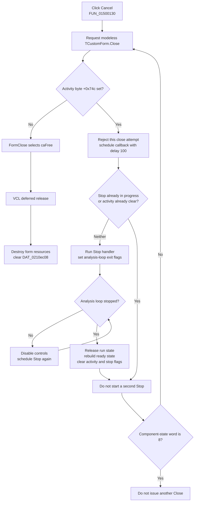

# Close the step-analysis control panel

> Analysis status: Evidence-backed source review complete.

## Control

| Property | Recovered value |
| --- | --- |
| Form | DStepAnalControlPanel |
| Component path | DStepAnalControlPanel.CancelBtn |
| Control class | TBitBtn |
| Caption | Supplied by the built-in button kind. |
| Kind | bkCancel |
| Handler name | CancelBtnClick |
| Handler address | 01500130 |
| Graph node | `resource:dfm:DStepAnalControlPanel/DStepAnalControlPanel.CancelBtn` |
| Handler node | `function:01500130` |
| Graph layer | UI |

The recovered form is a modeless `Control Panel` for step analysis. Its speed buttons are named Play, Pause, Stop, Step Back, Step Forward, Speed Up, and Slow Down. `FUN_01500620` constructs the form with the application as owner, stores it in the singleton slot `DAT_0210ec08`, initializes its analysis state, and calls the modeless Show path.

## What happens when clicked

`TDStepAnalControlPanel.CancelBtnClick` calls the shared VCL `TCustomForm.Close` routine. It does not stop the analysis directly. The form's close query decides whether the close can continue.

- If the activity byte at form offset `+0x74c` is clear, the query accepts the close immediately.
- If that byte is set, the query rejects this close attempt and schedules `FUN_01500140` with the common scheduler's delay value `100`.
- The deferred callback calls the same function as the panel's Stop button when the activity byte is still set and the stop-in-progress byte at `+0x74b` is clear. It then requests Close again unless the recovered component-state word at `+0x34` equals `8`.

The deferred Close can be rejected and scheduled again while Stop is still active. This lets the analysis loop leave before VCL releases the form.

## Active analysis interruption

Play sets the activity byte at `+0x74c`, clears the loop-exit flags at `+0x747` and `+0x748`, and enters one of two loops that process application messages. Stop sets both exit flags. If the loop has not yet reported its stopped state at `+0x740`, Stop marks a pending-stop byte at `+0x749`, disables analysis controls, and schedules itself again.

After the loop reports that it has stopped, the Stop path:

1. releases the current per-run analysis structures through `FUN_014fd660`;
2. shuts down the current global analysis object in the applicable mode;
3. rebuilds the panel's ready analysis state through `FUN_014fe830`;
4. enables the affected controls; and
5. clears the pending-stop, activity, and stop-in-progress bytes.

The next deferred Close therefore passes the close query. `FormClose` selects `TCloseAction` value `2`. Recovered Delphi RTTI identifies this value as `caFree`, so `TCustomForm.Close` selects the VCL release path instead of hiding the form.

## Close and ownership cleanup

Release runs the form destructor. The destructor calls the form's analysis cleanup again for the rebuilt ready state, shuts down the applicable global analysis object, clears `DAT_0210ec08`, resets related application analysis services, and then runs inherited form destruction. `FormHide` also releases the two temporary resources that `FormShow` stored at `+0x718` and `+0x720`.

Cancel does not commit a model, write a file, update an INI setting, or set a modal result. The application owns the form, but the form's `caFree` close action releases this instance and clears the cached pointer.

## Cancel flow

## No-op and error behavior

- An idle click does not show a confirmation dialog. It goes directly through the accepted close path.
- If Stop is already in progress, the deferred callback does not start a second Stop. It retries Close, which continues the delayed polling while the activity byte remains set.
- The Stop handler itself only starts its work when one of its two recovered eligibility bytes is set. Their Delphi names are not recovered. If the activity byte remains set but this guard prevents Stop from clearing it, the close query can continue to reschedule. No retry limit or timeout is visible.
- The component-state value `8` suppresses another Close request from the callback. The source does not identify the enum member, so this document does not assign it a Delphi name.
- One analysis loop has an automatic error path. Its no-progress case shows `Analysis can't be performed: use delay by the components`, sets the global error byte, clears the panel's activity byte, and calls this same Cancel handler. Because activity is already clear, the close query accepts that error-driven close without running Stop again.
- The handler and close callbacks have no local exception handler. Cleanup failures would unwind through the caller. The recovered path has no rollback or user-facing cleanup error message.

## Recovered evidence

- [`FUN_01500130`](../../../DecompiledSources/Tina16/functions/0000000001500130__FUN_01500130.c) is `TDStepAnalControlPanel.CancelBtnClick`; it contains only the shared close call.
- [`FUN_00805200`](../../../DecompiledSources/Tina16/functions/0000000000805200__FUN_00805200.c) is the canonical `TCustomForm.Close` path. It runs the modeless close query and close event, then maps the selected action to hide, minimize, or release.
- [`FUN_015001a0`](../../../DecompiledSources/Tina16/functions/00000000015001A0__FUN_015001a0.c) accepts closure only when `+0x74c` is clear and otherwise schedules the deferred callback.
- [`FUN_01500140`](../../../DecompiledSources/Tina16/functions/0000000001500140__FUN_01500140.c) conditionally invokes Stop and retries Close.
- [`FUN_014ffe80`](../../../DecompiledSources/Tina16/functions/00000000014FFE80__FUN_014ffe80.c) is the shared Stop-button path. It ends the analysis loop, polls for completion, cleans and rebuilds analysis state, enables controls, and clears the active-stop bytes.
- [`FUN_014fede0`](../../../DecompiledSources/Tina16/functions/00000000014FEDE0__FUN_014fede0.c) and [`FUN_014ff340`](../../../DecompiledSources/Tina16/functions/00000000014FF340__FUN_014ff340.c) are the two message-processing analysis loops. The second contains the recovered error-driven Cancel call.
- [`FUN_01500190`](../../../DecompiledSources/Tina16/functions/0000000001500190__FUN_01500190.c) writes close action `2`. [`FUN_018ea7e0`](../../../DecompiledSources/Tina16/functions/00000000018EA7E0__FUN_018ea7e0.c) supplies the recovered `TCloseAction` RTTI order that identifies it as `caFree`.
- [`FUN_014fdeb0`](../../../DecompiledSources/Tina16/functions/00000000014FDEB0__FUN_014fdeb0.c) cleans the form's analysis state, clears the singleton slot, resets related services, and destroys the form.
- [`FUN_014fdf50`](../../../DecompiledSources/Tina16/functions/00000000014FDF50__FUN_014fdf50.c) allocates the two show-time resources. [`FUN_014fe030`](../../../DecompiledSources/Tina16/functions/00000000014FE030__FUN_014fe030.c) releases them when the form hides.
- [`FUN_01500620`](../../../DecompiledSources/Tina16/functions/0000000001500620__FUN_01500620.c) constructs the application-owned singleton, initializes analysis state, and uses the modeless Show path.
- [`ui-evidence.json`](../../../DecompiledSources/Tina16/resources/dfm/ui-evidence.json) supplies the form caption, the built-in `bkCancel` kind, the playback controls, and all event bindings.

## Analysis limits

The recovered field offsets establish the state transitions, but most original Delphi field names are not available. The scheduler receives delay value `100`; the recovered source does not expose the scheduler's public type name. No live run was used to force a cleanup exception or a permanently blocked Stop state.
