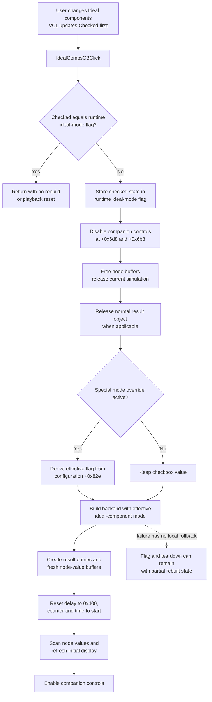

# Rebuild Step Analysis with or without ideal components

> Analysis status: Recovered checkbox state, runtime ideal-mode flag, synchronous simulation rebuild, playback reset and control interaction, no-op behavior, persistence boundary, and partial-failure risks reviewed.

## Control

| Property | Recovered value |
| --- | --- |
| Form | DStepAnalControlPanel |
| Component path | DStepAnalControlPanel.IdealCompsCB |
| Control class | TCheckBox |
| Caption | &Ideal components |
| Hint | Not present in the recovered resource. |
| Text | Not present in the recovered resource. |
| Checked in DFM | true |
| State in DFM | cbChecked |
| Handler name | IdealCompsCBClick |
| Handler address | 01500280 |
| Graph node | `resource:dfm:DStepAnalControlPanel/DStepAnalControlPanel.IdealCompsCB` |
| Handler node | `function:01500280` |
| Graph layer | UI |

## What happens when clicked

The VCL changes the `TCheckBox` state before it calls `OnClick`. [`FUN_01500280`](../../../DecompiledSources/Tina16/functions/0000000001500280__FUN_01500280.c) therefore reads the new checked state through the recovered checkbox getter at virtual offset `+0x260`. The handler does not invert the value itself.

It compares that value with the process runtime flag at `*PTR_DAT_020024f8`. If both values are equal, it returns immediately. It does not rebuild the analysis, reset playback, disable another control, or redraw the result grid on this no-op path.

When the values differ, the handler:

1. writes the checked state to the runtime flag;
2. disables two companion form controls at `+0x6d8` and `+0x6b8` through the recovered VCL Enabled setter;
3. tears down the current Step Analysis buffers and simulation;
4. releases the current normal-backend result object when that object is active;
5. rebuilds the simulation, result model, and initial display from the selected mode; and
6. enables the two companion controls again.

The click therefore restarts the Step Analysis model immediately. It is not a flag that waits for the next Play command.

## Runtime ideal-component mode

[`FUN_014fd730`](../../../DecompiledSources/Tina16/functions/00000000014FD730__FUN_014fd730.c) is the normal-backend setup path. It passes `*PTR_DAT_020024f8` into [`FUN_014fd300`](../../../DecompiledSources/Tina16/functions/00000000014FD300__FUN_014fd300.c), which includes the Boolean in the new digital-simulation configuration. It also calls the imported `_SetStatusIdealMode` operation with the same value before it initializes the digital simulation.

This establishes that the checkbox controls the digital simulator's ideal-component mode. The recovered code does not expose a per-component list in this click path. The flag applies to the rebuilt Step Analysis simulation as a whole.

[`FUN_014fe830`](../../../DecompiledSources/Tina16/functions/00000000014FE830__FUN_014fe830.c) reads the checkbox again when rebuild starts and writes the same runtime flag. One global mode can override the user's checked state: when `*PTR_DAT_02002b78` is set, the rebuild replaces the flag with the test `configuration +0x82e == 2` and sets form mode byte `+0x741`. The handler does not write that override back to the checkbox. In this mode, the visible check can therefore differ from the effective runtime flag after rebuild.

The setup helper also has a separate backend branch selected by `*PTR_DAT_02003fc8`. The normal branch creates and initializes the digital simulation with the ideal-mode flag. The alternate branch creates a different analysis backend and node-value buffers. The source does not prove that the imported ideal-mode setter is used on that alternate branch.

## Teardown and rebuild

[`FUN_014fd660`](../../../DecompiledSources/Tina16/functions/00000000014FD660__FUN_014fd660.c) frees the current node-value buffers at form offsets `+0x730` and `+0x738`. On the normal backend, when model field `+0x790` exists, it releases that model, detaches the simulation object at `+0x798`, and clears both model pointers. On the alternate backend, it obtains and frees the backend-owned working allocation from object `+0x728`.

After teardown, the handler decrements the current result object's reference count through [`FUN_01cc6030`](../../../DecompiledSources/Tina16/functions/0000000001CC6030__FUN_01cc6030.c) when form mode `+0x741` selects the normal result path. That helper destroys the object when the count reaches zero.

`FUN_014fe830` then performs a full rebuild:

- it chooses the effective ideal-mode flag and backend mode;
- on the normal result path, it creates and initializes a new result container;
- it calls `FUN_014fd730` to create the simulation/backend and fresh node-value buffers;
- it scans circuit objects and creates the result entries used by the Step Analysis view;
- it resets the 16-bit playback delay at `+0x782` to `0x0400`;
- it resets the progress/stall counter at `+0x9c0` to zero; and
- it calls [`FUN_014fd9d0`](../../../DecompiledSources/Tina16/functions/00000000014FD9D0__FUN_014fd9d0.c) to initialize time, node values, and the first displayed state.

`FUN_014fd9d0` sets the current analysis time to zero, the displayed step time at `+0x750` to `1e-12`, the recovered end-time field at `+0x760`, and the previous-time field at `+0x9b8` to zero. It scans the new backend's node values and refreshes the initial grid/display through the normal or alternate backend path.

The old playback position and a user-adjusted speed are not preserved. A successful click returns with a new model at the beginning and the stored default delay value 1,024.

## Playback and Stop interaction

The recovered playback handlers show when this checkbox can normally be used:

- [`FUN_014ffdd0`](../../../DecompiledSources/Tina16/functions/00000000014FFDD0__FUN_014ffdd0.c), the Play handler, disables `IdealCompsCB` before it enters the playback loop.
- [`FUN_014fffb0`](../../../DecompiledSources/Tina16/functions/00000000014FFFB0__FUN_014fffb0.c) and [`FUN_01500090`](../../../DecompiledSources/Tina16/functions/0000000001500090__FUN_01500090.c), Step Back and Step Forward, also disable the checkbox before they process a step.
- [`FUN_014ffe80`](../../../DecompiledSources/Tina16/functions/00000000014FFE80__FUN_014ffe80.c), the Stop handler, uses the same teardown, result release, and rebuild chain. It enables the checkbox again after the restart completes.

The normal UI therefore prevents a user from changing ideal-component mode during active Play or a step operation. `FUN_01500280` itself does not test the control's Enabled state or a playback-state byte. If code invokes the handler while the checkbox is disabled, it can still rebuild the model.

The ideal-mode click does not call Play, Pause, Stop, Step Forward, or Step Back. Its rebuild and time reset are synchronous. The next playback command starts from the newly initialized state.

## Persistence and shared configuration

The selected value is stored in the process runtime flag and in the newly built simulation configuration. [`FUN_014f7a70`](../../../DecompiledSources/Tina16/functions/00000000014F7A70__FUN_014f7a70.c), the accepted Digital Timing Analysis settings path, can also write this same runtime flag from its own `IdealCompsCB`. This confirms that the flag is shared analysis state rather than a private field of this control panel.

This click path does not write a file, registry value, project record, or settings store. It does not call a Save command or set a recovered document-modified flag. Cross-session persistence is not established. A later settings action or special-mode override can replace the runtime value.

## Errors and partial-state boundaries

- The handler has no confirmation, Cancel branch, error dialog, local exception handler, `finally` block, or rollback.
- It writes the runtime ideal-mode flag before it tears down the old simulation. A failure can leave the new flag active after the old model has already been partly or fully destroyed.
- The two companion controls are enabled again only after `FUN_014fe830` returns. An exception or fatal setup failure can leave them disabled.
- Teardown and rebuild update buffers, model pointers, result objects, timing fields, and display state in sequence. A later failure can leave a mixture of released old state and partial new state.
- `FUN_014fd730` checks the normal simulation initializer and the alternate backend constructor, but its failure paths call a shared error routine rather than return a recoverable status to the click handler.
- The same-state no-op avoids all teardown and setup risks. There is no retry or forced refresh when the checked state already equals the runtime flag.

## Click flow

## Handler and call-path evidence

- Checkbox handler: [FUN_01500280](../../../DecompiledSources/Tina16/functions/0000000001500280__FUN_01500280.c)
- Current-model teardown: [FUN_014fd660](../../../DecompiledSources/Tina16/functions/00000000014FD660__FUN_014fd660.c)
- Full rebuild coordinator: [FUN_014fe830](../../../DecompiledSources/Tina16/functions/00000000014FE830__FUN_014fe830.c)
- Simulation/backend setup: [FUN_014fd730](../../../DecompiledSources/Tina16/functions/00000000014FD730__FUN_014fd730.c)
- Normal digital-simulation constructor: [FUN_014fd300](../../../DecompiledSources/Tina16/functions/00000000014FD300__FUN_014fd300.c)
- Initial time and result display: [FUN_014fd9d0](../../../DecompiledSources/Tina16/functions/00000000014FD9D0__FUN_014fd9d0.c)
- Reference-count release: [FUN_01cc6030](../../../DecompiledSources/Tina16/functions/0000000001CC6030__FUN_01cc6030.c)
- Play interaction: [FUN_014ffdd0](../../../DecompiledSources/Tina16/functions/00000000014FFDD0__FUN_014ffdd0.c)
- Step Back interaction: [FUN_014fffb0](../../../DecompiledSources/Tina16/functions/00000000014FFFB0__FUN_014fffb0.c)
- Step Forward interaction: [FUN_01500090](../../../DecompiledSources/Tina16/functions/0000000001500090__FUN_01500090.c)
- Stop and restart interaction: [FUN_014ffe80](../../../DecompiledSources/Tina16/functions/00000000014FFE80__FUN_014ffe80.c)
- Shared Digital Timing Analysis setting: [FUN_014f7a70](../../../DecompiledSources/Tina16/functions/00000000014F7A70__FUN_014f7a70.c)

## Resource and graph evidence

- The DFM defines a `TCheckBox` captioned `&Ideal components`, initially checked with state `cbChecked`.
- The resource contains no hint, action, list items, image reference, embedded glyph, or picture for this control.
- No same-parent label candidate is available. The caption supplies the only direct text evidence.
- The DFM binds `IdealCompsCB.OnClick` to `IdealCompsCBClick` at `01500280`.
- The graph places the handler in the UI layer. This analysis owns the handler and the shared Step Analysis teardown, rebuild, backend setup, and initial-state helpers. The Play and Stop articles cite these shared helpers but own their unique handlers.

## Analysis limits

- Original Delphi names for the global flags, backend objects, result container, node-value buffers, timing fields, and two temporarily disabled companion controls are not recovered.
- The imported name `_SetStatusIdealMode`, the checkbox caption, and the constructor data flow establish simulator ideal-component mode. The source does not state which electrical or timing property is idealized for every component class.
- The alternate backend is structurally distinct, but its original product-facing name and exact ideal-mode semantics are not recovered.
- No live run was used to observe the display. Immediate model reset and display refresh are established from the recovered calls and field writes.
