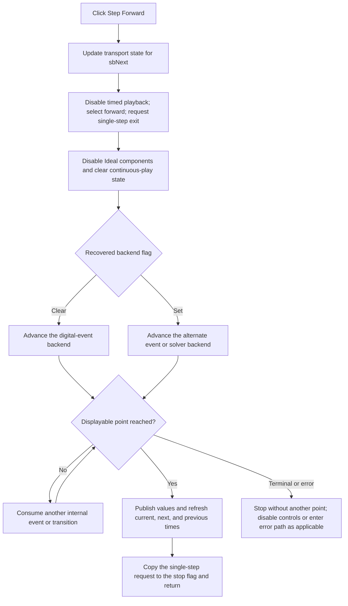

# Advance the DStep analysis to the next displayable timing point

> Analysis status: Evidence-backed source review complete.

## Control

| Property | Recovered value |
| --- | --- |
| Form | DStepAnalControlPanel |
| Component path | DStepAnalControlPanel.Panel2.sbNext |
| Control class | TSpeedButton |
| Caption | Not present in the recovered resource. |
| Hint | Step Forward\| |
| Text | Not present in the recovered resource. |
| Handler name | sbNextClick |
| Handler address | 01500090 |
| Graph node | `resource:dfm:DStepAnalControlPanel/DStepAnalControlPanel.Panel2.sbNext` |
| Handler node | `function:01500090` |
| Graph layer | UI |

## What happens when clicked

`sbNextClick` advances an initialized DStep analysis forward to its next stable, displayable timing point. It performs one user-visible step. A step can consume more than one internal simulator event when the current time is already on a stored transition boundary.

The handler does the following work before it enters the shared stepping code:

1. It passes the **Step Forward** control at form field `+0x700` to the shared transport-state updater.
2. It writes `0` to playback-delay flag `+0x780`. This selects an immediate step, not continuous timed playback.
3. It writes `1` to forward-direction flag `+0x745`.
4. It writes `1` to loop-stop field `+0x747` and single-step termination field `+0x748`.
5. It disables the **Ideal components** checkbox at `+0x6b0`.
6. It clears continuous-play or close-coordination field `+0x74c`.
7. It synchronously calls the shared backend dispatcher.

Unlike Play, the Step Forward handler has no availability guard. The normal UI state is therefore responsible for preventing an invalid click.

## One displayable step

The dispatcher selects one of two recovered simulation backends. The [Play analysis](sbplay-5b93506e7b.md) owns the canonical descriptions of this dispatcher and its digital-event and alternate event/solver loops.

Both loops use `+0x745` to select forward motion. If display time `+0x750` is behind the simulator time, they first move it to the next stored transition bound. Otherwise, they advance the selected simulator toward its next event or recovered analysis end. They use `FUN_01522550` to find the nearest stored transition before and after a requested time.

When the current time coincides with an internal boundary that is not yet a stable display point, the loop clears `+0x747` and continues internally. At a displayable point, it copies the requested value `1` from `+0x748` to `+0x747`, which ends this dispatcher call. Thus, **one click means one displayable forward step**, not necessarily one low-level solver or digital event.

The click does not use the speed setting at `+0x782`. Both execution loops apply that delay only when `+0x780` is `1`, while Step Forward sets it to `0`. **Speed Up** and **Slow Down** therefore affect Play, not this click.

## Result and UI updates

On an ordinary step, the shared execution code updates the in-memory simulation values for the selected time. It publishes the selected time to the recovered analysis and plot consumers and refreshes the direct-backend result display where applicable. It then writes formatted current, next, and previous time values into column 1 of the control panel grid.

The handler disables **Ideal components** before execution because the active simulator has already captured that model choice. Step Forward does not rebuild the simulator and does not reread the checkbox. Full simulator teardown and control re-enabling belong to Stop.

The stepping loops drain application messages while they run. This permits Pause, Stop, and close requests to update the shared termination state between backend operations. The Step Forward request itself does not start the timer-based Play delay.

## Bounds, no-op, and error behavior

- The handler contains no local current-time, end-time, selected-model, or null-object check.
- At the recovered terminal-time sentinel, the shared loops cannot produce another forward point. The alternate event/solver loop also disables Play and Step Forward and sets its termination flags. A direct or stale call can still enter the handler because it has no availability guard.
- In one recovered solver mode, 50 consecutive operations without time progress show **Analysis can't be performed: use delay by the components**, set the shared error flag, and can enter the Cancel or close path.
- Digital, solver, collection, result-publication, formatting, grid-update, and message-dispatch failures have no local catch, retry, transaction, or rollback in `sbNextClick`. An exception can leave transport flags changed and **Ideal components** disabled.
- The action changes transient simulator, timing, result, grid, and transport state only. It does not save a document, serialize the current time, write settings, or mark a document modified.

## Step Forward flow

## Handler and execution evidence

- Step Forward flag setup, checkbox lock, and dispatcher call: [FUN_01500090](../../../DecompiledSources/Tina16/functions/0000000001500090__FUN_01500090.c)
- Shared backend dispatcher: [FUN_014fedb0](../../../DecompiledSources/Tina16/functions/00000000014FEDB0__FUN_014fedb0.c)
- Digital-event stepping loop: [FUN_014fede0](../../../DecompiledSources/Tina16/functions/00000000014FEDE0__FUN_014fede0.c)
- Alternate event/solver stepping loop and progress error: [FUN_014ff340](../../../DecompiledSources/Tina16/functions/00000000014FF340__FUN_014ff340.c)
- Shared transport-control state updater: [FUN_014ffa60](../../../DecompiledSources/Tina16/functions/00000000014FFA60__FUN_014ffa60.c)
- Previous and next transition-bound lookup: [FUN_01522550](../../../DecompiledSources/Tina16/functions/0000000001522550__FUN_01522550.c)
- Time-grid refresh: [FUN_014fe060](../../../DecompiledSources/Tina16/functions/00000000014FE060__FUN_014fe060.c)
- Analysis result publication: [FUN_014fe7d0](../../../DecompiledSources/Tina16/functions/00000000014FE7D0__FUN_014fe7d0.c)
- Recovered control resources: [ui-evidence.json](../../../DecompiledSources/Tina16/resources/dfm/ui-evidence.json)

## Resource and annotation limits

- `sbNext` is a 30 by 30 `TSpeedButton` with hint **Step Forward|**, no caption, action, checked state, or same-parent label candidate.
- [The extracted 18 by 14 glyph](../../../glyph/0130_DStepAnalControlPanel_DStepAnalControlPanel_Panel2_sbNext_Glyph_Data.png) shows a right-pointing triangle followed by a vertical bar. This supports the next-step direction. The handler and stepping loops prove the simulator effect.
- Recovered names for fields such as playback delay, forward direction, loop stop, single-step termination, and current time describe their observed writers and readers. The original Delphi field declarations are not recovered.
- This Bead owns only the canonical annotation for `FUN_01500090`. The Play analysis owns `FUN_014fedb0`, `FUN_014fede0`, and `FUN_014ff340`. The Stop analysis owns `FUN_014ffa60`.
