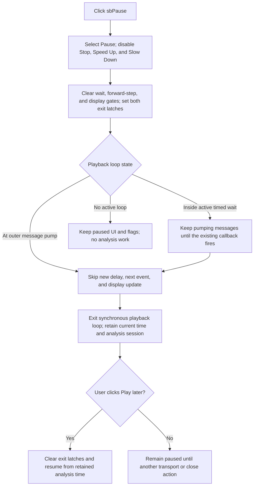

# Pause automatic Step Analysis playback

> Analysis status: Evidence-backed source review complete.

## Control

| Property | Recovered value |
| --- | --- |
| Form | DStepAnalControlPanel |
| Component path | DStepAnalControlPanel.Panel2.sbPause |
| Control class | TSpeedButton |
| Caption | Not present in the recovered resource. |
| Hint | Pause\| |
| Handler name | sbPauseClick |
| Handler address | 014ffe40 |
| Graph node | `resource:dfm:DStepAnalControlPanel/DStepAnalControlPanel.Panel2.sbPause` |
| Handler node | `function:014ffe40` |
| Handler graph layer | UI |

## What happens when clicked

`FUN_014ffe40` changes the active Step Analysis transport state from automatic
play to pause. It first passes `sbPause` to the shared transport-control updater
`FUN_014ffa60`. It then writes five Boolean fields in the control-panel form:

| Form field | Paused value | Proven effect in the playback loops |
| --- | --- | --- |
| `+0x780` | `0` | Disables the timed inter-step wait on a later loop pass. |
| `+0x745` | `0` | Prevents the loop from advancing to the next analysis event. |
| `+0x747` | `1` | Makes the current synchronous playback loop exit. |
| `+0x748` | `1` | Keeps the exit latch set if the rendering block copies this field back to `+0x747`. |
| `+0x746` | `0` | Prevents the event-display update block from running after the click. |

The two recovered playback loops, `FUN_014fede0` and `FUN_014ff340`, run until
`+0x747` becomes nonzero. They test `+0x745` before they advance the current
analysis time and test `+0x746` before they calculate and draw the event state.
The five writes therefore stop automatic playback without advancing or drawing
one more event through the visible loop path.

## Transport-button state

The shared updater reads the clicked speed button's Delphi `Tag` field. The
Pause button takes its tag-2 branch. That branch calls the VCL `SetEnabled`
virtual method with false for `sbStop`, `sbSpeedUp`, and `sbSlowDown`. It does
not change the enabled state of Play, Pause, Step Back, or Step Forward. Since
Play, Pause, and Stop use `GroupIndex = 1`, the normal speed-button click also
makes Pause the selected transport button and releases Play.

The updater records the Pause tag and button pointer in form fields `+0x784`
and `+0x788`. It also derives form flag `+0x742` from `sbPlay.Down`. After Pause
releases Play, this flag permits the Play handler to run. The updater is shared
with the other transport controls and is owned by `TIARA-diz.6.7.394`; this
article cites it but does not annotate it.

## Timer and loop interaction

The form resource contains no `TTimer`. Automatic playback instead runs a
synchronous loop that calls the VCL application message pump. When automatic
delay is enabled, the loop calls `FUN_00f835c0` with the 16-bit delay at form
offset `+0x782`. That helper schedules a one-shot callback, repeatedly pumps
application messages, and returns after the callback sets its completion byte.
This nested message pump is what lets the Pause click execute while the Play
handler is still inside its loop.

Pause does not cancel the callback or destroy its temporary wait object. The
result depends on where the click is dispatched:

- If the outer playback message pump dispatches the click, the loop sees
  `+0x780 = 0`, skips a new wait, skips the step and display blocks, and exits.
- If the click is dispatched inside an already active timed wait, that wait
  continues pumping messages until its callback fires. The loop then returns
  from the wait, sees the pause fields, skips the step and display blocks, and
  exits.

Thus Pause is cooperative. Its UI state changes during the click, but an active
delay can finish before the Play handler returns.

## Resume and retained analysis state

Pause does not call the playback dispatcher, a simulation-step function, or the
Stop cleanup path. It preserves the current analysis time at form offset
`+0x750`, the current-event bounds, the prepared analysis objects, and the
active-session flag at `+0x74c`. The playback loop marks itself inactive at
`+0x740` when it exits.

Clicking Play after Pause is a resume operation. `FUN_014ffdd0` checks the
Play-available flag `+0x742`, selects Play through the shared updater, enables
timed waiting and forward stepping, clears both exit latches, and re-enters the
shared playback dispatcher. It does not reset `+0x750`, so playback continues
from the retained analysis time. Stop is the separate command that performs
analysis cleanup and releases the active session.

## Repeated, idle, and error behavior

The Pause handler has no running-state guard. A repeated or programmatic call
writes the same paused values again and runs the same UI-state update. If no
playback loop is active, there is no loop to stop; the handler only leaves the
form in its paused transport state. It does not show a message for either case.

The handler has no input validation, local exception handler, retry, or
rollback. It calls the shared UI updater before it writes the five loop fields.
An exception inside that updater can therefore leave a partial button-state
change while the loop flags still have their old values. Normal execution after
the updater contains only fixed field writes.

## Model and persistence boundary

Pause changes only transient control-panel, transport, and loop state. It does
not modify the circuit or analysis model, mark a document as changed, save a
file, or serialize a result. The already calculated analysis state remains in
memory so Play can resume it. Closing or stopping the session follows separate
handlers.

## Click flow

## Handler and loop evidence

- Pause handler:
  [FUN_014ffe40](../../../DecompiledSources/Tina16/functions/00000000014FFE40__FUN_014ffe40.c)
- Shared transport-control updater:
  [FUN_014ffa60](../../../DecompiledSources/Tina16/functions/00000000014FFA60__FUN_014ffa60.c)
- Play handler and resume flags:
  [FUN_014ffdd0](../../../DecompiledSources/Tina16/functions/00000000014FFDD0__FUN_014ffdd0.c)
- Playback dispatcher and its two loop variants:
  [FUN_014fedb0](../../../DecompiledSources/Tina16/functions/00000000014FEDB0__FUN_014fedb0.c),
  [FUN_014fede0](../../../DecompiledSources/Tina16/functions/00000000014FEDE0__FUN_014fede0.c),
  and
  [FUN_014ff340](../../../DecompiledSources/Tina16/functions/00000000014FF340__FUN_014ff340.c)
- Timer-backed, message-pumping delay:
  [FUN_00f835c0](../../../DecompiledSources/Tina16/functions/0000000000F835C0__FUN_00f835c0.c),
  [FUN_00f833f0](../../../DecompiledSources/Tina16/functions/0000000000F833F0__FUN_00f833f0.c),
  and
  [FUN_00f82df0](../../../DecompiledSources/Tina16/functions/0000000000F82DF0__FUN_00f82df0.c)
- Stop and form-close state contrast:
  [FUN_014ffe80](../../../DecompiledSources/Tina16/functions/00000000014FFE80__FUN_014ffe80.c)
  and
  [FUN_015001a0](../../../DecompiledSources/Tina16/functions/00000000015001A0__FUN_015001a0.c)
- VCL `SetEnabled` implementation for virtual slot `+0x128`:
  [FUN_0064dc60](../../../DecompiledSources/Tina16/functions/000000000064DC60__FUN_0064dc60.c)
- Recovered form and control resource evidence:
  [ui-evidence.json](../../../DecompiledSources/Tina16/resources/dfm/ui-evidence.json)

## Resource and glyph evidence

- The DFM binds `sbPause.OnClick` to `sbPauseClick` at `014ffe40`.
- `sbPause` is a 30 by 30 `TSpeedButton` with `GroupIndex = 1`, recovered hint
  `Pause|`, and a 242-byte embedded BMP resource.
- The extracted 14 by 15 PNG shows the standard two vertical pause bars:
  [pause glyph](../../../glyph/0128_DStepAnalControlPanel_DStepAnalControlPanel_Panel2_sbPause_Glyph_Data.png).
  The hint and glyph support the pause meaning; the handler flags and loop
  consumers prove it.
- No same-parent label candidate is available. The graph places the handler in
  the `UI` layer and contains a `triggers` edge from this control to the handler.

## Annotation ownership

- This Bead owns only the unique Pause handler `FUN_014ffe40`.
- `TIARA-diz.6.7.390` owns the shared dispatcher and playback loops.
- `TIARA-diz.6.7.394` owns shared UI-state updater `FUN_014ffa60`.
- The core analysis owns the general timer-backed wait `FUN_00f835c0`.
