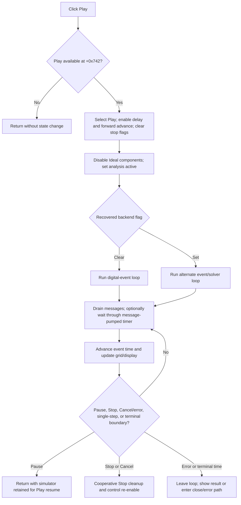

# Play or resume the DStep analysis event sequence

> Analysis status: Evidence-backed source review complete.

## Control

| Property | Recovered value |
| --- | --- |
| Form | DStepAnalControlPanel |
| Component path | DStepAnalControlPanel.Panel2.sbPlay |
| Control class | TSpeedButton |
| Caption | Not present in the recovered resource. |
| Hint | Play\| |
| Text | Not present in the recovered resource. |
| Handler name | sbPlayClick |
| Handler address | 014ffdd0 |
| Graph node | `resource:dfm:DStepAnalControlPanel/DStepAnalControlPanel.Panel2.sbPlay` |
| Handler node | `function:014ffdd0` |
| Graph layer | UI |

## What happens when clicked

`sbPlay` runs the initialized DStep analysis forward through successive event times until Pause, Stop, a close/error path, or the analysis end condition stops the loop. After Pause, clicking Play resumes from the retained current time and simulator state; it does not reinitialize the analysis.

`FUN_014ffdd0` first tests form flag `+0x742`, the recovered Play-available state maintained by the shared transport-state helper. If the flag is false, the handler returns without changing a control or simulator field.

When Play is available, the handler:

1. calls the shared transport-state helper with the Play control;
2. sets playback-delay flag `+0x780` to `1`;
3. sets forward-advance flag `+0x745` to `1`;
4. clears loop-stop flag `+0x747` and single-step termination flag `+0x748`;
5. disables the **Ideal components** checkbox;
6. sets active-analysis or close-veto flag `+0x74c` to `1`; and
7. calls the shared stepping dispatcher.

The transport-state helper adjusts the Play/Pause/Stop/step/speed control state. Its canonical annotation belongs to the Stop analysis because the helper is shared by this whole control group.

## Dispatcher and execution backends

`FUN_014fedb0` reads the recovered backend-selection byte at `PTR_DAT_02003fc8`:

- zero dispatches to `FUN_014fede0`, which uses the recovered digital-event functions `__run_digital` and `_get_next_event_time` when it reaches the next digital boundary;
- nonzero dispatches to `FUN_014ff340`, which advances the alternate event/solver object and includes solver-progress and error checks.

The original Delphi name and exact enum meaning of this backend byte are not recovered. Both implementations use the same form flags, current-time fields, transport controls, message pump, and optional playback delay. The same dispatcher also serves Step Forward and Step Back. Their handlers preset single-step flags so the loop returns after one operation. Play clears the single-step flag, so the loop continues.

## Message-pumped playback and delay

Both loops set running-loop marker `+0x740` to `0`, then drain pending application messages at the start of every iteration. This makes a synchronous click handler responsive to Pause, Stop, speed controls, and close requests. The delay helper also drains messages while it waits for a one-shot timer.

Playback delay is applied only when `+0x780` is `1` and recovered analysis-mode flag `+0x741` is zero. The delay interval is the unsigned 16-bit field at `+0x782`. Setup initializes it to `0x400` or 1024 timer units. **Speed Up** halves this value down to `1`; **Slow Down** doubles it while it is below `0xfffe`. A speed click received during an already-created delay changes the field used by the next delay; the current one-shot timer keeps the interval passed when it was created.

The delay is not a blocking sleep. `FUN_00f835c0` creates a timer callback and repeatedly drains the application message queue until the callback marks the wait complete. Message dispatch is reentrant and can run other application handlers, not only the DStep transport controls.

## Time advancement and loop termination

With forward-advance flag `+0x745` set, each loop moves current-time field `+0x750` toward the next recovered event or analysis boundary. The clear-backend loop can run the next digital event and query a new event time. The set-backend loop advances its solver/event source, checks progress, and can clamp the next display boundary to recovered end fields.

When a valid interval is available, the loop updates the control panel's time grid and the analyzed schematic or display state. It then copies termination-request field `+0x748` to loop-stop field `+0x747`. This is the key Play versus Step distinction:

- Play sets `+0x748` to `0`, so an ordinary completed iteration requests another iteration.
- Step Forward and Step Back set `+0x748` to `1`, so their dispatcher call returns after the requested step.
- Pause and Stop set both fields to `1` while the message pump is active, so the current loop exits at its next tested boundary.
- The set-backend loop also sets both fields to `1` and disables Play when current time reaches the recovered terminal-time sentinel.

On its normal loop exit, each backend sets running-loop marker `+0x740` back to `1` and returns through the dispatcher to `sbPlayClick`.

## Pause, resume, Stop, and Cancel

Pause changes the transport state, clears playback-delay and forward-advance flags, and sets the two termination flags. It does not tear down the simulator and does not clear active-analysis flag `+0x74c`. The Play button can therefore resume the retained analysis. Play restores delay and forward advancement and reenters the dispatcher from the current time.

Stop also sets the termination flags. If the loop is still running, Stop schedules a 100-unit callback that polls until running-loop marker `+0x740` indicates exit. It then tears down the simulation, refreshes the analyzed view, re-enables the checkbox and form controls, and clears `+0x74c`. These cleanup operations belong to the Stop handler, not to Play's normal pause boundary.

The form's Cancel button enters the VCL close path. `OnCloseQuery` vetoes an immediate close while `+0x74c` is set and schedules a callback that invokes Stop before it tries to close again. Thus Cancel is not a direct exception or thread abort. The Play loop must process the queued close/stop messages and reach its termination test.

## Ideal-component setting

The **Ideal components** checkbox is checked in the recovered resource. During analysis setup, `FUN_014fe830` copies the checkbox state into global flag `PTR_DAT_020024f8`, with a recovered analysis-mode override. `FUN_014fd730` passes that flag into digital model construction and calls `_SetStatusIdealMode` before digital simulation initialization.

Play does not reread or change this ideal-component flag. It disables the checkbox before entering the loop so the initialized model and the UI choice cannot diverge during playback. Pause leaves it disabled because the same initialized simulator is available for resume. Stop cleanup re-enables it. The checkbox's own handler owns rebuilding the simulator when a permitted value change occurs.

## Errors, end state, and persistence

- A false Play-available flag is a silent no-op.
- The handler assumes setup has supplied the simulator objects, arrays, current-time fields, and terminal bounds. It has no local null, range, or initialization-error guard.
- The set-backend loop detects 50 consecutive iterations with no time progress in one recovered solver mode. It displays **Analysis can't be performed: use delay by the components**, sets the shared error flag, and can clear active-analysis state and enter the form's Cancel/close path.
- Other solver or digital initialization, update, draw, timer, and callback failures have no local recovery, transaction, retry, or rollback in the Play handler.
- Because pending messages run inside the loop and inside the timer wait, a Pause, Stop, checkbox-independent UI command, or close request can mutate shared state before the current iteration resumes.
- A Stop request is cooperative. The current backend operation must return to the loop and reach its flag test. The source does not establish a forced cancellation or timeout for a backend call that does not return.
- Play changes transient analysis, UI, timing, and display state. It does not save a document, serialize the current time, write a project option, or mark a document modified.
- A normal terminal-time exit can leave the analysis result displayed and Play disabled. Full simulator teardown and control re-enabling are owned by Stop or the close cleanup path.

## Play and resume flow

## Handler and execution evidence

- Play guard, transport flags, checkbox lock, and dispatcher call: [FUN_014ffdd0](../../../DecompiledSources/Tina16/functions/00000000014FFDD0__FUN_014ffdd0.c)
- Backend dispatcher: [FUN_014fedb0](../../../DecompiledSources/Tina16/functions/00000000014FEDB0__FUN_014fedb0.c)
- Digital-event playback loop: [FUN_014fede0](../../../DecompiledSources/Tina16/functions/00000000014FEDE0__FUN_014fede0.c)
- Alternate event/solver playback loop and error path: [FUN_014ff340](../../../DecompiledSources/Tina16/functions/00000000014FF340__FUN_014ff340.c)
- Shared transport-control state update: [FUN_014ffa60](../../../DecompiledSources/Tina16/functions/00000000014FFA60__FUN_014ffa60.c)
- Timer wait with message pumping: [FUN_00f835c0](../../../DecompiledSources/Tina16/functions/0000000000F835C0__FUN_00f835c0.c)
- Application message drain: [FUN_0080cc70](../../../DecompiledSources/Tina16/functions/000000000080CC70__FUN_0080cc70.c)
- Pause and Stop coordination: [FUN_014ffe40](../../../DecompiledSources/Tina16/functions/00000000014FFE40__FUN_014ffe40.c) and [FUN_014ffe80](../../../DecompiledSources/Tina16/functions/00000000014FFE80__FUN_014ffe80.c)
- Single-step flag contrast: [FUN_01500090](../../../DecompiledSources/Tina16/functions/0000000001500090__FUN_01500090.c) and [FUN_014fffb0](../../../DecompiledSources/Tina16/functions/00000000014FFFB0__FUN_014fffb0.c)
- Speed interval changes: [FUN_015000f0](../../../DecompiledSources/Tina16/functions/00000000015000F0__FUN_015000f0.c) and [FUN_01500110](../../../DecompiledSources/Tina16/functions/0000000001500110__FUN_01500110.c)
- Ideal-component capture and simulator initialization: [FUN_014fe830](../../../DecompiledSources/Tina16/functions/00000000014FE830__FUN_014fe830.c) and [FUN_014fd730](../../../DecompiledSources/Tina16/functions/00000000014FD730__FUN_014fd730.c)
- Close-query and deferred close/Stop path: [FUN_015001a0](../../../DecompiledSources/Tina16/functions/00000000015001A0__FUN_015001a0.c) and [FUN_01500140](../../../DecompiledSources/Tina16/functions/0000000001500140__FUN_01500140.c)
- Recovered control resources: [ui-evidence.json](../../../DecompiledSources/Tina16/resources/dfm/ui-evidence.json)

## Resource and annotation limits

- `sbPlay` is a 30 by 30 `TSpeedButton` in transport group `1`. It has hint **Play|**, no caption, action, checked state, or same-parent label candidate.
- [The extracted 9 by 9 glyph](../../../glyph/0127_DStepAnalControlPanel_DStepAnalControlPanel_Panel2_sbPlay_Glyph_Data.png) is a right-pointing triangle. It supports Play direction only. The handler and stepping loops prove the simulator effect.
- Recovered field names such as Play available, active analysis, loop stop, single-step termination, current time, and playback delay are behavioral names derived from their writers and readers. The original Delphi declarations are not recovered.
- This Bead owns canonical annotations for `FUN_014ffdd0`, `FUN_014fedb0`, `FUN_014fede0`, and `FUN_014ff340`. The Stop analysis owns the shared transport-state helper. Setup, ideal-component, Pause, Stop, Next, Previous, speed, timer, message-pump, display-update, and close helpers remain evidence under their shared or sibling ownership.
