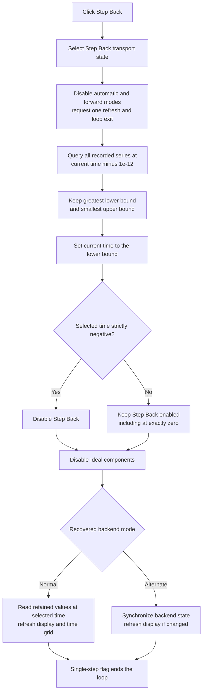

# Move the Step Analysis display to the previous recorded boundary

> Analysis status: Reviewed from the DFM event, handler, recorded-event
> interval search, both playback backends, display and grid refresh paths,
> setup state, transport controls, and extracted glyph.

## Control

| Property | Recovered value |
| --- | --- |
| Form | DStepAnalControlPanel |
| Component path | DStepAnalControlPanel.Panel2.sbPrev |
| Control class | TSpeedButton |
| Caption | Not present in the recovered resource. |
| Hint | Step Back\| |
| Text | Not present in the recovered resource. |
| Handler name | sbPrevClick |
| Handler address | 014fffb0 |
| Graph node | `resource:dfm:DStepAnalControlPanel/DStepAnalControlPanel.Panel2.sbPrev` |
| Handler node | `function:014fffb0` |
| Graph layer | UI |

## What happens when clicked

[`FUN_014fffb0`](../../../DecompiledSources/Tina16/functions/00000000014FFFB0__FUN_014fffb0.c)
moves the Step Analysis view to the recorded interval immediately before its
current time. It does not decrement a step number and it does not run the
solver in reverse.

The handler first gives `sbPrev` to the shared transport-state helper. It then
sets these control-panel fields:

- `+0x780 = 0` disables the automatic-play delay path;
- `+0x745 = 0` disables forward event or solver advancement;
- `+0x746 = 1` requests a state and display refresh;
- `+0x747 = 1` and `+0x748 = 1` select a bounded, one-pass operation; and
- `+0x74C = 0` clears the active-analysis close veto used by Play.

These writes also stop a message-pumped Play loop at its next flag test. If
the command starts while playback is already paused, it uses the same retained
analysis time and recorded history. The handler does not call analysis setup
or teardown.

## Exact previous-boundary selection

Current analysis time is the double field at `+0x750`. The handler calls
[`FUN_01522550`](../../../DecompiledSources/Tina16/functions/0000000001522550__FUN_01522550.c)
with:

`query time = current time - 1e-12`

The small subtraction makes a query at an exact event boundary fall on the
interval before that boundary. The helper returns a common lower and upper
bound in fields `+0x768` and `+0x770`. The handler copies only the returned
lower bound to current time `+0x750`.

The interval helper does this work:

1. initialize its lower and upper outputs to the recovered negative and
   positive time sentinels;
2. visit every recorded Step Analysis series;
3. ask [`FUN_01cc5870`](../../../DecompiledSources/Tina16/functions/0000000001CC5870__FUN_01cc5870.c)
   for that series' time bracket around the query;
4. retain the greatest lower bound; and
5. retain the smallest upper bound.

The result is the intersection of the recorded intervals around the requested
time. A series with no samples contributes only the sentinel bounds. A query
before or after a series uses a sentinel on that side. The handler has no
separate empty-history or uninitialized-state guard.

## Lower boundary and repeat behavior

After it stores the returned lower bound as the new current time, the handler
disables `sbPrev` only when that value is strictly negative. The recovered
test is `value <= 0.0 && value != 0.0`.

The source therefore proves these exact cases:

- a positive result keeps Step Back enabled;
- an exact zero result also keeps Step Back enabled;
- a strictly negative result disables Step Back; and
- the value is not clamped to zero.

A normal user click cannot reach the handler again after the control becomes
disabled. The handler itself does not test the control's Enabled state. A
direct or reentrant call can therefore repeat the interval query even when the
button is disabled. There is no wrap to the last event.

## Display refresh, model state, and playback state

The handler disables the **Ideal components** checkbox before it enters the
shared backend dispatcher. This keeps the option used to build the current
analysis model unchanged. Step Back does not change the checkbox value. Stop
cleanup later re-enables the checkbox.

[`FUN_014fedb0`](../../../DecompiledSources/Tina16/functions/00000000014FEDB0__FUN_014fedb0.c)
selects one of two shared playback loops. The Play analysis owns the canonical
annotations for the dispatcher and both loops. With the flags set by Step
Back, neither loop uses the playback delay or enters its forward-advance
branch.

In the normal recovered mode, the selected loop:

- processes pending application messages once;
- recalculates the previous and next recorded bounds around the selected time;
- calls [`FUN_014fe7d0`](../../../DecompiledSources/Tina16/functions/00000000014FE7D0__FUN_014fe7d0.c)
  to make that time the source for analyzed display values;
- calls [`FUN_014fe060`](../../../DecompiledSources/Tina16/functions/00000000014FE060__FUN_014fe060.c)
  to refresh the grid row with the current, previous, and next times; and
- copies the single-step flag to the loop-stop flag, then returns.

For the alternate recovered mode, the loop asks its backend to synchronize to
the selected state. It refreshes the analyzed display if that backend reports
a change. The original Delphi name for this mode byte is not recovered.

The display refresh reads values from retained analysis data at the selected
time. The clear-backend path also rebuilds the displayed value collection from
that stored data. No reverse solver call, event deletion, input-data change,
or new analysis initialization is present. Step Back is therefore a recorded
time-navigation command with a model and UI refresh, not a physical reverse
simulation.

## Errors, no-op cases, and retained state

- The handler has no confirmation, error message, exception handler, retry,
  transaction, or rollback.
- A missing or empty recorded-series collection is not checked locally. The
  interval helper returns its initialized sentinel bounds when it has no item
  to visit.
- The alternate playback loop's recovered no-progress error belongs to its
  forward-advance branch. Step Back sets the forward flag to zero, so this
  command does not reach that error branch.
- Pending messages run before the one-step refresh. A reentrant transport or
  close action can therefore change shared flags while this handler is active.
- The handler changes transport fields, current display time, bounds, control
  availability, and shown analysis values. If a later refresh call fails,
  earlier field and control changes have no local rollback.
- The initialized simulator and its recorded data remain allocated. A later
  Play can continue from the retained selected time. Stop owns full teardown
  and setup reset.
- The command does not save a document, write settings, create an undo item,
  or serialize the selected time. Its changes are runtime state only.

## Step Back flow

## Handler and downstream evidence

- Previous-boundary query, flags, lower-bound test, checkbox lock, and dispatch:
  [FUN_014fffb0](../../../DecompiledSources/Tina16/functions/00000000014FFFB0__FUN_014fffb0.c)
- Common recorded-interval aggregation:
  [FUN_01522550](../../../DecompiledSources/Tina16/functions/0000000001522550__FUN_01522550.c)
- Per-series time-bracket lookup:
  [FUN_01cc5870](../../../DecompiledSources/Tina16/functions/0000000001CC5870__FUN_01cc5870.c)
- Shared transport-control update:
  [FUN_014ffa60](../../../DecompiledSources/Tina16/functions/00000000014FFA60__FUN_014ffa60.c)
- Shared backend dispatcher and bounded-loop behavior:
  [FUN_014fedb0](../../../DecompiledSources/Tina16/functions/00000000014FEDB0__FUN_014fedb0.c),
  [FUN_014fede0](../../../DecompiledSources/Tina16/functions/00000000014FEDE0__FUN_014fede0.c), and
  [FUN_014ff340](../../../DecompiledSources/Tina16/functions/00000000014FF340__FUN_014ff340.c)
- Display-time selection and value refresh:
  [FUN_014fe7d0](../../../DecompiledSources/Tina16/functions/00000000014FE7D0__FUN_014fe7d0.c) and
  [FUN_014ff100](../../../DecompiledSources/Tina16/functions/00000000014FF100__FUN_014ff100.c)
- Time-grid refresh:
  [FUN_014fe060](../../../DecompiledSources/Tina16/functions/00000000014FE060__FUN_014fe060.c)
- Initial time and recorded-bound setup:
  [FUN_014fd9d0](../../../DecompiledSources/Tina16/functions/00000000014FD9D0__FUN_014fd9d0.c)
- Sibling playback context: [Play](sbplay-5b93506e7b.md) and
  [Step Forward](sbnext-57dc9ccbe3.md)

## Resource and annotation limits

- `sbPrev` is a 30 by 30 `TSpeedButton`. It has hint **Step Back|**, no
  caption, action, checked state, group index, or same-parent label candidate.
- [The extracted 18 by 14 pixel glyph](../../../glyph/0129_DStepAnalControlPanel_DStepAnalControlPanel_Panel2_sbPrev_Glyph_Data.png)
  shows a left-pointing triangle beside a vertical bar. It supports previous
  direction only. The handler and interval sources prove the time-navigation
  behavior.
- Original Delphi names for the form fields, backend mode, recorded series,
  and sentinel values are not recovered. The behavioral field names in this
  article come from their writers and readers.
- This Bead owns canonical annotations for `FUN_014fffb0` and
  `FUN_01522550`. The Stop analysis owns `FUN_014ffa60`. The Play analysis
  owns `FUN_014fedb0`, `FUN_014fede0`, and `FUN_014ff340`. Display and
  per-series lookup helpers remain evidence only here.
