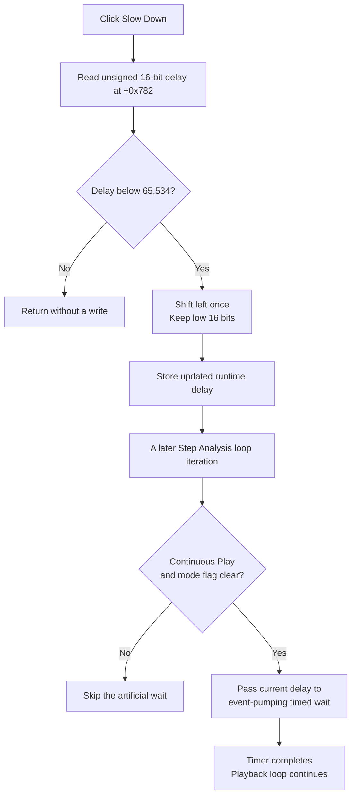

# Slow automatic Step Analysis playback

> Analysis status: Complete. The recovered handler, delay initialization, both playback-loop consumers, and the shared event-pumping wait establish the control behavior and its 16-bit wraparound boundary.

## Control

| Property | Recovered value |
| --- | --- |
| Form | DStepAnalControlPanel |
| Component path | DStepAnalControlPanel.Panel2.sbSlowDown |
| Control class | TSpeedButton |
| Caption | Not present in the recovered resource. |
| Hint | Slow Down\| |
| Handler name | sbSlowDownClick |
| Handler address | 01500110 |
| Graph node | `resource:dfm:DStepAnalControlPanel/DStepAnalControlPanel.Panel2.sbSlowDown` |
| Handler node | `function:01500110` |
| Graph layer | UI |

The resource gives this button no recovered `GroupIndex`, `AllowAllUp`, or checked state. It acts as a momentary command. The handler does not change the button's pressed, enabled, visible, or checked state.

## Delay change

`FUN_01500110` reads the panel field at `+0x782` as an unsigned 16-bit value. Its complete operation is:

1. If the value is 65,534 or 65,535, return without changing it.
2. Otherwise, shift the value left by one bit and store the result back into the same 16-bit field.

For values below 32,768, this normally doubles the delay. The store keeps only the low 16 bits, so this is not a saturating upper bound. In value notation, the write is `(oldDelay * 2) modulo 65,536` after the `oldDelay < 65,534` guard.

The Step Analysis setup function `FUN_014fe830` initializes this field to `0x400`, or 1,024. Repeated clicks from that default produce:

| Slow-down clicks | Stored delay |
| ---: | ---: |
| 0 | 1,024 |
| 1 | 2,048 |
| 2 | 4,096 |
| 3 | 8,192 |
| 4 | 16,384 |
| 5 | 32,768 |
| 6 | 0 |
| 7 and later | 0 |

Thus, the sixth repeated click from the default wraps the delay to zero rather than clamping it. Zero passes the guard, but shifting zero still stores zero. Separately, an existing value of 65,534 or 65,535 is a true no-write case. The paired [Speed Up command](sbspeedup-efcea07d8d.md) halves the same field only while it is greater than one.

## Effect on playback

The click handler does not call the simulator, advance a step, or wait. It only changes the runtime field. Both recovered Step Analysis playback loops, `FUN_014fede0` and `FUN_014ff340`, read `+0x782` near the start of each iteration and pass it to the shared event-pumping timed wait `FUN_00f835c0` when both conditions are true:

- The continuous-play flag at `+0x780` equals 1. The [Play command](sbplay-5b93506e7b.md) sets this flag.
- The mode flag at `+0x741` is clear. Setup derives this flag from the Ideal Components setting documented with [Ideal components](idealcompscb-4312c8dab0.md).

When either condition is false, the loop skips the artificial wait. The click still changes the field, but manual stepping or the excluded mode has no immediate timing change.

`FUN_00f835c0` receives the current 16-bit value, schedules a completion callback for that interval, and continues to process application messages until the callback marks the wait complete. This keeps the controls responsive during the wait. Because the interval is passed by value, a slow-down click processed after a wait has already been scheduled does not extend that active timer. A later loop iteration uses the updated field. If the outer loop processes the click before it schedules its next wait, that next wait uses the new value.

The recovered import thunk used by the timer does not preserve its API name. The source proves the relative interval values and timer flow, but not the interval's named unit. This article therefore does not relabel 1,024 as milliseconds.

## Click flow

## Repeats, errors, and persistence

- Every click performs only a field comparison and, when allowed, one 16-bit write. There are no calls, allocations, dialogs, or exception branches in the handler.
- The handler does not disable the button at a minimum or maximum and does not show the current value. When the button is enabled, the handler has no separate repetition guard beyond the numeric test.
- Delay values 65,534 and 65,535 are unchanged. A value of zero remains zero. Other values can wrap because the write is 16-bit.
- With the recovered default sequence, 32,768 wraps to zero. The timed-wait helper then receives a zero interval on later eligible playback iterations; it still schedules its callback and processes messages, so the source does not justify replacing this path with an assumed direct return.
- The value is panel runtime state. The handler does not write an INI file, document, analysis model, or application preference.
- `FUN_014fe830` resets the field to 1,024 during panel setup and rebuild paths, including the Ideal Components rebuild. The chosen speed is therefore not persistent across those resets or a new panel instance.

## Evidence

- [Slow-down handler `FUN_01500110`](../../../DecompiledSources/Tina16/functions/0000000001500110__FUN_01500110.c) contains the unsigned `0xfffe` guard and the 16-bit left-shift store.
- [Step Analysis setup `FUN_014fe830`](../../../DecompiledSources/Tina16/functions/00000000014FE830__FUN_014fe830.c) initializes delay field `+0x782` to `0x400`. The related rebuild route is documented in [Ideal components](idealcompscb-4312c8dab0.md), TIARA-diz.6.7.387.
- [First playback loop `FUN_014fede0`](../../../DecompiledSources/Tina16/functions/00000000014FEDE0__FUN_014fede0.c) passes the field to `FUN_00f835c0` only when `+0x780` is 1 and `+0x741` is clear.
- [Second playback loop `FUN_014ff340`](../../../DecompiledSources/Tina16/functions/00000000014FF340__FUN_014ff340.c) uses the same conditions and wait call. The play route is documented in [Play](sbplay-5b93506e7b.md), TIARA-diz.6.7.390.
- [Event-pumping timed wait `FUN_00f835c0`](../../../DecompiledSources/Tina16/functions/0000000000F835C0__FUN_00f835c0.c) schedules a completion callback with the supplied interval and processes application messages until completion. Its canonical graph annotation remains in the core function map.
- [Extracted minus-sign glyph](../../../glyph/0132_DStepAnalControlPanel_DStepAnalControlPanel_Panel2_sbSlowDown_Glyph_Data.png) and the `Slow Down|` hint corroborate direction only; the handler and wait consumers establish the effect.

## Evidence limits

- The recovered timer import has no resolved API name, so the exact time unit is not stated.
- The source shows that the mode flag at `+0x741` gates the timed wait and that setup derives it from the Ideal Components state. This article does not infer a broader simulation meaning for that flag.
- The decompiled handler exposes no explicit overflow warning or clamp. The wraparound result follows from storing the shifted value into the recovered 16-bit field.
