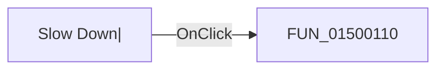

# Slow Down|

> Analysis status: Pending individual source review.

## Control

| Property | Recovered value |
| --- | --- |
| Form | DStepAnalControlPanel |
| Component path | DStepAnalControlPanel.Panel2.sbSlowDown |
| Control class | TSpeedButton |
| Caption | Not present in the recovered resource. |
| Hint | Slow Down\| |
| Text | Not present in the recovered resource. |
| Handler name | sbSlowDownClick |
| Handler address | 01500110 |
| Graph node | `resource:dfm:DStepAnalControlPanel/DStepAnalControlPanel.Panel2.sbSlowDown` |
| Handler node | `function:01500110` |
| Graph layer | UI |

## What happens when clicked

Pending individual analysis. An agent must read the recovered handler source and its relevant callees before it replaces this text.

## Click flow

## Handler evidence

- Source: [DecompiledSources/Tina16/functions/0000000001500110__FUN_01500110.c](../../../DecompiledSources/Tina16/functions/0000000001500110__FUN_01500110.c)
- Recovered role: Step Analysis playback slow-down handler
- Current graph summary: Slows automatic Step Analysis playback by doubling the 16-bit inter-step delay when it is below 65,534. Handles 1 Delphi UI event: DStepAnalControlPanel.Panel2.sbSlowDown.OnClick.
- Current graph behavior: Slows automatic Step Analysis playback by doubling the 16-bit inter-step delay when it is below 65,534.
- Current graph evidence: The button hint is Slow Down and its glyph is a minus sign. The handler doubles field 0x782. Setup initializes it to 0x400, and both Step Analysis loops pass it to the timed-wait helper.
- Complexity: simple
- Distinct outgoing calls: 0

## Direct calls

- No direct call edge is present in the recovered graph.

## Resource evidence

- Kind: Not present in the recovered resource.
- Modal result: Not present in the recovered resource.
- Checked state: Not present in the recovered resource.
- List items: Not present in the recovered resource.
- Image reference: Not present in the recovered resource.
- Extracted glyph: [`0132_DStepAnalControlPanel_DStepAnalControlPanel_Panel2_sbSlowDown_Glyph_Data.png`](../../../glyph/0132_DStepAnalControlPanel_DStepAnalControlPanel_Panel2_sbSlowDown_Glyph_Data.png)

## Nearby label candidates

Nearby labels are layout candidates only. They are not proof of behavior.

- No same-parent label candidate is available.

## Analysis limits

- Do not infer behavior from the control class, caption, hint, glyph, or nearby label alone.
- Do not replace the pending status until the handler source and relevant call path provide enough evidence.
