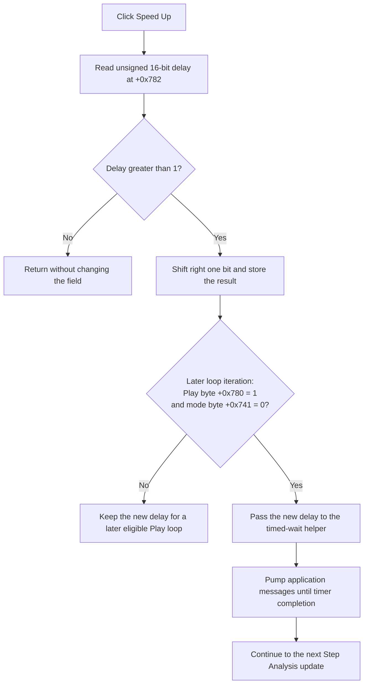

# Speed up automatic Step Analysis playback

> Analysis status: Reviewed from the speed-up handler, panel setup, Play/Pause/step controls, both playback loops, shared timed-wait implementation, DFM resource, and extracted glyph.

## Control

| Property | Recovered value |
| --- | --- |
| Form | DStepAnalControlPanel |
| Component path | DStepAnalControlPanel.Panel2.sbSpeedUp |
| Control class | TSpeedButton |
| Caption | Not present in the recovered resource. |
| Raw hint | `Speed Up\|` |
| Size | 30 by 30 |
| Handler name | sbSpeedUpClick |
| Handler address | 015000f0 |
| Graph node | `resource:dfm:DStepAnalControlPanel/DStepAnalControlPanel.Panel2.sbSpeedUp` |
| Handler node | `function:015000f0` |
| Graph layer | UI |

## What happens when clicked

[`FUN_015000f0`](../../../DecompiledSources/Tina16/functions/00000000015000F0__FUN_015000f0.c) reads the unsigned 16-bit field at control-panel offset `+0x782`. If the value is greater than `1`, the handler shifts it right by one bit and writes the result back. This is integer division by two:

- even values are halved exactly;
- odd values greater than one are rounded down, for example `3` becomes `1`; and
- values `0` and `1` are unchanged.

The handler makes no function call. It does not start playback, advance a simulation step, redraw a control, change a button state, display the new value, persist a setting, or report an error.

## Initial value and lower bound

[`FUN_014fe830`](../../../DecompiledSources/Tina16/functions/00000000014FE830__FUN_014fe830.c), the coordinated Step Analysis setup routine, initializes field `+0x782` to hexadecimal `0x400`, or decimal `1024`.

Starting from that value, ten accepted Speed Up clicks produce:

`1024, 512, 256, 128, 64, 32, 16, 8, 4, 2, 1`

Further clicks at `1` are no-ops. Thus, `1` is the lower bound reached from the normal positive setup value. The source also explicitly leaves an unexpected value `0` at `0`; it does not repair it to `1`.

The paired [Slow Down control](sbslowdown-86fee6aadf.md) doubles the same 16-bit field under its own upper-bound guard. This article does not assign its overflow or ownership details to the Speed Up handler.

## Effect on active playback

Both recovered Step Analysis loops, [`FUN_014fede0`](../../../DecompiledSources/Tina16/functions/00000000014FEDE0__FUN_014fede0.c) and [`FUN_014ff340`](../../../DecompiledSources/Tina16/functions/00000000014FF340__FUN_014ff340.c), read field `+0x782` before an inter-step wait. They pass the current 16-bit value to [`FUN_00f835c0`](../../../DecompiledSources/Tina16/functions/0000000000F835C0__FUN_00f835c0.c), the shared timed-wait helper.

The loops use this wait only when automatic playback byte `+0x780` equals `1` and mode byte `+0x741` equals `0`. `sbPlayClick` sets `+0x780` to `1`; Pause, Step Back, and Step Forward set it to `0`. Therefore:

- during eligible Play operation, a smaller field value shortens later inter-step waits;
- while paused or using a one-step command, the click still changes the stored field but does not time that manual action; and
- when mode byte `+0x741` is nonzero, both loops skip this timed wait, so the field change has no proven timing effect in that mode.

The timed-wait helper copies its delay argument into a timer request and then pumps application messages until the timer callback marks completion. This keeps the button reachable during a wait. A Speed Up click that occurs after the current timer was scheduled does not reschedule that timer; the next eligible loop wait reads the new value.

## Click flow

## Repeat, no-op, and error behavior

- Every click above `1` halves the value once. The handler has no acceleration curve, repeat timer, or long-press branch.
- At `1`, repeated clicks do nothing. At an unexpected `0`, repeated clicks also do nothing.
- An odd value is truncated by the logical right shift. No rounding-to-nearest step is present.
- A click during an already scheduled wait affects the next eligible wait, not the timer that is already running.
- A click while playback is paused changes the field silently. A later Play operation uses that value unless setup resets it first.
- The handler has no allocation, validation, exception handler, rollback, error message, or failure return.

## Persistence and reset boundary

The delay field is runtime control-panel state. `FUN_015000f0` calls no settings writer, file routine, registry routine, or serializer.

Step Analysis setup writes `0x400` each time it runs. The recovered callers include initial control-panel setup, the Stop completion path, and a reinitialization after the **Ideal components** option changes. These paths discard prior Speed Up clicks. The source does not prove persistence across panel recreation, a new analysis session, or application restart.

## Resource evidence

- The DFM binds `sbSpeedUp.OnClick` to `sbSpeedUpClick` at `015000f0`.
- The raw hint is `Speed Up|`; the text before the hint separator is **Speed Up**.
- The extracted 16-by-14 bitmap is a plus sign. This supports the direction of the adjustment, while the source proves that the adjusted quantity is the playback delay.
- Extracted glyph: [`0131_DStepAnalControlPanel_DStepAnalControlPanel_Panel2_sbSpeedUp_Glyph_Data.png`](../../../glyph/0131_DStepAnalControlPanel_DStepAnalControlPanel_Panel2_sbSpeedUp_Glyph_Data.png)
- Caption, text, action, checked state, group index, image-list reference, and modal result are not present in the recovered resource.

## Handler evidence and annotation ownership

- The graph has no outgoing call edge for `function:015000f0`; its complete effect is the guarded field update.
- This Bead duplicates the existing core `FUN_015000f0` annotation exactly, including its tag order.
- `TIARA-diz.6.7.390` owns the coordinated setup, playback-loop, and dispatcher annotations.
- `FUN_00f835c0` is core-owned and remains evidence-only here. The sibling Slow Down Bead coordinates the paired control without taking ownership of this handler.

## Analysis limits

- The original Delphi field name and exact timer unit for `+0x782` are not recovered. The source proves only that a smaller value produces a shorter request to the same timed-wait mechanism.
- The original name and semantic meaning of mode byte `+0x741` are not recovered.
- The handler does not expose the current delay in a label or return value, so the source does not prove direct visual feedback for a successful click.
