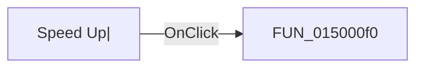

# Speed Up|

> Analysis status: Pending individual source review.

## Control

| Property | Recovered value |
| --- | --- |
| Form | DStepAnalControlPanel |
| Component path | DStepAnalControlPanel.Panel2.sbSpeedUp |
| Control class | TSpeedButton |
| Caption | Not present in the recovered resource. |
| Hint | Speed Up\| |
| Text | Not present in the recovered resource. |
| Handler name | sbSpeedUpClick |
| Handler address | 015000f0 |
| Graph node | `resource:dfm:DStepAnalControlPanel/DStepAnalControlPanel.Panel2.sbSpeedUp` |
| Handler node | `function:015000f0` |
| Graph layer | UI |

## What happens when clicked

Pending individual analysis. An agent must read the recovered handler source and its relevant callees before it replaces this text.

## Click flow

## Handler evidence

- Source: [DecompiledSources/Tina16/functions/00000000015000F0__FUN_015000f0.c](../../../DecompiledSources/Tina16/functions/00000000015000F0__FUN_015000f0.c)
- Recovered role: Step Analysis playback speed-up handler
- Current graph summary: Speeds automatic Step Analysis playback by halving the 16-bit inter-step delay when it is greater than one. Handles 1 Delphi UI event: DStepAnalControlPanel.Panel2.sbSpeedUp.OnClick.
- Current graph behavior: Speeds automatic Step Analysis playback by halving the 16-bit inter-step delay when it is greater than one.
- Current graph evidence: The button hint is Speed Up and its glyph is a plus sign. The handler halves field 0x782. Setup initializes it to 0x400, and both Step Analysis loops pass it to the timed-wait helper.
- Complexity: simple
- Distinct outgoing calls: 0

## Direct calls

- No direct call edge is present in the recovered graph.

## Resource evidence

- Kind: Not present in the recovered resource.
- Modal result: Not present in the recovered resource.
- Checked state: Not present in the recovered resource.
- List items: Not present in the recovered resource.
- Image reference: Not present in the recovered resource.
- Extracted glyph: [`0131_DStepAnalControlPanel_DStepAnalControlPanel_Panel2_sbSpeedUp_Glyph_Data.png`](../../../glyph/0131_DStepAnalControlPanel_DStepAnalControlPanel_Panel2_sbSpeedUp_Glyph_Data.png)

## Nearby label candidates

Nearby labels are layout candidates only. They are not proof of behavior.

- No same-parent label candidate is available.

## Analysis limits

- Do not infer behavior from the control class, caption, hint, glyph, or nearby label alone.
- Do not replace the pending status until the handler source and relevant call path provide enough evidence.
