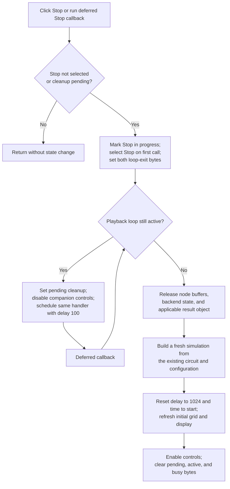

# Stop Step Analysis playback and rebuild its ready state

> Analysis status: Evidence-backed source review complete.

## Control

| Property | Recovered value |
| --- | --- |
| Form | DStepAnalControlPanel |
| Component path | DStepAnalControlPanel.Panel2.sbStop |
| Control class | TSpeedButton |
| Caption | Not present in the recovered resource. |
| Hint | Stop\| |
| Group index | 1 |
| Size | 30 by 30 |
| Handler name | sbStopClick |
| Handler address | 014ffe80 |
| Graph node | `resource:dfm:DStepAnalControlPanel/DStepAnalControlPanel.Panel2.sbStop` |
| Handler node | `function:014ffe80` |
| Graph layer | UI |

## What happens when clicked

`FUN_014ffe80` cooperatively stops the current Step Analysis operation. It does
not abort a solver call or free the simulation while a playback loop is still
using it. The handler first requests loop termination. It waits by scheduling
itself again until the loop reports that it has exited. It then releases the
per-run analysis state and builds a new ready state at the start of the
analysis.

The entry guard uses two form bytes:

- `+0x743` is maintained by the shared transport-state helper as
  `sbStop.Down == false`. It permits a new Stop request when Stop is not the
  selected transport button.
- `+0x749` marks deferred Stop cleanup. It permits a scheduled retry after the
  first call has selected Stop and made `+0x743` false.

If Stop is already selected and no cleanup is pending, the handler returns
without changing a flag, control, simulation object, or display.

For an accepted request, the handler sets stop-in-progress byte `+0x74b`. On
the first call, it also passes `sbStop` to the shared transport-state helper.
It then sets both playback termination bytes `+0x747` and `+0x748` to `1`.
Both recovered playback loops continue only while `+0x747` is zero. They set
running-loop marker `+0x740` to zero on entry and restore it to one on normal
exit. The Stop click therefore asks the active loop to return at its next flag
test.

## Deferred loop termination

When `+0x740` still says that a loop is running, Stop does not release the
simulator. It:

1. sets pending-cleanup byte `+0x749`;
2. disables the two companion controls at form offsets `+0x6d8` and `+0x6b8`;
3. packages `FUN_014ffe80` with the form instance as another callback; and
4. calls `FUN_00f836b0`, which passes that callback to the common scheduler
   with delay value `100`.

The original Delphi field names for the two companion controls are not
recovered, so this article does not assign names from DFM layout alone. The
scheduled callback enters the same handler. Pending byte `+0x749` bypasses the
now-selected Stop guard. If the loop is still active, the callback schedules
another retry. There is no retry count or timeout in this path.

The loops process application messages between analysis operations and during
their optional timer-backed delay. This allows the Stop click and its callbacks
to run while the synchronous Play handler is active. Cancellation remains
cooperative: a backend operation must return before its loop can test the exit
byte and set `+0x740` back to one.

## Cleanup and reset after the loop exits

When `+0x740` reports that the loop has exited, Stop performs the cleanup and
reset synchronously:

1. `FUN_014fd660` releases the current node-value buffers and the active
   backend's transient simulation state.
2. When form mode byte `+0x741` is zero, `FUN_01cc6030` releases the current
   shared analysis-result object.
3. `FUN_014fe830` constructs a fresh backend, buffers, and applicable result
   container from the existing circuit and analysis configuration.
4. The rebuild resets the unsigned 16-bit playback delay at `+0x782` to
   `0x400`, or decimal 1,024, and clears the recovered progress counter at
   `+0x9c0`.
5. `FUN_014fd9d0` resets analysis time to zero, sets displayed time `+0x750`
   to `1e-12`, recalculates the initial event bounds and node values, and
   refreshes the initial grid or analyzed display.
6. The handler clears pending byte `+0x749`, enables the two companion controls
   and **Ideal components**, clears active-session byte `+0x74c`, and clears
   stop-in-progress byte `+0x74b`.

This is a reset, not a Pause. Stop discards the current playback position,
transient solver state, and user-adjusted playback delay. It leaves the panel
with a newly initialized simulation at the start. The source circuit and
analysis configuration are inputs to that rebuild; this click does not edit or
save them.

## Transport-control state

`FUN_014ffa60` is the shared UI-state updater for the seven transport buttons.
It reads the selected button's Delphi `Tag` field, changes VCL `Enabled` and
group-button state, stores the selected tag at `+0x784` and button pointer at
`+0x788`, and refreshes the Play-available and Stop-available cache bytes from
`sbPlay.Down` and `sbStop.Down`.

For the Stop button's tag-3 branch, the helper:

- enables Play and Step Forward;
- disables Pause, Step Back, Speed Up, and Slow Down; and
- applies the grouped speed-button selection rules before it records Stop as
  the current transport control.

The helper does not directly change the Enabled state of Stop in this branch.
If cleanup must wait for the playback loop, the Stop handler separately
disables its two companion controls until rebuild completes. `FormShow` also
calls this helper with Stop, so a newly shown panel starts with the same stopped
transport arrangement.

Other tag branches prove that the helper belongs to the whole transport group:
Play enables Pause, Stop, Step Back, and both speed controls; Pause disables
Stop and both speed controls; Step Back and Step Forward enable all seven
transport buttons. The sibling transport articles cite this shared helper but
do not redefine it.

## Close, repeat, and error behavior

- Repeated Stop clicks after completed cleanup are silent no-ops because Stop
  is selected and `+0x749` is clear.
- A scheduled Stop retry is not a no-op because pending byte `+0x749` remains
  set until cleanup finishes.
- The form's close query rejects a close while active-session byte `+0x74c` is
  set. Its delayed callback calls this Stop handler when a Stop is not already
  in progress, then retries Close. Close therefore uses the same cooperative
  cleanup instead of destroying the form under the active loop.
- Stop has no confirmation dialog, error result, local exception handler,
  transaction, `finally` block, or rollback.
- If teardown or rebuild raises after the old state has been released, the
  handler can leave partial new state. The final control enables and flag
  clears occur only after rebuild returns.
- If a backend call never returns to its playback loop, the recovered source
  has no forced cancellation or timeout. Deferred callbacks can continue to
  find the running marker clear and schedule another retry.
- Stop does not mark the circuit document modified, serialize the last time,
  preserve an analysis snapshot, or write a preference. It replaces only the
  transient Step Analysis session and visible initial result.

## Stop flow

## Handler and call-path evidence

- Stop guard, loop-exit request, deferred callback, cleanup, and final control
  state: [FUN_014ffe80](../../../DecompiledSources/Tina16/functions/00000000014FFE80__FUN_014ffe80.c)
- Shared transport-button state:
  [FUN_014ffa60](../../../DecompiledSources/Tina16/functions/00000000014FFA60__FUN_014ffa60.c)
- Shared callback wrapper and scheduler call:
  [FUN_00f836b0](../../../DecompiledSources/Tina16/functions/0000000000F836B0__FUN_00f836b0.c)
  and
  [FUN_00f83490](../../../DecompiledSources/Tina16/functions/0000000000F83490__FUN_00f83490.c)
- Transient analysis teardown:
  [FUN_014fd660](../../../DecompiledSources/Tina16/functions/00000000014FD660__FUN_014fd660.c)
- Simulation rebuild and initial-state refresh:
  [FUN_014fe830](../../../DecompiledSources/Tina16/functions/00000000014FE830__FUN_014fe830.c)
  and
  [FUN_014fd9d0](../../../DecompiledSources/Tina16/functions/00000000014FD9D0__FUN_014fd9d0.c)
- Shared analysis-result release:
  [FUN_01cc6030](../../../DecompiledSources/Tina16/functions/0000000001CC6030__FUN_01cc6030.c)
- Playback-loop running marker and exit-byte consumers:
  [FUN_014fede0](../../../DecompiledSources/Tina16/functions/00000000014FEDE0__FUN_014fede0.c)
  and
  [FUN_014ff340](../../../DecompiledSources/Tina16/functions/00000000014FF340__FUN_014ff340.c)
- Close-query Stop coordination:
  [FUN_015001a0](../../../DecompiledSources/Tina16/functions/00000000015001A0__FUN_015001a0.c)
  and
  [FUN_01500140](../../../DecompiledSources/Tina16/functions/0000000001500140__FUN_01500140.c)
- Initial stopped transport state:
  [FUN_014fdf50](../../../DecompiledSources/Tina16/functions/00000000014FDF50__FUN_014fdf50.c)

## Resource and glyph evidence

- The DFM binds `sbStop.OnClick` to `sbStopClick` at `014ffe80`.
- `sbStop` is a 30 by 30 `TSpeedButton` in transport group `1`. It has hint
  `Stop|`, no caption, action, checked state, or same-parent label candidate.
- [The extracted 13 by 13 glyph](../../../glyph/0133_DStepAnalControlPanel_DStepAnalControlPanel_Panel2_sbStop_Glyph_Data.png)
  is a black square. The glyph and hint support the Stop meaning; the handler,
  loop flags, teardown, and rebuild establish the exact effect.
- Recovered form and event resources:
  [ui-evidence.json](../../../DecompiledSources/Tina16/resources/dfm/ui-evidence.json)

## Annotation ownership and limits

- This Bead owns the unique Stop handler `FUN_014ffe80` and the shared
  transport UI-state updater `FUN_014ffa60`.
- `TIARA-diz.6.7.390` owns the dispatcher and both playback loops. This article
  uses those functions only as evidence for cooperative termination.
- The coordinated **Ideal components** analysis owns the shared teardown,
  rebuild, and initial-state helpers. This article uses them as evidence for
  Stop's reset effect.
- The original Delphi names for the state fields, scheduler, backend modes,
  result objects, and two companion controls are not recovered. The delay
  argument `100` and reset value `1,024` are proven numeric values; their
  original public units or option names are not recovered.
