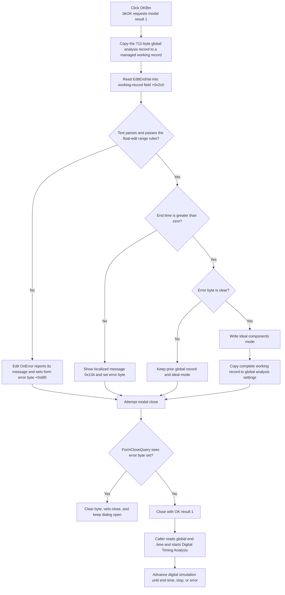

# Accept Digital Timing Analysis settings

> Analysis status: Reviewed from the recovered handler, validation helpers, close query, modal caller, and digital timing runner.

## Control

| Property | Recovered value |
| --- | --- |
| Form | DTranAnalDlg |
| Form caption | Digital Timing Analysis |
| Component path | DTranAnalDlg.OKBtn |
| Control class | TBitBtn |
| Kind | bkOK |
| Handler name | OKBtnClick |
| Handler address | 014f7a70 |
| Graph node | `resource:dfm:DTranAnalDlg/DTranAnalDlg.OKBtn` |
| Handler node | `function:014f7a70` |
| Graph layer | UI |

## What happens when clicked

The handler accepts two controls:

- `EditEndVal` supplies the Digital Timing Analysis end time in seconds.
- `IdealCompsCB`, captioned **Ideal components**, supplies the digital simulator's ideal-component mode.

The handler first initializes a 712-byte managed local record and copies the current global analysis-settings record into it. The local variable that receives `EditEndVal` starts exactly `0x2c0` bytes into this record. A valid value therefore replaces global analysis-record field `+0x2c0` when the working record is copied back.

The handler does not start analysis. Its modal caller starts Digital Timing Analysis only after the dialog closes without the Cancel result.

## End-time validation

[`FUN_00b90090`](../../../DecompiledSources/Tina16/functions/0000000000B90090__FUN_00b90090.c) reads the edit's current text as an engineering-format floating-point number. It rejects a value outside `-1e50` through `1e50` and applies any edit-specific validator. A parser or range failure raises a Delphi input exception. The OK handler has no local exception handler and does not reach its global commit after such a failure.

The handler then applies its application rule: the end time must be greater than zero. Zero, a negative value, and negative zero all take the invalid branch because the recovered comparison is `endTime <= 0.0`.

For this invalid branch, the handler loads localized resource string `0x134` and calls [`FUN_014f7a10`](../../../DecompiledSources/Tina16/functions/00000000014F7A10__FUN_014f7a10.c). That function displays the message only while form error byte `+0x6f0` is clear, then sets the byte. The exact localized text is not recovered.

`EditEndVal.OnError` is bound to [`FUN_014f7c00`](../../../DecompiledSources/Tina16/functions/00000000014F7C00__FUN_014f7c00.c). It sends the edit's own error text through the same coordinator and therefore sets the same close-veto byte.

## Commit and preserved integration settings

The final commit is conditional on form error byte `+0x6f0`:

- byte clear: read `IdealCompsCB.Checked`, write the shared ideal-component-mode byte, and copy the complete 712-byte working record back to global analysis settings;
- byte set: skip both writes and keep the previous global end time and ideal-component mode.

Only record field `+0x2c0` is changed in the local copy. All other transient and integration settings in the global analysis record are copied into the working record and copied back unchanged. This dialog has no controls for integration method, integration order, time step, initial-condition mode, or point count. It does not validate or recalculate those settings.

[`FUN_014f7bc0`](../../../DecompiledSources/Tina16/functions/00000000014F7BC0__FUN_014f7bc0.c), the form's `OnCreate` handler, reads global field `+0x2c0` into `EditEndVal` and assigns help context `0x454`. It does not copy the current shared ideal-mode byte into `IdealCompsCB` in the recovered path. The DFM also has no explicit checked-state value for that checkbox.

## Modal result and close veto

The button's built-in `bkOK` kind supplies modal result `1`. The inherited VCL button path writes that result before it dispatches `OKBtnClick`.

[`FUN_014f7ba0`](../../../DecompiledSources/Tina16/functions/00000000014F7BA0__FUN_014f7ba0.c), the form's `OnCloseQuery` handler, permits the close only while byte `+0x6f0` is clear. It then clears the byte for the next attempt:

- successful validation: the global values are committed and the dialog closes with the normal OK result;
- reported validation error: the global values stay unchanged, the close is vetoed, and the dialog remains open;
- a stale error byte from an earlier edit event: even valid current text skips the commit and causes one rejected close; that rejection clears the byte so the user can try again.

The modal caller [`FUN_015267a0`](../../../DecompiledSources/Tina16/functions/00000000015267A0__FUN_015267a0.c) explicitly destroys the dialog after `ShowModal`. It treats result `2` as Cancel and returns before it starts the timing analysis. It does not copy fields out of the dialog. On any non-Cancel result, it reads the already committed global end time from `+0x2c0` and continues its analysis setup.

## Downstream analysis use

The accepted end time becomes the Digital Timing Analysis stop target. The caller stores it in `DAT_0210ed78`, prepares the digital simulation graph and result storage, initializes the simulator, and starts its progress object.

[`FUN_015260d0`](../../../DecompiledSources/Tina16/functions/00000000015260D0__FUN_015260d0.c) advances simulation events and updates results until its recovered event times reach that end time or an analysis stop or error condition occurs. It also sends the end time to the progress object.

The ideal-component byte is separate from the 712-byte record. [`FUN_014fd730`](../../../DecompiledSources/Tina16/functions/00000000014FD730__FUN_014fd730.c) passes it to the digital-simulation data builder and to `_SetStatusIdealMode` before `_initialize_digital_simulation`. Thus, this checkbox affects simulator construction; it is not only a display option.

## Click flow

## Error and partial-state behavior

- A normal parse error, an out-of-range value, a nonpositive end time, or a previously set error byte prevents both global writes. The prior end time and ideal mode remain unchanged.
- `FUN_00b90090` caches a successfully parsed number in the edit control before the application positivity test. A rejected zero or negative value can therefore change dialog-local edit state even though global state does not change.
- `FUN_014f7a10` shows only the first message while the error byte is set. Later errors before the close query do not open another message.
- The valid commit writes the ideal-mode byte before it copies the managed analysis record. The handler has no exception guard or rollback. An allocation or managed-field exception during that copy can leave the new ideal mode, and possibly a partly copied record, even though the normal commit path is otherwise grouped behind one validation gate.
- The dialog does not check whether the circuit can run a Digital Timing Analysis. The menu handler and `FUN_015267a0` perform later design, graph, simulator, and allocation checks. Those later failures do not reopen this dialog or roll its accepted settings back.

## Cancel contrast

`CancelBtn` is a built-in `bkCancel` button with no application click handler. A normal Cancel returns modal result `2`. The caller destroys the form and skips Digital Timing Analysis.

Cancel does not restore a prior accepted end time or ideal mode because edits are staged locally until a valid OK commit. If an edit error has already set byte `+0x6f0`, `FormCloseQuery` can veto the first Cancel attempt and clear that byte. A later Cancel can then close without calling `OKBtnClick`.

## Handler and call-path evidence

- OK handler: [FUN_014f7a70](../../../DecompiledSources/Tina16/functions/00000000014F7A70__FUN_014f7a70.c) creates the working record, reads and checks end time, gates the ideal-mode and record writes on the error byte, and finalizes the record.
- Error coordinator: [FUN_014f7a10](../../../DecompiledSources/Tina16/functions/00000000014F7A10__FUN_014f7a10.c) routes a preserved error string to the shared one-message flag helper at form `+0x6f0`.
- Shared message marker: [FUN_01b1cf30](../../../DecompiledSources/Tina16/functions/0000000001B1CF30__FUN_01b1cf30.c) shows the message only for a clear byte and then sets that byte.
- Close query: [FUN_014f7ba0](../../../DecompiledSources/Tina16/functions/00000000014F7BA0__FUN_014f7ba0.c) sets `CanClose` to the inverse of byte `+0x6f0` and clears the byte.
- Form initializer: [FUN_014f7bc0](../../../DecompiledSources/Tina16/functions/00000000014F7BC0__FUN_014f7bc0.c) fills `EditEndVal` from global record field `+0x2c0` and sets the form help context.
- Float getter: [FUN_00b90090](../../../DecompiledSources/Tina16/functions/0000000000B90090__FUN_00b90090.c) parses current text, enforces `-1e50` through `1e50`, applies an optional validator, and caches the accepted value in the edit.
- Managed-record copy: [FUN_00417c40](../../../DecompiledSources/Tina16/functions/0000000000417C40__FUN_00417c40.c) copies plain and managed fields according to record RTTI; [FUN_00417580](../../../DecompiledSources/Tina16/functions/0000000000417580__FUN_00417580.c) initializes and [FUN_00417740](../../../DecompiledSources/Tina16/functions/0000000000417740__FUN_00417740.c) finalizes the local record.
- Modal caller and analysis setup: [FUN_015267a0](../../../DecompiledSources/Tina16/functions/00000000015267A0__FUN_015267a0.c) creates and destroys the dialog, skips result `2`, reads the committed end time, builds the graph and result structures, initializes simulation, and starts the runner.
- Analysis loop: [FUN_015260d0](../../../DecompiledSources/Tina16/functions/00000000015260D0__FUN_015260d0.c) uses the accepted end time as its loop and progress limit.
- Ideal-mode consumer: [FUN_014fd730](../../../DecompiledSources/Tina16/functions/00000000014FD730__FUN_014fd730.c) applies the shared ideal-mode byte during digital-simulator construction.
- Recovered resources: [ui-evidence.json](../../../DecompiledSources/Tina16/resources/dfm/ui-evidence.json) supplies the form caption, end-time and unit labels, ideal-components caption, built-in button kinds, and event bindings.

## Resource evidence

- The form caption is **Digital Timing Analysis**.
- `LabelEndVal` is captioned **End time**, and `Unit1` is captioned **[s]**.
- `IdealCompsCB` is captioned **Ideal components**.
- `OKBtn`, `CancelBtn`, and `HelpBtn` have built-in kinds `bkOK`, `bkCancel`, and `bkHelp`.
- The OK button has no separate caption, hint, action, image reference, or extracted glyph.

## Analysis limits

- The localized text for resource `0x134` is not recovered. Its nonpositive-time condition, message call, error-byte effect, and close veto are proven.
- Original type and field names for the global 712-byte analysis record are not recovered. The end-time role of `+0x2c0` is proven by the **End time** control, form initialization, OK write, caller read, and analysis-loop use.
- No recovered code in this form names or edits integration parameters. This article states only that the full record copy preserves their existing values.
- The modal caller and analysis runner have broader graph-building, simulation, and result-display responsibilities. This article describes only their direct use of this dialog's two committed outputs.
- Canonical VCL button behavior and the shared `FUN_01b1cf30` error marker are annotated elsewhere. This control fragment cites but does not duplicate them.
