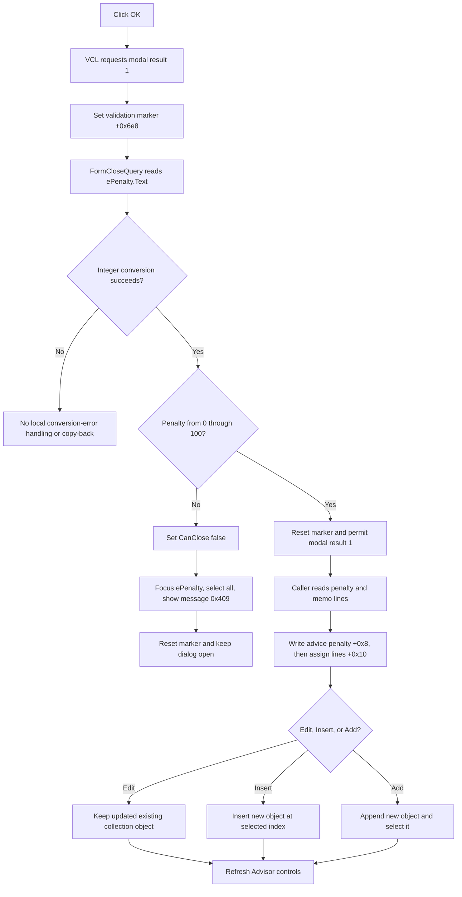

# Accept advice text and a validated penalty

## Control

| Property | Recovered value |
| --- | --- |
| Form | EditAdviceDlg |
| Form caption template | Edit Advice #%d |
| Component path | EditAdviceDlg.OKBtn |
| Control class | TBitBtn |
| Button kind | `bkOK` |
| Explicit caption | Not present in the recovered resource. |
| Handler name | OKBtnClick |
| Handler address | 01b728f0 |
| Graph node | `resource:dfm:EditAdviceDlg/EditAdviceDlg.OKBtn` |
| Handler node | `function:01b728f0` |
| Graph layer | UI |

## What happens when clicked

`FUN_01b728f0` does not read either editor. It sets dialog byte `+0x6e8` to `1`. This byte is a one-use request that tells the form's `OnCloseQuery` handler to validate an OK close.

The resource gives the button `Kind = bkOK`. The recovered VCL button path assigns modal result `1` before it dispatches the custom `OnClick`. The modal form then calls `FUN_01b72920`, its `FormCloseQuery` handler. Thus, the OK command is split into three stages:

1. VCL requests an accepted modal close.
2. `OKBtnClick` marks that close for penalty validation.
3. `FormCloseQuery` either permits the modal return or vetoes it.

The button handler itself does not copy any field to the advice object.

## Fields loaded into the dialog

The three recovered Schematic Editor callers initialize the dialog through `FUN_01b72750`. The dialog does not retain the supplied advice-object pointer. It copies these values into its controls:

- The 16-bit signed penalty at advice offset `+0x8` is converted to text and written to `ePenalty` at dialog offset `+0x6d0`.
- The string-list object at advice offset `+0x10` is assigned to `mAdvice.Lines`; `mAdvice` is at dialog offset `+0x6c0`.
- The caller's one-based item number is inserted into the `Edit Advice #%d` caption template. The formatted caption is stored at dialog offset `+0x6f0` and applied by `FormActivate`.

Only the penalty and memo lines are editable result fields. The formatted item number is display context and is not copied back.

## Penalty validation and close veto

When byte `+0x6e8` is set, `FUN_01b72920` reads `ePenalty.Text` and converts it to an integer.

- Values from `0` through `100`, inclusive, pass the range check.
- A value below `0` or above `100` sets the caller's `CanClose` byte to false.
- On that range failure, the handler makes `ePenalty` the active control, selects all of its text, and displays localized message resource `0x409`. The exact recovered message text is not available.

The handler resets byte `+0x6e8` to zero after the range check, whether the range passes or fails. A later OK click sets it again and runs validation again.

The integer converter has its own exception path for malformed text. `FormCloseQuery` has no local handler for that exception. Therefore, the recovered source does not prove the range message, focus change, marker reset, modal return, or caller copy-back after a conversion exception.

The memo content has no empty-text, length, line-count, or syntax validation in this path.

## Accepted copy-back

After a valid close, `ShowModal` returns `1`. Each caller tests this value before it calls `FUN_01b72860`.

The copy-back helper reads and converts `ePenalty.Text` again. It then passes the integer and `mAdvice.Lines` to `FUN_012be110`, which:

1. writes the penalty to the advice object's 16-bit field at `+0x8`; and
2. assigns the memo line collection to the advice object's existing string-list object at `+0x10`.

This updates the live advice object only after the modal dialog closes successfully. The advice text remains a line collection; the helper does not flatten it into one string.

## Caller ownership and consumption

The dialog is used by three Schematic Editor Expert Manager commands:

### Edit selected advice

`FUN_01c7de90` requires a valid selected index and passes the existing collection-owned advice object to the initializer. On accepted return, it copies the dialog values into that same object and refreshes the Advisor controls. Cancel leaves the existing object unchanged.

### Insert advice

`FUN_01c7df90` requires a valid selected index and allocates a new default advice object. On accepted return, it copies the dialog values into the new object, inserts that object at the selected index, and refreshes the Advisor controls. When the result is not accepted, it destroys the new object instead of inserting it.

### Add advice

`FUN_01c7e0d0` allocates a new default advice object and labels the dialog with the next one-based item number. On accepted return, it copies the values, appends the object, stores the returned collection index as the current selection, and refreshes the Advisor controls. When the result is not accepted, it destroys the new object.

All three callers destroy the modal dialog after `ShowModal`. The dialog is only a staging UI. Existing advice remains collection-owned, and newly allocated advice becomes collection-held only on the accepted insert or add path.

The shared Advisor refresh `FUN_01c7e2a0` updates command enabled states, the current-item count text, and the main penalty and advice displays. It does not save a file.

## Cancel contrast

`CancelBtn` has `Kind = bkCancel` and no recovered custom `OnClick`. The dialog initializer sets the validation marker to zero. A Cancel close therefore passes through `FormCloseQuery` without parsing or validating the penalty.

The callers copy data back only when `ShowModal` returns `1`. A Cancel result does not mutate an existing advice object. Insert and Add destroy their unaccepted temporary advice objects. If the user first attempts an out-of-range OK close, that attempt resets the marker after the veto; a later Cancel still skips validation and copy-back.

## Persistence and output boundary

The accepted path changes the live Expert Manager advisor collection and refreshes its visible controls. It does not call a project-save routine, file writer, explicit modified-state setter, or undo helper.

Advice records are serializable. `FUN_012be030` writes the 16-bit penalty and advice line collection, and parent writer `FUN_012be5d0` invokes it for every advice record in the collection. A later parent-model save can therefore preserve accepted changes. This OK click does not start that save.

## Partial failures and repeated actions

- An out-of-range penalty changes no advice object because the modal close is vetoed before caller copy-back.
- `FUN_012be110` writes the penalty before it assigns the memo lines. If the line assignment raises, the penalty can already be changed while the old or partly assigned line state remains.
- Edit refresh happens after copy-back. A refresh failure does not roll back the changed existing object.
- Insert and Add copy fields before collection insertion. A later insertion or refresh failure has no recovered rollback transaction.
- A successful modal close ends that dialog session. Editing again creates and initializes another dialog from the then-current advice object.
- The handler and callers have no retry or local error-reporting path for allocation, copy-back, insertion, refresh, or serialization failures.

## OK flow

## Evidence

- [OK handler `FUN_01b728f0`](../../../DecompiledSources/Tina16/functions/0000000001B728F0__FUN_01b728f0.c) sets only the validation marker.
- [`FUN_0082bc30`](../../../DecompiledSources/Tina16/functions/000000000082BC30__FUN_0082bc30.c), [`FUN_0082b0e0`](../../../DecompiledSources/Tina16/functions/000000000082B0E0__FUN_0082b0e0.c), [`FUN_00687f30`](../../../DecompiledSources/Tina16/functions/0000000000687F30__FUN_00687f30.c), and [`FUN_00650840`](../../../DecompiledSources/Tina16/functions/0000000000650840__FUN_00650840.c) prove the `bkOK` kind mapping, inherited button route, modal-result write, and later `OnClick` dispatch.
- [`FUN_01b72920`](../../../DecompiledSources/Tina16/functions/0000000001B72920__FUN_01b72920.c) implements the integer range check, close veto, focus, select-all, localized message, and marker reset.
- [`FUN_01b72750`](../../../DecompiledSources/Tina16/functions/0000000001B72750__FUN_01b72750.c) initializes the title, penalty edit, and advice memo from the supplied record.
- [`FUN_01b72900`](../../../DecompiledSources/Tina16/functions/0000000001B72900__FUN_01b72900.c) applies the formatted title on activation.
- [`FUN_01b72860`](../../../DecompiledSources/Tina16/functions/0000000001B72860__FUN_01b72860.c) reads the accepted controls and delegates record update.
- [`FUN_012be110`](../../../DecompiledSources/Tina16/functions/00000000012BE110__FUN_012be110.c) writes the penalty and assigns the memo lines to the advice record.
- [Edit caller `FUN_01c7de90`](../../../DecompiledSources/Tina16/functions/0000000001C7DE90__FUN_01c7de90.c), [Insert caller `FUN_01c7df90`](../../../DecompiledSources/Tina16/functions/0000000001C7DF90__FUN_01c7df90.c), and [Add caller `FUN_01c7e0d0`](../../../DecompiledSources/Tina16/functions/0000000001C7E0D0__FUN_01c7e0d0.c) prove modal-result testing, object ownership, collection insertion, and rejected-object cleanup.
- [`FUN_01c7e2a0`](../../../DecompiledSources/Tina16/functions/0000000001C7E2A0__FUN_01c7e2a0.c) refreshes the Advisor UI after accepted model changes.
- [`FUN_012be030`](../../../DecompiledSources/Tina16/functions/00000000012BE030__FUN_012be030.c) and [`FUN_012be5d0`](../../../DecompiledSources/Tina16/functions/00000000012BE5D0__FUN_012be5d0.c) provide the later record and parent-model serialization evidence.
- [`FUN_0043fc00`](../../../DecompiledSources/Tina16/functions/000000000043FC00__FUN_0043fc00.c) provides the malformed-integer exception boundary.
- [`FUN_00801e40`](../../../DecompiledSources/Tina16/functions/0000000000801E40__FUN_00801e40.c) and [`FUN_00680ad0`](../../../DecompiledSources/Tina16/functions/0000000000680AD0__FUN_00680ad0.c) focus the penalty editor and select all text after a range failure.
- [Recovered UI evidence](../../../DecompiledSources/Tina16/resources/dfm/ui-evidence.json) identifies `mAdvice`, `ePenalty`, `bkOK`, `bkCancel`, the labels, and the lifecycle event bindings.

## Annotation ownership

This Bead owns `FUN_01b728f0`, `FUN_01b72920`, `FUN_01b72750`, `FUN_01b72860`, and `FUN_012be110`. The Schematic Editor Edit, Insert, and Add handlers and shared Advisor UI refresh are evidence-only for their future control articles.
