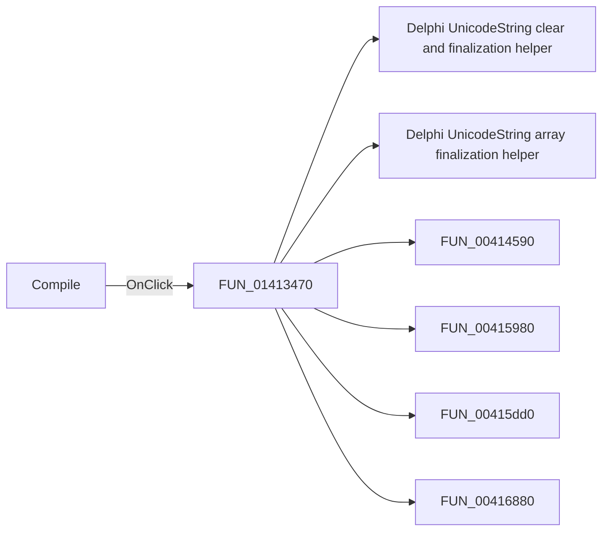

# Compile

> Analysis status: Pending individual source review.

## Control

| Property | Recovered value |
| --- | --- |
| Form | EditMCUInput |
| Component path | EditMCUInput.pnToolbar.sbCompile |
| Control class | TSpeedButton |
| Caption | Not present in the recovered resource. |
| Hint | Compile |
| Text | Not present in the recovered resource. |
| Handler name | sbCompileClick |
| Handler address | 01413470 |
| Graph node | `resource:dfm:EditMCUInput/EditMCUInput.pnToolbar.sbCompile` |
| Handler node | `function:01413470` |
| Graph layer | UI |

## What happens when clicked

Pending individual analysis. An agent must read the recovered handler source and its relevant callees before it replaces this text.

## Click flow

## Handler evidence

- Source: [DecompiledSources/Tina16/functions/0000000001413470__FUN_01413470.c](../../../DecompiledSources/Tina16/functions/0000000001413470__FUN_01413470.c)
- Recovered role: Not present in the recovered resource.
- Current graph summary: Handles 1 Delphi UI event: EditMCUInput.pnToolbar.sbCompile.OnClick.
- Current graph behavior: Not present in the recovered resource.
- Current graph evidence: Not present in the recovered resource.
- Complexity: complex
- Distinct outgoing calls: 18

## Direct calls

- `function:00414480` — Delphi UnicodeString clear and finalization helper
- `function:00414560` — Delphi UnicodeString array finalization helper
- `function:00414590` — FUN_00414590
- `function:00415980` — FUN_00415980
- `function:00415dd0` — FUN_00415dd0
- `function:00416880` — FUN_00416880
- `function:00416ad0` — FUN_00416ad0
- `function:00416cd0` — FUN_00416cd0
- `function:004425e0` — FUN_004425e0
- `function:00442620` — FUN_00442620
- `function:00442ae0` — FUN_00442ae0
- `function:006eae90` — FUN_006eae90
- `function:00e02960` — Calls the VHDL_DLL2.DLL export _compile_asm.
- `function:010a6f60` — FUN_010a6f60
- `function:01412f00` — FUN_01412f00
- `function:01413250` — FUN_01413250
- `function:015ff5b0` — FUN_015ff5b0
- `function:01d43440` — FUN_01d43440

## Resource evidence

- Kind: Not present in the recovered resource.
- Modal result: Not present in the recovered resource.
- Checked state: Not present in the recovered resource.
- List items: Not present in the recovered resource.
- Image reference: Not present in the recovered resource.
- Extracted glyph: [`0135_EditMCUInput_EditMCUInput_pnToolbar_sbCompile_Glyph_Data.png`](../../../glyph/0135_EditMCUInput_EditMCUInput_pnToolbar_sbCompile_Glyph_Data.png)

## Nearby label candidates

Nearby labels are layout candidates only. They are not proof of behavior.

- No same-parent label candidate is available.

## Analysis limits

- Do not infer behavior from the control class, caption, hint, glyph, or nearby label alone.
- Do not replace the pending status until the handler source and relevant call path provide enough evidence.
