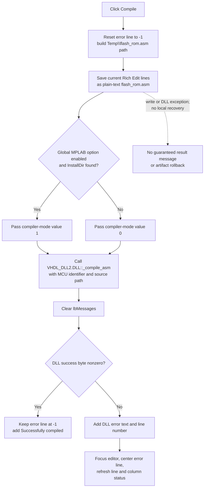

# Compile the current MCU source

> Analysis status: Evidence-backed source review complete.

## Control

| Property | Recovered value |
| --- | --- |
| Form | EditMCUInput |
| Form caption | MCU Source Code Editor |
| Component path | EditMCUInput.pnToolbar.sbCompile |
| Control class | TSpeedButton |
| Caption | Not present in the recovered resource. |
| Hint | Compile |
| Handler name | sbCompileClick |
| Handler address | 01413470 |
| Graph node | `resource:dfm:EditMCUInput/EditMCUInput.pnToolbar.sbCompile` |
| Handler node | `function:01413470` |
| Graph layer | UI |

## Compile inputs

`FUN_01413470` compiles two inputs that are already held by the dialog:

- The current text in `EditMCUInput.Panel3.Panel5.eEditor` is the assembly
  source. The handler switches the Rich Edit lines to plain-text mode, saves
  them to the TINA temporary file `flash_rom.asm`, and resets that mode to
  false before it starts the compiler.
- Dialog field `+0x758` supplies the MCU identifier. The modal caller
  `FUN_01418a70` copies this value from its own MCU field before it shows the
  editor. Other recovered checks compare the caller field with prefixes such
  as `PIC10`, `PIC12`, `PIC14`, and `PIC16`, which establishes that it is a
  device identifier and not source text.

The handler converts the MCU identifier to a null-terminated byte buffer and
the temporary path to a null-terminated wide-character buffer. It then passes
both buffers to `VHDL_DLL2.DLL::_compile_asm`.

There is no source-selection dialog on this path. The click always uses the
current editor and the MCU identifier staged when this modal editor was
opened. It does not check for an empty editor or an empty MCU identifier before
calling the DLL.

## What happens when clicked

The handler first writes `-1` to dialog field `+0x748`, which is the current
compiler-error line. It constructs the TINA temporary path ending in
`Temp\\flash_rom.asm` and saves the current editor lines there as plain text.
This is an unconditional temporary save for compilation. It is not the
**Save to Macro** action, it does not show `SaveDialog`, and it does not set the
dialog commit byte at `+0x760`.

`FUN_015ff5b0` selects the first argument to `_compile_asm`. It returns `1`
only when a global compiler option is enabled and an MPLAB X installation can
be resolved. `FUN_015fede0` opens `HKEY_LOCAL_MACHINE` for read access and
reads `InstallDir` below the MPLAB X key. `FUN_015fecc0` first tests the
`Software\\Wow6432Node\\Microchip\\MPLAB X` path and otherwise uses
`Software\\Microchip\\MPLAB X`. If the option is disabled, the key or value
is absent, or the read fails, the selector passes `0` to the DLL. The recovered
caller does not start a process itself; any compiler process used inside
`VHDL_DLL2.DLL` is outside the recovered source.

The DLL call is synchronous in the recovered handler. It receives output
locations for a success byte, an error-text buffer, and the error-line field.
Immediately after the call, the handler clears `lbMessages` and takes one of
two branches:

- If the success byte is nonzero, it resets the error line to `-1` and adds
  **Successfully compiled** to `lbMessages`.
- If the success byte is zero, it adds
  **Error: _DLL text_ in line _number_** to `lbMessages`. It focuses the
  editor, calls `FUN_010a6f60` to move the returned line near the vertical
  center of the Rich Edit view, and refreshes the localized line-and-column
  text in `pnEditStatus`. The stored error line is also used by the editor's
  recovered drawing route to mark the failing line.

The handler does not close the editor after either result. A second click
replaces the prior message because it clears the message list before adding
the new result.

## Output and persistence boundary

The direct caller-side artifact is the overwritten temporary
`flash_rom.asm`. A separate recovered caller of the same `_compile_asm` export
opens sibling `flash_rom.hex` and `flash_rom.lst` files after a successful
call. This is evidence for the compiler's expected output names. This click
handler itself does not open those files, install a new MCU program, update a
project object, or verify that an output file is newer than a previous one.

Compile also does not set the dialog's `+0x760` commit byte. The modal caller
uses that byte to distinguish the **Save to Macro** route from a close without
that save. Thus a successful compile does not commit the edited source to the
caller and does not persist project or macro data. The temporary source file
is still written before the DLL reports success or failure.

There is no caller-side cleanup, transaction, or rollback for
`flash_rom.asm`, `flash_rom.hex`, or `flash_rom.lst`. The recovered DLL body is
only an import stub, so its behavior for partial or stale output files on
failure is unknown. The handler also has no local exception handler. A file
write, DLL load, registry, or DLL exception can leave the temporary files as
they are and can exit before a result message is added.

## Click flow

## Handler and call-path evidence

- Compile controller and result branches:
  [FUN_01413470](../../../DecompiledSources/Tina16/functions/0000000001413470__FUN_01413470.c)
- Modal setup and staged MCU identifier transfer:
  [FUN_01418a70](../../../DecompiledSources/Tina16/functions/0000000001418A70__FUN_01418a70.c)
- MCU-family comparisons that identify that field:
  [FUN_014181d0](../../../DecompiledSources/Tina16/functions/00000000014181D0__FUN_014181d0.c)
  and
  [FUN_01419110](../../../DecompiledSources/Tina16/functions/0000000001419110__FUN_01419110.c)
- Compiler-mode selection and MPLAB X discovery:
  [FUN_015ff5b0](../../../DecompiledSources/Tina16/functions/00000000015FF5B0__FUN_015ff5b0.c),
  [FUN_015fede0](../../../DecompiledSources/Tina16/functions/00000000015FEDE0__FUN_015fede0.c),
  and
  [FUN_015fecc0](../../../DecompiledSources/Tina16/functions/00000000015FECC0__FUN_015fecc0.c)
- External compiler import:
  [VHDL_DLL2.DLL::_compile_asm](../../../DecompiledSources/Tina16/functions/0000000000E02960__VHDL_DLL2.DLL___compile_asm.c)
- Error focus, centering, and status refresh:
  [FUN_01413250](../../../DecompiledSources/Tina16/functions/0000000001413250__FUN_01413250.c),
  [FUN_010a6f60](../../../DecompiledSources/Tina16/functions/00000000010A6F60__FUN_010a6f60.c),
  and
  [FUN_01412f00](../../../DecompiledSources/Tina16/functions/0000000001412F00__FUN_01412f00.c)
- Error-line drawing callback:
  [FUN_01412d60](../../../DecompiledSources/Tina16/functions/0000000001412D60__FUN_01412d60.c)
- Parallel use of the same export and its expected `.hex` and `.lst` outputs:
  [FUN_01418330](../../../DecompiledSources/Tina16/functions/0000000001418330__FUN_01418330.c)
- Recovered form tree and event binding:
  [ui-evidence.json](../../../DecompiledSources/Tina16/resources/dfm/ui-evidence.json)

## Resource evidence and annotation ownership

- The button hint is **Compile**. Its extracted 32-by-16, two-glyph bitmap
  resembles an enabled and disabled compile-tool image:
  [`0135_EditMCUInput_EditMCUInput_pnToolbar_sbCompile_Glyph_Data.png`](../../../glyph/0135_EditMCUInput_EditMCUInput_pnToolbar_sbCompile_Glyph_Data.png).
  The source call to `_compile_asm` establishes the action; the hint and glyph
  only support that interpretation.
- This Bead owns `FUN_01413470`, `FUN_015ff5b0`, `FUN_015fede0`,
  `FUN_015fecc0`, and compile-error centering helper `FUN_010a6f60`.
- Generic editor focus `FUN_01413250`, caret-status refresh `FUN_01412f00`,
  Rich Edit plain-text mode, and shared save/file helpers remain evidence-only
  for their coordinated owners.
- The recovered source does not expose the Delphi names of fields `+0x748`,
  `+0x758`, or `+0x760`. Their names here describe their proven data flow.
