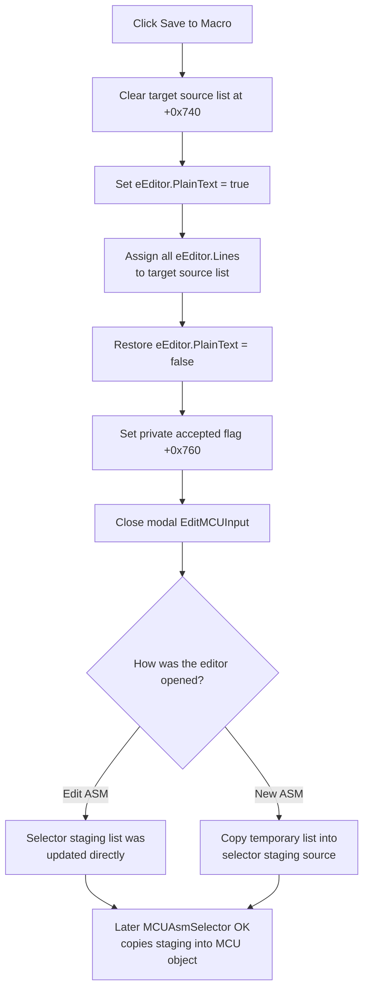

# Save the editor source to the MCU macro

> Analysis status: Reviewed from the recovered resource and glyph, Save handler, editor initialization paths, Compile and Save ASM siblings, modal caller, and MCU selector copy-back.

## Control

| Property | Recovered value |
| --- | --- |
| Form | EditMCUInput |
| Form caption | MCU Source Code Editor |
| Component path | EditMCUInput.pnToolbar.sbSave |
| Control class | TSpeedButton |
| Caption | Not present in the recovered resource. |
| Hint | Save to Macro |
| Handler name | sbSaveClick |
| Handler address | 014131e0 |
| Graph node | `resource:dfm:EditMCUInput/EditMCUInput.pnToolbar.sbSave` |
| Handler node | `function:014131e0` |
| Graph layer | UI |

The extracted 40-by-20 two-state glyph shows a floppy disk. The hint identifies the destination as the macro. The handler and its caller establish that this is an in-memory copy, not a file-save command.

## What happens when clicked

[`FUN_014131e0`](../../../DecompiledSources/Tina16/functions/00000000014131E0__FUN_014131e0.c) performs these operations in order:

1. It clears the target Delphi string list stored at form offset `+0x740`.
2. It sets `eEditor.PlainText` through the shared Rich Edit helper [`FUN_006eae90`](../../../DecompiledSources/Tina16/functions/00000000006EAE90__FUN_006eae90.c).
3. It assigns the complete `eEditor.Lines` collection at `eEditor +0x510` to the cleared target list.
4. It restores `eEditor.PlainText` to false.
5. It sets the private accepted flag at form offset `+0x760` to true and calls the shared VCL close pipeline [`FUN_00805200`](../../../DecompiledSources/Tina16/functions/0000000000805200__FUN_00805200.c).

The click therefore replaces the target MCU source list with all current editor lines. It does not append only a selection, and it does not depend on a successful compile.

## Target, format, and encoding

The save target is the string-list object passed to the editor at `+0x740`. The handler does not read `EditMCUInput.SaveDialog`, construct a path, call `SaveToFile`, test for an existing file, or request overwrite confirmation.

The temporary `PlainText` setting makes the Rich Edit expose source text instead of RTF data. The handler then uses an in-memory Delphi `TStrings.Assign` operation. No disk encoding or byte format is selected in this click path. The result remains a collection of Delphi strings until a later owner serializes the MCU data.

## Caller ownership and copy-back

The shared editor opener [`FUN_01418a70`](../../../DecompiledSources/Tina16/functions/0000000001418A70__FUN_01418a70.c) supports two caller cases from `MCUAsmSelector`:

- **Edit ASM:** [`FUN_01418ba0`](../../../DecompiledSources/Tina16/functions/0000000001418BA0__FUN_01418ba0.c) passes the selector's existing staging list to [`FUN_01412dd0`](../../../DecompiledSources/Tina16/functions/0000000001412DD0__FUN_01412dd0.c). That setup routine writes the input list to a temporary `temp.asm` file and loads it into the Rich Edit. This temporary path initializes the editor; the Save click does not write it again. Because the list is shared, Save replaces the selector's staging source directly.
- **New ASM:** [`FUN_01418c30`](../../../DecompiledSources/Tina16/functions/0000000001418C30__FUN_01418c30.c) creates a temporary empty string list. Save fills that list. After the modal editor returns, `FUN_01418a70` copies it into the selector's staging source only when the private accepted flag is true, then destroys the temporary object.

The selector owns its three staging lists. Its OK handler [`FUN_01418c90`](../../../DecompiledSources/Tina16/functions/0000000001418C90__FUN_01418c90.c) later clears and replaces the corresponding lists in the target MCU object. Thus, **Save to Macro** commits the editor text to selector staging; the MCU selector's OK action is the next model copy-back boundary. This handler does not save the TINA document or settings to disk.

## Modified state and close behavior

The handler does not read the Rich Edit's modified state and does not clear a recovered modified flag. Every click replaces the target list, even when the text has not changed. Offset `+0x760` is not an editor-dirty flag: [`FUN_01413100`](../../../DecompiledSources/Tina16/functions/0000000001413100__FUN_01413100.c) initializes it to false, this handler sets it to true after the copy, and the caller tests it to decide whether to accept a new temporary list.

`FUN_00805200` closes a modal VCL form by setting modal result `2` (`mrCancel`). `EditMCUInput` does not use that modal result to distinguish Save from dismissal; its caller uses the private accepted flag. On the modal branch, the recovered close routine does not run the modeless CloseQuery and close-action dispatch. There is no Save-specific close veto in this path.

If the user closes the editor without clicking Save, the flag stays false. An existing selector staging list remains unchanged because the Save handler did not clear it. For New ASM, the caller does not copy the temporary list and destroys it.

## Relation to Compile and Save ASM

- **Compile** ([`FUN_01413470`](../../../DecompiledSources/Tina16/functions/0000000001413470__FUN_01413470.c)) temporarily exposes the same editor as plain text, writes it to `flash_rom.asm`, calls the external assembler, and reports success or a line error. It does not update the target source list, set the accepted flag, or close the form.
- **Save ASM** ([`FUN_014137c0`](../../../DecompiledSources/Tina16/functions/00000000014137C0__FUN_014137c0.c)) opens `EditMCUInput.SaveDialog`; when accepted, it writes the editor lines to the chosen path. It does not update the macro source list, set the accepted flag, or close the form.
- **Save to Macro** does not call either sibling handler. It does not compile, export an ASM file, use their selected path, or inspect their result.

## No-op, overwrite, and error behavior

- There is no empty-text guard. Saving an empty editor clears the target source list and accepts that empty result.
- There is no file overwrite or partial-file case because this handler performs no file I/O.
- There is no validation, confirmation, message, local exception handler, or rollback.
- The target is cleared before `TStrings.Assign`. If assignment raises, the recovered order leaves the target already cleared or partly replaced; the accepted flag is not set and the close call is not reached. The handler also has no `finally` block that proves restoration of `PlainText` after such an exception.
- On the normal path, repeated clicks are not possible after the first click closes the modal editor. Reopening the editor creates a new form instance.

## Save flow

## Evidence

- Save handler: [FUN_014131e0](../../../DecompiledSources/Tina16/functions/00000000014131E0__FUN_014131e0.c)
- Form initialization and accepted-flag reset: [FUN_01413100](../../../DecompiledSources/Tina16/functions/0000000001413100__FUN_01413100.c)
- Existing-source editor setup: [FUN_01412dd0](../../../DecompiledSources/Tina16/functions/0000000001412DD0__FUN_01412dd0.c)
- New-source editor setup: [FUN_01412ed0](../../../DecompiledSources/Tina16/functions/0000000001412ED0__FUN_01412ed0.c)
- Shared editor opener and return handling: [FUN_01418a70](../../../DecompiledSources/Tina16/functions/0000000001418A70__FUN_01418a70.c)
- Edit and New caller wrappers: [FUN_01418ba0](../../../DecompiledSources/Tina16/functions/0000000001418BA0__FUN_01418ba0.c), [FUN_01418c30](../../../DecompiledSources/Tina16/functions/0000000001418C30__FUN_01418c30.c)
- MCU selector OK copy-back: [FUN_01418c90](../../../DecompiledSources/Tina16/functions/0000000001418C90__FUN_01418c90.c)
- Shared Rich Edit plain-text setter: [FUN_006eae90](../../../DecompiledSources/Tina16/functions/00000000006EAE90__FUN_006eae90.c)
- Shared VCL close pipeline: [FUN_00805200](../../../DecompiledSources/Tina16/functions/0000000000805200__FUN_00805200.c)
- Compile sibling: [FUN_01413470](../../../DecompiledSources/Tina16/functions/0000000001413470__FUN_01413470.c)
- Save ASM sibling: [FUN_014137c0](../../../DecompiledSources/Tina16/functions/00000000014137C0__FUN_014137c0.c)
- Recovered resources: [ui-evidence.json](../../../DecompiledSources/Tina16/resources/dfm/ui-evidence.json)
- Save glyph: [sbSave Glyph](../../../glyph/0134_EditMCUInput_EditMCUInput_pnToolbar_sbSave_Glyph_Data.png)

## Annotation ownership

This Bead owns only the unique `EditMCUInput.sbSaveClick` handler `FUN_014131e0`. The Rich Edit plain-text setter, VCL close pipeline, modal opener, selector handlers, and file-related sibling paths are shared evidence and are not annotated by this Bead.
