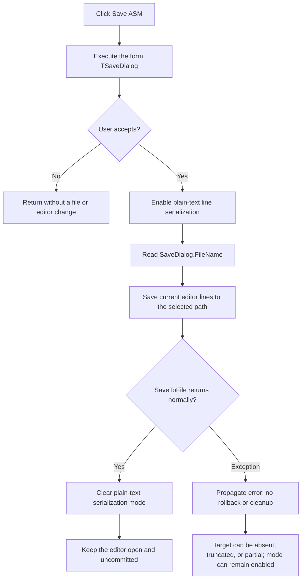

# Export the current MCU source as assembly text

## Control

| Property | Recovered value |
| --- | --- |
| Form | EditMCUInput |
| Component path | EditMCUInput.pnToolbar.sbSaveASM |
| Control class | TSpeedButton |
| Caption | Not present in the recovered resource. |
| Hint | Save ASM |
| Editor | EditMCUInput.Panel3.Panel5.eEditor (`TMyRichEdit`) |
| Handler name | sbSaveASMClick |
| Handler address | 014137c0 |
| Graph node | `resource:dfm:EditMCUInput/EditMCUInput.pnToolbar.sbSaveASM` |
| Handler node | `function:014137c0` |
| Graph layer | UI |

## What happens when clicked

Save ASM exports the current contents of the MCU source editor to a path that the user selects. It does not compile the source and does not commit the edited source back to the owning macro.

The handler opens the form's `TSaveDialog`. If the user cancels, it returns without changing the editor or creating a file. If the user accepts, it enables the rich-edit line object's plain-text serialization mode, gets the dialog's accepted `FileName`, and calls the line object's one-argument `SaveToFile` virtual method. After a successful write, it clears the plain-text mode again.

The exported content is the editor's current line collection. The handler does not add an assembly header, compiler arguments, object code, listing data, or diagnostics. The assembly meaning comes from the editor's source content and the `Save ASM` command context.

## Path, format, and encoding

- The DFM contains a plain `TSaveDialog` with no recovered filter, default extension, title, initial directory, options override, or initial file name. The handler does not configure any of these properties before `Execute`.
- The accepted path comes directly from `SaveDialog.FileName`. The handler does not append or force `.asm`.
- The line object is put into plain-text serialization mode for the write. The file is not RTF.
- `SaveToFile` receives only the path. No encoding, code page, byte-order-mark, or line-ending argument is present. Therefore, the exact byte encoding and BOM behavior depend on the line object's internal/default encoding and are not recoverable from this handler.
- The handler has no explicit file-existence test or overwrite prompt. Any prompt is the save dialog's responsibility. After acceptance, the line object's file-save implementation owns file creation or replacement.

## Editor and document state

The handler does not change the editor text, selection, caret, syntax state, modified flag, compile messages, error line, form caption, or caller-owned source list. It does not set the form's accepted-save byte at `+0x760` and does not close the form. The accepted path remains the dialog component's current `FileName`, but no project field, macro field, registry value, or settings file receives it in this path.

The only persistent output is the selected external text file. A successful export does not prove that the macro or project now owns that file, and it does not mark the edit session as committed.

## Save and Compile comparison

- `sbSave` is the commit command. It clears and assigns the current editor lines into the caller-owned macro source list, sets the form's accepted-save byte, and closes the form through the VCL close pipeline. It does not ask for a file path.
- `sbCompile` uses the same editor lines but saves them to an internally constructed path ending in `flash_rom.asm`. It then calls `_compile_asm`, clears and updates the message list, and selects or reports a compiler error line. It does not use `SaveDialog`.
- `sbSaveASM` only performs the user-selected plain-text export. It neither calls `_compile_asm` nor updates the caller-owned source list.

## Click flow

## Cancellation, overwrite, and failure behavior

- Cancel is a clean no-op. The plain-text mode and file-save path are not entered.
- The handler has no local confirmation or overwrite branch. The recovered dialog resource does not state whether its native options request overwrite confirmation.
- The write has no local exception handler and no `try/finally`. If filename access or `SaveToFile` fails after plain-text mode is enabled, the exception propagates and that mode can remain enabled.
- There is no temporary-file-then-rename transaction, backup, delete-on-failure step, or rollback. If the file implementation creates or truncates the target before a later write failure, the destination can be empty or partial.
- The handler does not display an error message or update `lbMessages`. A higher-level VCL exception path, if any, is outside the recovered handler.
- A repeated successful click opens the dialog again and writes the editor's then-current content. It does not compare the file with the previous export.

## Handler evidence

- [Save ASM handler `FUN_014137c0`](../../../DecompiledSources/Tina16/functions/00000000014137C0__FUN_014137c0.c) guards all export work with the save dialog's accepted result, toggles the editor line flag, reads `FileName`, and invokes the lines object's one-argument save virtual.
- [Plain-text mode setter `FUN_006eae90`](../../../DecompiledSources/Tina16/functions/00000000006EAE90__FUN_006eae90.c) writes the serialization flag on the rich edit's line object. Save, Compile, and Save ASM all bracket their line-copy or file-save operation with this setter.
- [Dialog filename getter `FUN_00724270`](../../../DecompiledSources/Tina16/functions/0000000000724270__FUN_00724270.c) returns the selected native-dialog path when active or the dialog's stored `FileName` otherwise.
- [Save-to-macro handler `FUN_014131e0`](../../../DecompiledSources/Tina16/functions/00000000014131E0__FUN_014131e0.c) assigns editor lines to the caller-owned list, sets `+0x760`, and closes the form.
- [Compile handler `FUN_01413470`](../../../DecompiledSources/Tina16/functions/0000000001413470__FUN_01413470.c) saves the same editor lines to the internal `flash_rom.asm` path, calls `_compile_asm`, and updates compile diagnostics.
- [Form creation `FUN_01413100`](../../../DecompiledSources/Tina16/functions/0000000001413100__FUN_01413100.c) initializes the accepted-save byte to false. Save ASM does not change it.
- [Caller coordinator `FUN_01418a70`](../../../DecompiledSources/Tina16/functions/0000000001418A70__FUN_01418a70.c) checks the accepted-save byte after the modal editor returns and updates the caller only on the committed Save path.
- [Recovered Delphi resource evidence](../../../DecompiledSources/Tina16/resources/dfm/ui-evidence.json) establishes the editor, generic save dialog, `Save ASM`, `Save to Macro`, and `Compile` controls.
- [Extracted two-frame glyph](../../../glyph/0136_EditMCUInput_EditMCUInput_pnToolbar_sbSaveASM_Glyph_Data.png) shows the control's document/export artwork. The hint and source path, not the artwork alone, establish the export behavior.

## Direct calls

- `FUN_006eae90` enables and then clears the rich-edit line object's plain-text serialization mode.
- `FUN_00724270` gets the accepted save-dialog path.
- `FUN_00414480` finalizes the temporary Unicode path string.
- The dialog execution and line save are recovered virtual calls and do not have direct call-graph edges.

## Resource evidence

- `sbSaveASM` is a `TSpeedButton` with hint `Save ASM`, a two-frame embedded glyph, and no caption.
- `eEditor` is a `TMyRichEdit` in the source editor panel.
- `SaveDialog` has no recovered configuration properties other than its component identity and layout coordinates.
- The neighboring toolbar hints are `Save to Macro` and `Compile`, which match their distinct recovered handlers.

## Analysis limits

- The exact output encoding, BOM policy, and line-ending convention are properties of the unresolved line-object `SaveToFile` implementation, not arguments supplied here.
- The save dialog's default native overwrite behavior is not serialized in the recovered DFM.
- No code in this handler associates the exported path with a project or macro after the write.
