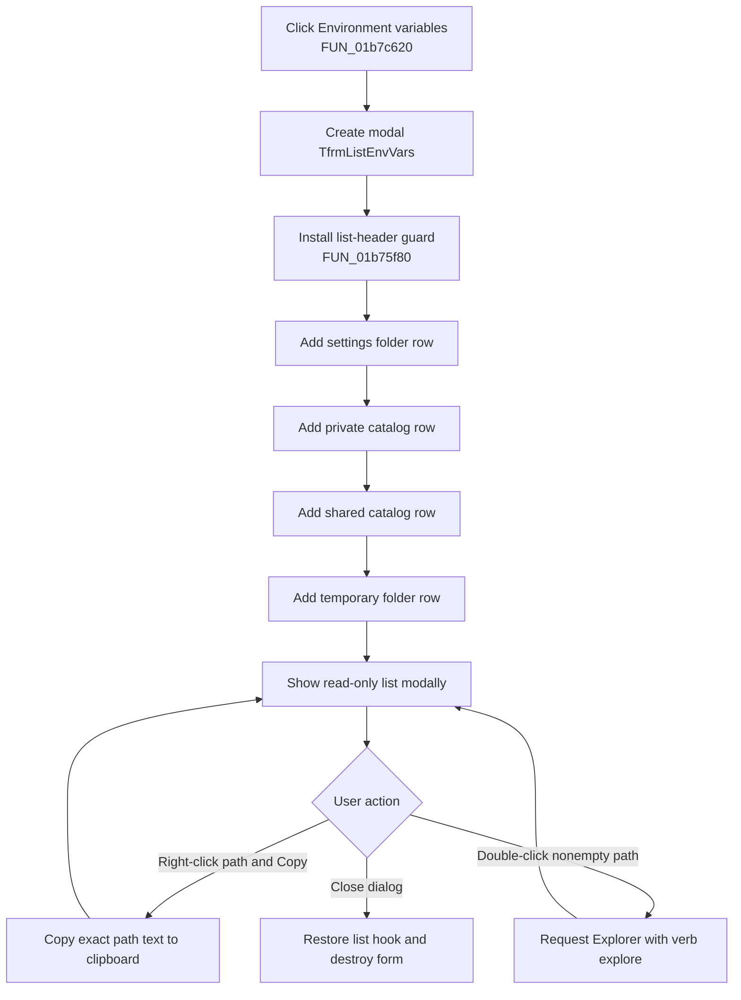

# Show the TINA folder variables

> Analysis status: Evidence-backed source review complete.

## Control

| Property | Recovered value |
| --- | --- |
| Form | EditorOpsDlg |
| Component path | EditorOpsDlg.btnListEnvVars |
| Control class | TButton |
| Caption | Environment variables |
| Hint | Not present in the recovered resource. |
| Handler name | btnListEnvVarsClick |
| Handler address | 01b7c620 |
| Graph node | `resource:dfm:EditorOpsDlg/EditorOpsDlg.btnListEnvVars` |
| Handler node | `function:01b7c620` |
| Graph layer | UI |

## What happens when clicked

`TEditorOpsDlg.btnListEnvVarsClick` creates a `TfrmListEnvVars` form owned by the global VCL application. It shows that form modally and destroys it after a normal modal return. The modal result is not read.

The modal form is a read-only `TListView` titled **Environment Variables**. Despite that title, the recovered code does not enumerate the Windows process environment. It adds exactly four TINA folder rows:

1. settings folder from `PTR_DAT_02005010`;
2. private catalog folder from `PTR_DAT_02004438`;
3. shared or common catalog folder from `PTR_DAT_02001340`;
4. temporary folder from `PTR_DAT_020030c8`.

Each row has a localized label and one path value. The label lookup keys are `d.ListEnvVars_sSettingsFolder`, `d.ListEnvVars_sCatalogFolder`, `d.ListEnvVars_sCommonCatalogFolder`, and `d.ListEnvVars_sTempFolder`. The source adds the rows in that order.

## Source of the values

The four values are application-wide folder strings that startup code has already resolved:

- The settings, private catalog, and temporary folders come from the corresponding TINA folder configuration, with application defaults applied during startup.
- The shared/common catalog folder is derived from the application installation layout.
- The button does not call `GetEnvironmentStrings`, `GetEnvironmentVariable`, the registry, or a shell command to discover more variables.
- The dialog is a snapshot. It copies the four current strings into list rows when the modal form is created.

If a folder string is empty, the row is still added with an empty value. There is no test that removes or replaces a missing value.

## List, sorting, and filtering behavior

- `lstvEnvVars` is read-only. The user cannot edit a label or path in the list.
- The recovered population path performs no sort and no filter. It appends the fixed four rows in source order.
- The form has no search field, category selector, refresh command, or filter handler.
- `FormCreate` replaces the list view's window procedure and blocks the ANSI and Unicode `HDN_BEGINTRACK` notifications. This prevents interactive column-width tracking. `FormDestroy` restores the original procedure.
- Selection and scrolling remain transient list-view state. They do not change the four global folder strings.

## Copy and open behavior

The list has a popup command named **Copy as text**. A right-click hit test records the path subitem under the pointer and opens the popup. The copy handler reads that subitem and places the exact text on the process-wide VCL clipboard as `CF_UNICODETEXT`. It does not copy a `name=value` pair or all four rows. An empty value causes no clipboard write.

A double-click resolves the text under the pointer. For nonempty text, it calls the recovered shell-execute thunk with verb `explore`. This asks Windows Explorer to open the path. The return value is not checked, so an invalid or unavailable folder has no form-specific error message.

Future Bead `.1934` owns the canonical annotation for **Copy as text** handler `FUN_01b76620`. This article cites that handler and the list mouse handlers but does not duplicate their annotations.

## Sensitive data handling

The dialog does not display every operating-system environment variable. It therefore does not intentionally enumerate passwords, tokens, or arbitrary process configuration.

The four folder paths are not masked. A settings or temporary path can contain a Windows account name, and a catalog path can contain a network server or share name. The list shows those values as plain text. **Copy as text** also publishes the selected path as plain Unicode text on the shared Windows clipboard, where another process can read it until the clipboard content changes.

## Click flow

## Mutation and persistence boundaries

- Opening, selecting, copying, and closing do not write the settings, private catalog, shared catalog, or temporary folder globals.
- The handler does not update any `EditorOpsDlg` control and does not invoke the Editor Options OK/commit path.
- It does not write `TINA.INI`, the registry, a project, or another file.
- Clipboard copy publishes the selected path. Double-click sends a path to Explorer but does not store it. The modal list, hit-test coordinates, and selection are discarded with the form.
- The dialog does not refresh while open. A later click creates a new form and reads the current global folder strings again.

## No-op and error behavior

- Four rows are added even when one or more values are empty. An empty path is displayed as an empty value.
- Copy is a no-op when the recorded path subitem is empty.
- Double-click does nothing when it does not resolve nonempty cell text.
- Shell navigation success is not checked.
- The launcher has no local message, retry, rollback, or exception handler for form construction, row population, modal display, clipboard, or shell failures. Normal VCL application error handling remains the boundary.

## Recovered evidence

- [`FUN_01b7c620`](../../../DecompiledSources/Tina16/functions/0000000001B7C620__FUN_01b7c620.c) constructs class `PTR_FUN_01b75828`, invokes modal-form slot `+0x2d0`, and then calls the nil-safe Delphi destructor.
- [`FUN_01b75f80`](../../../DecompiledSources/Tina16/functions/0000000001B75F80__FUN_01b75f80.c) installs the list notification hook and appends the four localized label/path rows. This Bead owns its canonical annotation.
- [`FUN_01b76700`](../../../DecompiledSources/Tina16/functions/0000000001B76700__FUN_01b76700.c) blocks the ANSI and Unicode begin-column-tracking notifications and delegates all other messages to the saved list procedure. [`FUN_01b766e0`](../../../DecompiledSources/Tina16/functions/0000000001B766E0__FUN_01b766e0.c) restores that procedure.
- [`FUN_01b76540`](../../../DecompiledSources/Tina16/functions/0000000001B76540__FUN_01b76540.c) records the right-clicked subitem and opens the popup. [`FUN_01b76620`](../../../DecompiledSources/Tina16/functions/0000000001B76620__FUN_01b76620.c) copies the corresponding subitem text through the VCL clipboard. Bead `.1934` owns the copy handler.
- [`FUN_01b76360`](../../../DecompiledSources/Tina16/functions/0000000001B76360__FUN_01b76360.c) resolves clicked cell text and sends nonempty text to the shell-execute thunk with verb `explore`.
- [`FUN_01d86bd0`](../../../DecompiledSources/Tina16/functions/0000000001D86BD0__FUN_01d86bd0.c) initializes the four folder globals during application startup.
- [`ui-evidence.json`](../../../DecompiledSources/Tina16/resources/dfm/ui-evidence.json) identifies `TfrmListEnvVars`, its read-only list view, the **Copy as text** popup command, and their event bindings. The launcher button has no hint, image, or glyph.

## Analysis limits

The resource extractor does not preserve the list-view column captions. The localization keys and row data flow identify each row's role, but the exact translated label text depends on runtime language resources. The shell thunk's `explore` verb and folder-path inputs establish Explorer navigation; the decompiler does not recover a direct import name for that thunk.
