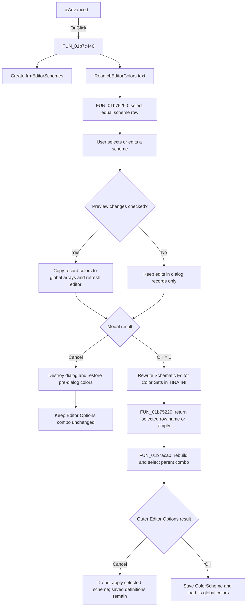

# &Advanced...

> Analysis status: Complete. The recovered handler and the color-scheme dialog call path support this explanation.

## Control

| Property | Recovered value |
| --- | --- |
| Form | EditorOpsDlg |
| Component path | EditorOpsDlg.gbEditorColors.btnSchemes |
| Control class | TButton |
| Caption | &Advanced... |
| Hint | Not present in the recovered resource. |
| Handler name | btnSchemesClick |
| Handler address | 01b7c440 |
| Graph node | `resource:dfm:EditorOpsDlg/EditorOpsDlg.gbEditorColors.btnSchemes` |
| Handler node | `function:01b7c440` |
| Graph layer | UI |

## What happens when clicked

`FUN_01b7c440` creates the modal `frmEditorSchemes` dialog. It reads the visible text from `EditorOpsDlg.gbEditorColors.cbEditorColors` and passes that name to `FUN_01b75290`. That helper looks for an equal name in `frmEditorSchemes.lbSchemes`. If it finds the name, it selects that row and calls the list-selection handler. An unknown name does not cause an error and does not select another row in this helper.

The scheme dialog loads its list from the `Schematic Editor Color Sets` section of `TINA.INI`. Each row owns a record with its display name, fixed identifier, Light or Dark mode, 27 main colors, and 16 paired colors. The two system schemes use fixed identifiers. Selecting one of those records disables its Scheme type radio group. Custom records can be added or copied, and their colors and mode can be changed. The dialog's delete handler also rejects the two system identifiers with the message `You cannot delete a system color scheme`.

List selection updates the color grid and, because `&Preview changes` is checked by default, copies the selected record's colors into the global editor-color arrays and refreshes the active schematic editor. Color-grid edits use the same preview path. Clearing `&Preview changes` restores the arrays that the dialog saved when it opened. The dialog destructor also restores those saved arrays and refreshes the editor. Therefore, a preview is temporary even when the scheme dialog closes with OK.

The modal result controls the lasting effects:

- Cancel uses the standard `bkCancel` button. The launcher destroys the dialog without reading its selection or rebuilding the parent combo box. The dialog restores the pre-dialog colors. It does not write its in-memory scheme records to the INI file.
- OK deletes the old `Schematic Editor Color Sets` section and writes every current record back to `TINA.INI`. It then sets modal result `1`. The launcher reads the selected row name with `FUN_01b75220`, rebuilds `cbEditorColors` from the saved INI records with `FUN_01b7aca0`, and selects the returned name when it is present.

The rebuilt combo-box selection is still an Editor Options value. It does not keep the inner dialog's preview colors. The outer `EditorOpsDlg.OKBtn` handler later saves the selected scheme name as `Schematic Editor/ColorScheme` and loads its colors into the global arrays. Canceling Editor Options leaves that selection unapplied. However, scheme definitions that the inner dialog already saved with its own OK remain in `TINA.INI`; the outer Cancel path does not roll them back.

`FUN_01b7aca0` also handles old or incomplete configuration data. While it rebuilds the combo box, it maps the legacy names `Black background` and `White background` to the two fixed system identifiers, supplies a missing identifier, and writes these repairs to the color-set section. If no requested name can be selected, it uses a matching known record when available or adds the localized fallback entry.

## Click flow

## Inputs, state, and outputs

- Input: the current `cbEditorColors` display text seeds the modal list selection.
- Dialog state: selected list row, Light or Dark mode, main colors, paired colors, and the Preview checkbox.
- Live preview state: the dialog temporarily replaces the global editor-color arrays and refreshes the schematic editor.
- Inner OK output: all scheme definitions are rewritten in `TINA.INI`, and the selected display name returns to Editor Options.
- Parent staged output: `cbEditorColors` is rebuilt and points to the returned scheme when that name exists.
- Outer OK output: the selected scheme name and its colors become the application settings.

## Error and no-op behavior

- If the current combo text is not in the modal list, `FUN_01b75290` leaves the list selection unchanged. It does not display an error.
- If no modal row is selected, `FUN_01b75220` returns an empty string. The parent rebuild helper then chooses its recovered matching or fallback path.
- Cancel does not call the parent combo rebuild path.
- The launcher has no recovered validation message, exception handler, retry, or rollback for an INI write failure. The recovered source does not establish how a lower-level I/O exception is presented.

## Source evidence

- Launcher: [FUN_01b7c440](../../../DecompiledSources/Tina16/functions/0000000001B7C440__FUN_01b7c440.c)
- Modal-list seed: [FUN_01b75290](../../../DecompiledSources/Tina16/functions/0000000001B75290__FUN_01b75290.c)
- Selected-name reader: [FUN_01b75220](../../../DecompiledSources/Tina16/functions/0000000001B75220__FUN_01b75220.c)
- Parent combo rebuild and legacy migration: [FUN_01b7aca0](../../../DecompiledSources/Tina16/functions/0000000001B7ACA0__FUN_01b7aca0.c)
- Scheme-dialog load and backup: [FUN_01b73c00](../../../DecompiledSources/Tina16/functions/0000000001B73C00__FUN_01b73c00.c)
- Scheme-row selection and preview: [FUN_01b74210](../../../DecompiledSources/Tina16/functions/0000000001B74210__FUN_01b74210.c) and [FUN_01b75500](../../../DecompiledSources/Tina16/functions/0000000001B75500__FUN_01b75500.c)
- Scheme-dialog OK persistence: [FUN_01b746d0](../../../DecompiledSources/Tina16/functions/0000000001B746D0__FUN_01b746d0.c) and [FUN_01aa02c0](../../../DecompiledSources/Tina16/functions/0000000001AA02C0__FUN_01aa02c0.c)
- Preview toggle and close-time restore: [FUN_01b756a0](../../../DecompiledSources/Tina16/functions/0000000001B756A0__FUN_01b756a0.c) and [FUN_01b755e0](../../../DecompiledSources/Tina16/functions/0000000001B755E0__FUN_01b755e0.c)
- Outer Editor Options commit: [FUN_01b7baa0](../../../DecompiledSources/Tina16/functions/0000000001B7BAA0__FUN_01b7baa0.c)

## Analysis limits

- The recovered source identifies the two protected system schemes by fixed identifiers and shows legacy Black and White name migration. It does not expose the original Delphi constant names for those identifiers.
- The outer Editor Options setup and open functions are owned by the adjacent OK-button analysis. This article only uses them to establish the outer staging boundary.
- The deeper `frmEditorSchemes` control handlers are evidence here and are reserved for their own control articles.
