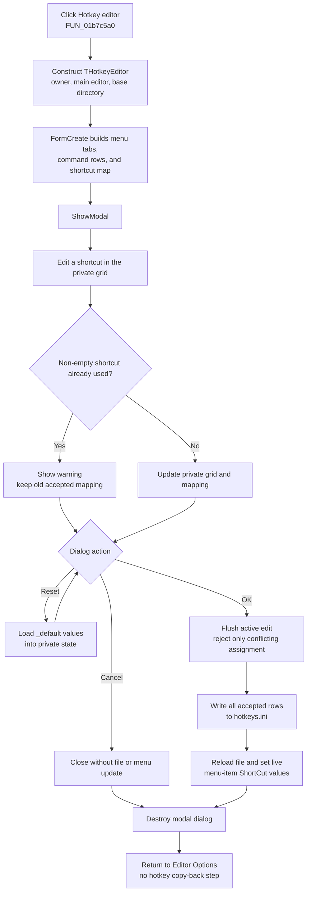

# Open the menu shortcut editor

> Analysis status: Evidence-backed source review complete.

## Control

| Property | Recovered value |
| --- | --- |
| Form | EditorOpsDlg |
| Form caption | Editor Options |
| Component path | EditorOpsDlg.btnSetHotkeys |
| Control class | TButton |
| Caption | Hotkey editor |
| Handler name | btnSetHotkeysClick |
| Handler address | 01b7c5a0 |
| Graph node | `resource:dfm:EditorOpsDlg/EditorOpsDlg.btnSetHotkeys` |
| Handler node | `function:01b7c5a0` |
| Graph layer | UI |

The button has no recovered hint, action, image reference, or glyph. Its caption agrees with the source-created `THotkeyEditor`, whose form caption is **Menu shortcut editor**.

## What happens when clicked

`FUN_01b7c5a0` constructs one `THotkeyEditor`. It passes three inputs:

- the global VCL application object as owner;
- the main editor window stored at `EditorOpsDlg +0x808` as the menu source and update target;
- the application base-directory string used to locate `hotkeys.ini`.

The handler calls the dialog's virtual `ShowModal` method. It does not inspect the returned modal result. After `ShowModal` returns, it destroys the dialog through the shared nil-safe Delphi object-destruction helper.

The outer Editor Options form does not copy a hotkey result into its own staged settings. The hotkey dialog owns its own commit boundary.

## Dialog staging and command mapping

The Hotkey Editor `FormCreate` path builds private lists for excluded commands and current shortcut mappings. It walks the main editor's menu roots and creates a tab with a two-column grid for each supported root. The grid builder recursively visits eligible leaf menu items. It skips separators, `mnMRU`, `mnOther`, and the hard-coded excluded menu names.

Each accepted row connects three values:

- a hierarchical menu-caption path for display;
- the menu item's stable component name for INI lookup and later menu resolution;
- the current `ShortCut` value converted to text for editing.

The dialog creates a `THotKey` editor dynamically. It is normally hidden. Selecting a shortcut cell moves it over that cell, converts the cell text back to a VCL shortcut value, and shows it. Leaving the cell hides it. The dialog keeps a private name-to-shortcut list in parallel with the grids. No menu item's live `ShortCut` property changes while the user only edits this staged state.

## Shortcut conflict handling

When selection moves away from a changed shortcut cell, and again before OK saves the dialog, the editor tries to flush the active `THotKey` value.

The conflict checker permits an empty shortcut. For a non-empty shortcut, it scans the shortcut values for all staged menu commands. If another value is equal, it shows a warning dialog and returns false. The grid cell and private mapping keep their old accepted value. If no equal value exists, the new shortcut text replaces the grid value and the mapping value for that menu item.

The active editor remembers its original shortcut. An unchanged value is not checked against itself. A rejected conflict does not cancel the complete Hotkey Editor OK action: the invalid assignment is omitted, while other accepted staged changes can still be saved.

## OK, Cancel, Reset, and persistence

The Hotkey Editor buttons define separate boundaries:

- **OK** first flushes the active shortcut edit. It then writes every grid row to `<application base directory>\hotkeys.ini`, using a menu section, the menu-item component name, and the shortcut text. After the file write, it reloads that file and applies the resolved shortcut values to the target main editor's menu items. The same loader runs during application initialization.
- **Cancel** is a `bkCancel` button with no custom click handler. It closes the modal dialog without calling the OK writer or menu reload. The private grids and mapping list are destroyed, so staged changes are discarded.
- **Reset** loads values from the corresponding `_default` INI sections into the private grids and rebuilds the private mapping list. It does not save or apply them by itself. The user must then choose Hotkey Editor OK.

These actions are independent of the outer Editor Options buttons. If the user accepts the Hotkey Editor and then cancels Editor Options, the already written `hotkeys.ini` file and live menu shortcuts are not rolled back. If the user cancels the Hotkey Editor and later accepts Editor Options, no staged shortcut is copied or saved.

## Click and commit flow

## No-op, refresh, and error behavior

- The launcher has no running-state, null-target, or re-entry guard. Every click constructs a new modal dialog and waits for it to close.
- Cancel performs no file write and no live menu refresh. It is the full no-commit path.
- Empty shortcut text is valid and removes the key combination for that staged command after OK applies it.
- A duplicate non-empty shortcut is rejected with a warning. There is no automatic reassignment, swap, or removal from the other command.
- OK applies shortcuts to the live menu model after the INI writer finishes. No editor document, circuit, undo stack, color scheme, or other Editor Options value changes in this path.
- The launcher, constructor, conflict checker, INI writer, and reload path have no local exception handler. A dialog-construction or modal exception can bypass the launcher's explicit destroy call. An INI exception after some row writes can leave a partially changed file. An exception during reload can occur after the file was written and can leave only part of the live menu tree updated.
- The recovered code shows no success message, retry, transactional file replacement, rollback, or validation of directory write access.

## Source evidence

- Editor Options launcher, `ShowModal`, and destruction: [FUN_01b7c5a0](../../../DecompiledSources/Tina16/functions/0000000001B7C5A0__FUN_01b7c5a0.c)
- Hotkey Editor constructor and stored target/base-directory fields: [FUN_01b77240](../../../DecompiledSources/Tina16/functions/0000000001B77240__FUN_01b77240.c)
- Editor Options constructor, which stores the main editor at `+0x808`: [FUN_01b7a760](../../../DecompiledSources/Tina16/functions/0000000001B7A760__FUN_01b7a760.c)
- Main editor caller that supplies itself to Editor Options: [FUN_01c83ba0](../../../DecompiledSources/Tina16/functions/0000000001C83BA0__FUN_01c83ba0.c)
- Hotkey Editor form initialization and excluded-menu list: [FUN_01b778f0](../../../DecompiledSources/Tina16/functions/0000000001B778F0__FUN_01b778f0.c)
- Per-menu tab/grid creation and recursive command-row construction: [FUN_01b78990](../../../DecompiledSources/Tina16/functions/0000000001B78990__FUN_01b78990.c) and [FUN_01b78c70](../../../DecompiledSources/Tina16/functions/0000000001B78C70__FUN_01b78c70.c)
- Cell selection, active editor flush, shortcut staging, and hiding: [FUN_01b79110](../../../DecompiledSources/Tina16/functions/0000000001B79110__FUN_01b79110.c), [FUN_01b79440](../../../DecompiledSources/Tina16/functions/0000000001B79440__FUN_01b79440.c), and [FUN_01b79370](../../../DecompiledSources/Tina16/functions/0000000001B79370__FUN_01b79370.c)
- Duplicate-shortcut checker and warning: [FUN_01b795f0](../../../DecompiledSources/Tina16/functions/0000000001B795F0__FUN_01b795f0.c)
- Hotkey Editor OK writer and immediate reload: [FUN_01b77350](../../../DecompiledSources/Tina16/functions/0000000001B77350__FUN_01b77350.c)
- `hotkeys.ini` loader and recursive live-menu update: [FUN_01b770b0](../../../DecompiledSources/Tina16/functions/0000000001B770B0__FUN_01b770b0.c) and [FUN_01b76f80](../../../DecompiledSources/Tina16/functions/0000000001B76F80__FUN_01b76f80.c)
- Reset-to-default staged-grid path: [FUN_01b775c0](../../../DecompiledSources/Tina16/functions/0000000001B775C0__FUN_01b775c0.c)
- Application initialization also reloads `hotkeys.ini`: [FUN_01c69770](../../../DecompiledSources/Tina16/functions/0000000001C69770__FUN_01c69770.c)
- Recovered form captions, button kinds, and event bindings: [ui-evidence.json](../../../DecompiledSources/Tina16/resources/dfm/ui-evidence.json)

## Evidence and annotation limits

- The resource proves that Cancel is `bkCancel`, but it has no custom handler. The absence of a writer call outside Hotkey Editor OK establishes the discard path.
- The recovered shortcut conversion functions use the VCL `ShortCut` encoding. This article does not assign names to numeric key codes that are not present in the DFM.
- The exact text of the duplicate warning is not recovered. Its data flow includes the rejected shortcut string and a modal warning call.
- This Bead owns only `FUN_01b7c5a0` and constructor `FUN_01b77240`. Later Hotkey Editor Beads `.628` and `.629` own the OK/apply and Reset handlers. Their staging, conflict, mapping, INI, and menu-update helpers remain evidence only here.
