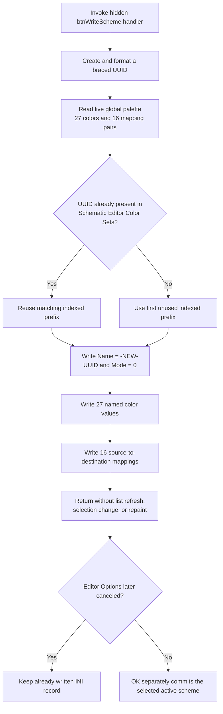

# Write a hidden new editor color scheme

> Analysis status: Evidence-backed source review complete.

## Control

| Property | Recovered value |
| --- | --- |
| Form | EditorOpsDlg |
| Form caption | Editor Options |
| Component path | EditorOpsDlg.gbEditorColors.btnWriteScheme |
| Control class | TButton |
| Parent caption | Editor C&olor Scheme |
| Caption | Not present in the recovered resource. |
| Initial resource state | Hidden (`Visible = false`), 9 by 12 pixels |
| Handler name | btnWriteSchemeClick |
| Handler address | 01b7c390 |
| Graph node | `resource:dfm:EditorOpsDlg/EditorOpsDlg.gbEditorColors.btnWriteScheme` |
| Handler node | `function:01b7c390` |
| Graph layer | UI |

The resource has no hint, action, image reference, or glyph for this button. Its hidden state and very small size mean that the recovered form does not offer it as a normal user command. The following behavior applies if the handler is invoked, for example by legacy or programmatic code.

## What happens when invoked

`FUN_01b7c390` creates a 16-byte UUID, formats it as `{8-4-4-4-12}` hexadecimal groups, and calls the shared color-scheme writer with these fixed arguments:

- scheme name `-NEW-`;
- the generated UUID;
- mode value `0`;
- the process-wide 27-entry schematic-editor color array; and
- the process-wide 16-pair color-mapping array.

There is no edit control or dialog for a scheme name. The handler does not read `cbEditorColors`, so `-NEW-` is not taken from the selected combo-box item. It also has no file dialog or path parameter.

## Destination and stored format

`EditorOpsDlg.FormCreate` constructs the settings object at form offset `+0x800` from the application settings directory and `TINA.INI`. The click passes that existing object to `FUN_01aa02c0`. The destination is therefore the `Schematic Editor Color Sets` section of `TINA.INI`, not a separate scheme file.

The writer asks `FUN_01a9fe00` for an indexed record prefix. That resolver scans the record UUID fields in index order. It returns the existing prefix when the requested UUID already exists, or the first unused indexed prefix when it does not. The writer then stores one scheme as a set of INI values under that prefix:

1. `Name`, with `-NEW-` converted through code page 65001 before storage;
2. the record's UUID field, with the braced UUID text;
3. `Mode`, as decimal text `0`;
4. 27 values under the recovered table of named schematic color keys; and
5. 16 mapping values whose key suffix is the formatted source color and whose stored value is the formatted destination color.

The color formatter uses a recognized color token when one exists. Otherwise, it writes a fixed color prefix followed by eight hexadecimal digits. This is an INI key/value representation. It is not a binary color-scheme stream.

## Which colors are saved

The click serializes `PTR_DAT_02003ad0` and `PTR_DAT_02005048` directly. Other recovered paths identify these as the live process-wide schematic-editor palette and color mapping:

- the shared scheme reader loads a selected scheme into these arrays;
- the advanced scheme editor copies accepted working arrays into them and refreshes the schematic display; and
- schematic drawing code reads the color array.

The button does not serialize a private EditorOpsDlg copy. It also does not first apply a different item that the user has only selected in `cbEditorColors`. The Editor Options OK handler is the path that reads that combo selection, saves its UUID as `Schematic Editor / ColorScheme`, and loads the selected scheme into the live arrays. Therefore, this hidden handler saves the live arrays as they exist at the instant of invocation.

## List, selection, and persistence effects

The handler does not call the combo-list builder `FUN_01b7aca0`. It neither adds a visible `-NEW-` row to `cbEditorColors` nor selects the new UUID. The list builder reads the persisted indexed records when EditorOpsDlg initializes. The accepted **Advanced...** path also rebuilds the combo and selects the UUID returned by the scheme dialog. A later one of those rebuilds can expose the record, but this click does not refresh it.

The INI writes occur during the handler. They are not staged until EditorOpsDlg OK. The form's `bkCancel` button has no application handler that deletes the record, and the write path has no rollback. Cancel can discard the other uncommitted Editor Options controls, but it does not undo a scheme record already written by this hidden handler.

The click does not change the saved `Schematic Editor / ColorScheme` UUID. It therefore does not make the new record the active scheme, repaint the schematic, or change the current combo selection.

## Repeat, overwrite, and error behavior

- There is no validation branch, overwrite question, success message, or normal no-op branch.
- Under normal UUID creation, each invocation gets a new identifier and uses the first unused indexed record slot.
- If the resolver finds the same UUID, it reuses that record prefix and rewrites its values without confirmation. The handler ignores the UUID creator's returned status, so it does not protect this case with a failure branch.
- The writer performs the metadata, 27 color writes, and 16 mapping writes in sequence. It has no transaction, temporary file, exception handler, cleanup of an incomplete record, or rollback. If a settings write raises after earlier writes succeeded, a partial record can remain in `TINA.INI`.
- The source exposes no returned success value from the settings writes and shows no local error message. Any lower-level exception can escape the handler.

## Invocation flow

## Source evidence

- [Hidden button handler](../../../DecompiledSources/Tina16/functions/0000000001B7C390__FUN_01b7c390.c) supplies `-NEW-`, generated UUID text, mode `0`, and the two global arrays to the writer.
- [UUID creation wrapper](../../../DecompiledSources/Tina16/functions/000000000043DC90__FUN_0043dc90.c) calls `UuidCreate` and returns a status that the handler does not test.
- [UUID formatter](../../../DecompiledSources/Tina16/functions/000000000043DEC0__FUN_0043dec0.c) proves the braced `{8-4-4-4-12}` hexadecimal layout.
- [Indexed-prefix resolver](../../../DecompiledSources/Tina16/functions/0000000001A9FE00__FUN_01a9fe00.c) scans UUID fields until it finds a match or an unused indexed record.
- [Scheme writer](../../../DecompiledSources/Tina16/functions/0000000001AA02C0__FUN_01aa02c0.c) writes the name, UUID, mode, 27 named colors, and 16 mapping entries to `Schematic Editor Color Sets`.
- [Color formatter](../../../DecompiledSources/Tina16/functions/00000000005EF7D0__FUN_005ef7d0.c) proves the recognized-token or eight-hex-digit fallback representation.
- [EditorOpsDlg initializer](../../../DecompiledSources/Tina16/functions/0000000001B7A820__FUN_01b7a820.c) constructs the `TINA.INI` settings object and initially rebuilds the scheme combo.
- [Editor Options OK handler](../../../DecompiledSources/Tina16/functions/0000000001B7BAA0__FUN_01b7baa0.c) separately commits the combo's selected UUID and loads that scheme into the global arrays.
- [Advanced button handler](../../../DecompiledSources/Tina16/functions/0000000001B7C440__FUN_01b7c440.c) rebuilds and reselects the combo only after its modal scheme dialog is accepted.
- [Advanced scheme initialization](../../../DecompiledSources/Tina16/functions/0000000001B73C00__FUN_01b73c00.c), [accepted live-color copy](../../../DecompiledSources/Tina16/functions/0000000001B755E0__FUN_01b755e0.c), and [alternate live-color copy](../../../DecompiledSources/Tina16/functions/0000000001B75500__FUN_01b75500.c) distinguish working arrays from the live globals used here.
- [Scheme reader](../../../DecompiledSources/Tina16/functions/0000000001AA0060__FUN_01aa0060.c) reads the same 27 color keys and 16 mapping entries back into supplied arrays.
- [Recovered resource evidence](../../../DecompiledSources/Tina16/resources/dfm/ui-evidence.json) identifies the parent caption, hidden geometry, and resolved `OnClick` binding. It contains no caption, hint, action, image reference, or glyph for this control.

## Evidence and annotation limits

- This Bead owns canonical annotations for `FUN_01b7c390`, `FUN_01aa02c0`, and `FUN_01a9fe00`.
- Bead `.462` owns the Advanced scheme picker and combo rebuild path. Bead `.459` owns the Editor Options OK staging and commit path. Those functions are evidence only here.
- Several prefix fragments are unresolved data symbols in the decompilation. The source proves indexed records and the `Name`, UUID, `Mode`, color, and mapping field roles, but this article does not invent the unresolved literal prefix text.
- The recovered code does not expose an operating-system error message or an atomic-write guarantee for the settings object. The partial-record statement follows from the visible ordered writes and absence of a transaction or rollback.
