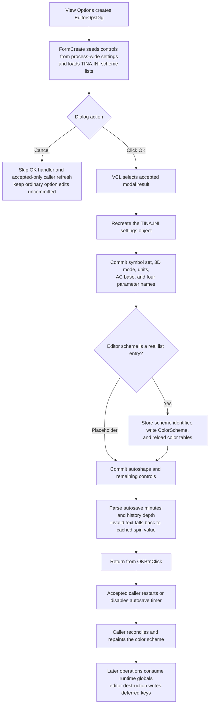

# Commit the schematic-editor options

> Analysis status: Evidence-backed source review complete.

## Control

| Property | Recovered value |
| --- | --- |
| Form | EditorOpsDlg |
| Form caption | Editor Options |
| Component path | EditorOpsDlg.OKBtn |
| Control class | TBitBtn |
| Caption | Supplied by the standard `bkOK` kind; no explicit caption is stored. |
| Kind | `bkOK` |
| Hint | Not present in the recovered resource. |
| Glyph | No extracted custom glyph; the standard kind supplies its image. |
| Handler name | OKBtnClick |
| Handler address | 01b7baa0 |
| Graph node | `resource:dfm:EditorOpsDlg/EditorOpsDlg.OKBtn` |
| Handler node | `function:01b7baa0` |
| Graph layer | UI |

## What happens when clicked

[`FUN_01b7baa0`](../../../DecompiledSources/Tina16/functions/0000000001B7BAA0__FUN_01b7baa0.c) commits the controls directly to process-wide schematic-editor settings. It first destroys the form's existing settings object, creates a new object for `<settings folder>\TINA.INI`, and then updates global values and selected INI keys in a fixed sequence. This is not a final copy from a complete dialog-local settings record. Each control remains the working value until the handler reaches it.

The handler captures these options:

| Control or group | Accepted value | Commit and persistence behavior |
| --- | --- | --- |
| Component Symbol Set | `rbUS.Checked = true` selects USA/ANSI; a clear `rbUS` selects European/DIN. | Stores the inverse of `rbUS.Checked` in the runtime symbol-set flag. It writes `Schematic Editor/DefSymbolSet` only when the flag changes. |
| Enable 3D shapes | `cbEnable3DShapes.Checked`. | Stores the Boolean globally and writes `Enable3DShapes` immediately. |
| Measurement Units | Radio index `0` selects inch; every other recovered index selects millimeter. | Stores internal unit code `1` or `3` and writes `DefUnit` as `inch` or the recovered millimeter value. |
| Base function for AC | Radio index `0` selects sine; any other recovered value selects cosine. | Stores the index byte globally. It writes `ACBaseFunc` only when the value changes. |
| Parameter #1 through #4 | The four edit texts, including empty text. | Copies the strings to the four runtime parameter-name globals. No syntax, uniqueness, or empty-value check occurs. The application settings saver writes `Param1` through `Param4` later. |
| Editor Color Scheme | The selected combo text and its attached scheme identifier. | A text that begins with the recovered placeholder marker is ignored. Otherwise, the handler converts the selected item's identifier to text, stores it as the active scheme, writes `ColorScheme`, and reloads the active color tables from `TINA.INI`. |
| Autoshape Color Scheme | Combo-box item index. | Stores the index globally and writes `AutoShapeColorSet` immediately. There is no explicit index-range guard. |
| Global Settings: Values and Units | The two check-box states. | Stores the `AppendValueToLabel` and `AppendUnitToLabel` runtime flags. The general settings saver writes them later. |
| Global Settings: Labels | `cbLabel.Checked`. | Stores the inverse in the internal hide-label flag. The later saver writes the corresponding `ShowLabels` value with the inverse mapping. |
| Mouse wheel operating mode | Radio index byte: DFM item `0` is Scroll and item `1` is Zoom. | Stores the byte as `MouseWheelZooming` and writes it immediately. |
| Autosave interval | Parsed `seAutoSaveTime` integer multiplied by `60,000`. | Stores milliseconds globally. The main Editor Options caller immediately re-arms the autosave timer from this value. The general saver writes `AutoSaveInterval` later. |
| Autosave history depth | Parsed `seAutoSaveHistDepth` integer. | Stores the count globally. The general saver writes `AutoSaveHistoryDepth` later. |
| Renumber Components on Paste | `cbRenumberOnPaste.Checked`. | Stores the runtime flag; deferred settings save writes `RenumberOnPaste`. |
| Compressed project files | `cbCompressedTSC.Checked`. | Stores the runtime flag and writes `CompressedTSCFormat` immediately. |
| Store pictures in GIF format | `cbPictureAsGIF.Checked`. | Stores the runtime flag and writes `SavePictureAsGIF` immediately. |
| Continue where you left off | `cbStartAsNew.Checked`. | Stores its inverse as the internal `StartAsNew` flag; deferred settings save writes that internal value. |
| Save macro shape and content with reference only | `cbSaveRefOnly.Checked`. | Stores the runtime flag; deferred settings save writes `SaveReferenceOnly`. The recovered DFM hides this control, and the settings loader currently initializes the runtime flag to false. |

The hidden `cbAutoUpdate` control is not read by this handler. Clicking OK therefore does not change its setting. The handler also does not read the Help button or any state from the Environment Variables and Hotkey Editor child dialogs.

## Staging, OK, and Cancel

[`FUN_01b7a820`](../../../DecompiledSources/Tina16/functions/0000000001B7A820__FUN_01b7a820.c), the form's `OnCreate` handler, creates the initial `TINA.INI` object and seeds each listed control from the current globals. It also rebuilds the editor and autoshape scheme lists. The four text editors and all check boxes, radio groups, combo boxes, and spin edits are therefore the dialog's working state, but there is no separate settings structure that can be atomically copied back.

`OKBtn` has standard kind `bkOK`. The VCL gives it accepted modal result `1`; `FUN_01b7baa0` itself does not assign `ModalResult` or call `Close`. After the modal call returns `1`, the owning Options command performs the accepted-only refresh work described below.

`CancelBtn` has standard kind `bkCancel` and no custom handler. It does not invoke `FUN_01b7baa0`, so ordinary control edits are not copied to globals and the caller does not run its accepted-only timer or color refresh. Cancel does not provide a general transaction around child dialogs. For example, the [Hotkey editor button](btnsethotkeys-d107f7d7f1.md) launches a nested dialog whose own OK writes and reloads `hotkeys.ini`; the outer Editor Options result is not consulted by that nested commit.

## Live effects after acceptance

[`FUN_01c83ba0`](../../../DecompiledSources/Tina16/functions/0000000001C83BA0__FUN_01c83ba0.c), the Schematic Editor `View > Options...` command, stores the old color-scheme identifier, constructs this dialog, and calls `ShowModal`. On result `1` it:

1. removes the existing autosave callback and creates a new one when the committed interval is greater than zero;
2. compares the old and new color-scheme identifiers;
3. invalidates the primary schematic view when the identifier is unchanged; or
4. reconciles the new scheme and, when the scheme helper returns zero, changes the current editor background color, invalidates the affected editor controls, and refreshes an open data-display window.

No dedicated accepted-only call rebuilds existing symbols, converts existing geometry between inch and millimeter, reruns AC analysis, rewrites current labels, recompresses an open project, or converts an already stored picture. The caller's invalidation can make drawing-related flags visible on the next paint, but the recovered source does not identify a separate label rewrite. Other committed globals are read by later schematic, serialization, drawing, or analysis operations.

## Validation and boundary behavior

The OK handler has no cross-field validator, warning, confirmation, error-message call, or focus repair. The radio and check-box values are accepted as returned by their VCL controls. Parameter names are copied exactly.

The two spin editors use [`FUN_00c5a450`](../../../DecompiledSources/Tina16/functions/0000000000C5A450__FUN_00c5a450.c). It reads the displayed text and calls a non-raising integer conversion that returns the spin editor's cached value when parsing fails. Thus, malformed text does not produce an OK error; it falls back to the control value. The recovered handler has no explicit multiplication-overflow check when it converts autosave minutes to milliseconds.

The active color-scheme path has only the placeholder-prefix test before it uses the current item index and attached object. Other invalid selection states have no local guard or explanatory message.

## Persistence and partial failures

The handler writes symbol set, 3D shape enablement, measurement unit, AC base function, active editor scheme, autoshape scheme index, mouse-wheel mode, compressed-project mode, and GIF storage mode to `TINA.INI` during the click. The other accepted values remain process-wide globals until [`FUN_01c85f70`](../../../DecompiledSources/Tina16/functions/0000000001C85F70__FUN_01c85f70.c) serializes the schematic-editor settings during editor destruction. That later saver is evidence for the persistence boundary; it is not owned by this control's annotation fragment.

`FUN_01b7baa0` does not check a writer return value and has no local exception handler, transaction, rollback, or restoration of the old settings object. Global assignments and INI writes are interleaved. A failure after an earlier assignment or write can therefore leave a mixture of old and new values in memory or on disk. A later deferred-save failure can also leave the current session with accepted runtime values while `TINA.INI` retains older deferred values.

Calling the handler again with unchanged controls repeats the unconditional assignments and INI writes. The symbol-set and AC-base keys are skipped when their globals already match, and the placeholder editor-scheme entry remains a no-op. In normal modal use, the first successful OK ends that dialog instance.

## Accept flow

## Evidence

- [OKBtnClick](../../../DecompiledSources/Tina16/functions/0000000001B7BAA0__FUN_01b7baa0.c) contains the complete ordered assignment and immediate `TINA.INI` write sequence.
- [FormCreate](../../../DecompiledSources/Tina16/functions/0000000001B7A820__FUN_01b7a820.c) maps the current global values into the form controls, initializes both scheme lists, and creates the settings object.
- [The EditorOpsDlg constructor](../../../DecompiledSources/Tina16/functions/0000000001B7A760__FUN_01b7a760.c) calls the inherited form constructor and retains the calling schematic editor at `+0x808`; this reference is used by the nested Hotkey Editor launcher.
- [The `View > Options...` owner](../../../DecompiledSources/Tina16/functions/0000000001C83BA0__FUN_01c83ba0.c) proves the accepted-only timer and color refresh boundary and the absence of a caller-side settings copy.
- [The editor-scheme combo loader](../../../DecompiledSources/Tina16/functions/0000000001B7ACA0__FUN_01b7aca0.c), canonically owned by Bead `.462`, supplies the visible scheme names and attached identifiers consumed by OK.
- [The autoshape-scheme combo loader](../../../DecompiledSources/Tina16/functions/0000000001B7B890__FUN_01b7b890.c) supplies the indices consumed by OK.
- [The general schematic-editor settings saver](../../../DecompiledSources/Tina16/functions/0000000001C85F70__FUN_01c85f70.c) writes the deferred label, autosave, start, paste, reference-only, and parameter-name keys during [schematic-editor destruction](../../../DecompiledSources/Tina16/functions/0000000001C6CBC0__FUN_01c6cbc0.c).
- [The recovered UI evidence](../../../DecompiledSources/Tina16/resources/dfm/ui-evidence.json) supplies the form and control captions, item lists, visibility, standard button kinds, and event bindings. There is no custom OK hint or glyph.
- Standard `bkOK` and `bkCancel` modal behavior is recovered in [TBitBtn.SetKind](../../../DecompiledSources/Tina16/functions/000000000082BC30__FUN_0082bc30.c) and [TCustomButton.Click](../../../DecompiledSources/Tina16/functions/0000000000687F30__FUN_00687f30.c).

## Ownership and limits

- This Bead owns canonical annotations for `FUN_01b7baa0`, `FUN_01b7a820`, `FUN_01b7a760`, and `FUN_01c83ba0`.
- Bead `.462` owns shared editor-scheme combo helper `FUN_01b7aca0`. The autoshape loader, VCL accessors, color applier, autosave timer helpers, settings writer, and downstream consumers are evidence only here.
- Beads `.460` through `.462` document the Environment Variables, Hotkey Editor, and Advanced color-scheme buttons. Their independent modal behavior is not folded into the ordinary OK option commit.
- The recovered source does not name the internal globals. This article uses the INI keys, DFM captions, initialization symmetry, and downstream reads to describe them without inventing Delphi field names.
