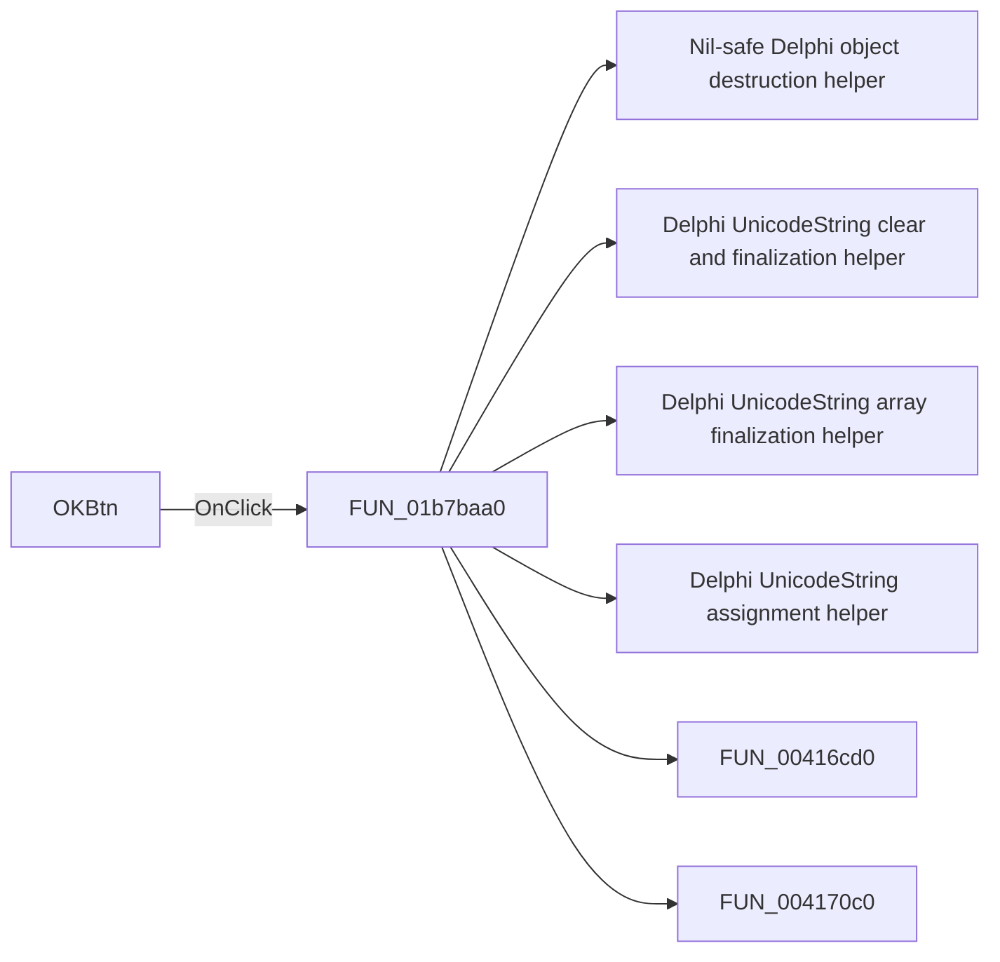

# OKBtn

> Analysis status: Pending individual source review.

## Control

| Property | Recovered value |
| --- | --- |
| Form | EditorOpsDlg |
| Component path | EditorOpsDlg.OKBtn |
| Control class | TBitBtn |
| Caption | Not present in the recovered resource. |
| Hint | Not present in the recovered resource. |
| Text | Not present in the recovered resource. |
| Handler name | OKBtnClick |
| Handler address | 01b7baa0 |
| Graph node | `resource:dfm:EditorOpsDlg/EditorOpsDlg.OKBtn` |
| Handler node | `function:01b7baa0` |
| Graph layer | UI |

## What happens when clicked

Pending individual analysis. An agent must read the recovered handler source and its relevant callees before it replaces this text.

## Click flow

## Handler evidence

- Source: [DecompiledSources/Tina16/functions/0000000001B7BAA0__FUN_01b7baa0.c](../../../DecompiledSources/Tina16/functions/0000000001B7BAA0__FUN_01b7baa0.c)
- Recovered role: Not present in the recovered resource.
- Current graph summary: Handles 1 Delphi UI event: EditorOpsDlg.OKBtn.OnClick.
- Current graph behavior: Not present in the recovered resource.
- Current graph evidence: Not present in the recovered resource.
- Complexity: complex
- Distinct outgoing calls: 11

## Direct calls

- `function:00410f20` — Nil-safe Delphi object destruction helper
- `function:00414480` — Delphi UnicodeString clear and finalization helper
- `function:00414560` — Delphi UnicodeString array finalization helper
- `function:00414ad0` — Delphi UnicodeString assignment helper
- `function:00416cd0` — FUN_00416cd0
- `function:004170c0` — FUN_004170c0
- `function:0043dec0` — FUN_0043dec0
- `function:005da0f0` — FUN_005da0f0
- `function:0064dd90` — VCL control Unicode text reader
- `function:00c5a450` — FUN_00c5a450
- `function:01aa0060` — FUN_01aa0060

## Resource evidence

- Kind: bkOK
- Modal result: Not present in the recovered resource.
- Checked state: Not present in the recovered resource.
- List items: Not present in the recovered resource.
- Image reference: Not present in the recovered resource.
- Extracted glyph: None.

## Nearby label candidates

Nearby labels are layout candidates only. They are not proof of behavior.

- Rank 1: Autosave history depth at distance 556.
- Rank 2: [min] at distance 589.
- Rank 3: Autosave interval (0 - no autosave) at distance 819.

## Analysis limits

- Do not infer behavior from the control class, caption, hint, glyph, or nearby label alone.
- Do not replace the pending status until the handler source and relevant call path provide enough evidence.
