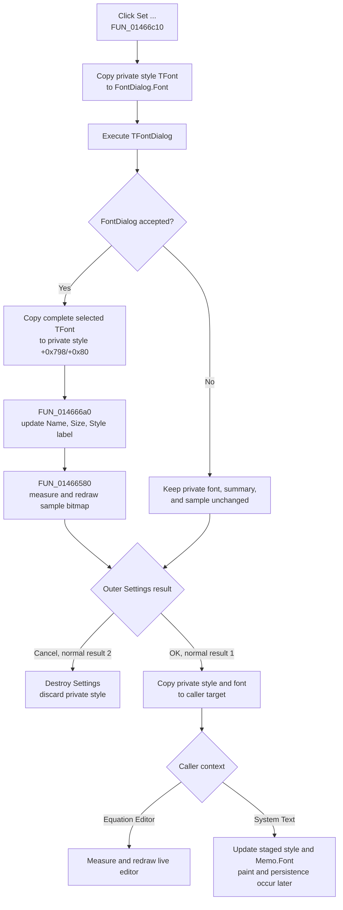

# Set the equation-rendering font

> Analysis status: Evidence-backed source review complete.

## Control

| Property | Recovered value |
| --- | --- |
| Form | EEConfigDlg |
| Form caption | Settings |
| Component path | EEConfigDlg.FontGB.BitBtn1 |
| Control class | TBitBtn |
| Caption | Set ... |
| Hint | Not present in the recovered resource. |
| Handler name | FntBtnClick |
| Handler address | 01466c10 |
| Graph node | `resource:dfm:EEConfigDlg/EEConfigDlg.FontGB.BitBtn1` |
| Handler node | `function:01466c10` |
| Graph layer | UI |

The button is in the **Font** group beside label `EECDFntAttribsLB`, whose design-time text is **Name: Arial**. The form also contains a `TFontDialog` and a **Sample** image. The button has no recovered hint or glyph.

## What happens when clicked

`TEEConfigDlg.FntBtnClick` edits the font of the dialog-private equation-layout style at form field `+0x798`. It does not edit the caller's font directly.

The handler performs this sequence:

1. It copies the complete private `TFont` at style-object field `+0x80` into `FontDialog.Font` at form control `+0x778`, field `+0xd0`.
2. It calls `TFontDialog.Execute`.
3. If Execute returns false, it returns without changing the private style, summary label, or sample.
4. If Execute returns true, it copies the complete selected `TFont` back to the private style's font object.
5. It rebuilds the adjacent font summary label.
6. It rebuilds and redraws the dialog's sample image with the updated private style.

There is no second validation or equality test after the native dialog accepts the selection.

## Font attributes and visible feedback

The two virtual assignment calls copy whole `TFont` objects, not only a face name. The accepted private font therefore receives the font attributes supported by the dialog, including face, size, style, color, and other `TFont` state.

The `.261`-owned recovered `TFontDialog` constructor enables the `fdEffects` option. The streamed `EEConfigDlg.FontDialog` does not override the dialog options in its DFM data. This supports selection of color and effects such as underline and strikeout, in addition to the face and size.

The adjacent text summary is narrower than the stored font state. `FUN_014666a0` passes the accepted private `TFont` to `.261`-owned `FUN_00f05050`, then writes the result to `EECDFntAttribsLB`. The formatter reports:

- font name;
- point size; and
- Normal, Bold, Italic, UnderLine, or StrikeOut style state.

It does not include color, charset, pitch, quality, or orientation in the label. Those omitted properties can still remain in the copied font and affect rendering.

`FUN_01466580` then replaces the sample's backing bitmap, measures the dialog-private equation style with the new font, sizes the bitmap with small recovered margins, assigns it to `SampleImg`, and draws the sample at offset `(2, 2)`. This is an immediate preview inside **Settings**. It is not yet a repaint of the caller's equation or system-text object.

## Inner and outer cancel boundaries

There are two separate modal decisions:

- **FontDialog Cancel or false Execute:** the handler has only seeded `FontDialog.Font`. The private style font, font summary, and sample remain unchanged.
- **FontDialog acceptance:** the private style, summary, and sample change immediately, but the caller still does not own that change.
- **Outer Settings Cancel (`bkCancel`, normal result `2`):** inspected callers destroy `TEEConfigDlg` without copying the private style back. This discards the accepted inner font selection.
- **Outer Settings OK (`bkOK`, normal result `1`):** inspected callers copy the complete private equation-layout style and font to their target, then destroy the Settings dialog.

The font button does not set the outer form's modal result and does not close either dialog itself.

## Caller refresh and persistence

The recovered callers use the accepted outer result in different owner contexts:

- The Equation Editor settings caller `FUN_01464600` copies the private style and font into its live equation-rendering object and calls `FUN_01463140`, which measures and redraws the editor content. This is the proven immediate owner refresh after outer OK.
- The CSysText-related callers `FUN_0146a460` and `FUN_0146b080` copy the accepted style into their staged nested text object and assign the font to the staged Memo. They do not directly call the outer preview paint handler. A later paint uses the accepted font, and the caller commits the staged text only after its own outer dialog is accepted.

The font handler itself performs no file, registry, database, or INI write. Some Settings callers also edit global autoformat rules and write those rules to `TINA.INI` after outer acceptance, but those writes are not font persistence. In the inspected system-text path, the accepted font is serialized only later when the caller commits and saves the owning text object. Outer Settings Cancel prevents both the style copy-back and the associated accepted-path autoformat writes in these callers.

## Click flow

## Repeated action and error behavior

- A repeated click always reseeds `FontDialog.Font` from the current private style, including a previously accepted inner selection that has not yet been committed by outer OK.
- Accepting the same font still copies it, rebuilds the label, destroys and replaces the sample bitmap, and redraws the sample. There is no unchanged-value shortcut.
- A false Execute result is treated like Cancel. The recovered handler does not distinguish user cancellation from a native dialog failure.
- The handler has no local exception block, error message, retry, or rollback.
- On the accepted path, the private font changes before the summary and sample refreshes. An exception in formatting or preview generation can leave the private font updated while the visible summary or sample remains stale.
- `FUN_01466580` destroys the prior shared sample bitmap before it allocates the replacement. A later allocation, measurement, assignment, or drawing failure can therefore leave the sample without its earlier backing bitmap. No rollback is visible.
- An exception propagating from the font assignment or native dialog prevents the remaining handler steps. Outer caller cleanup then depends on the surrounding Delphi exception path, which is not recovered in this handler.

## Recovered evidence

- [`FUN_01466c10`](../../../DecompiledSources/Tina16/functions/0000000001466C10__FUN_01466c10.c) is `TEEConfigDlg.FntBtnClick`. Its assignment direction, Execute test, accepted reverse assignment, and two refresh calls establish the inner staging boundary.
- [`FUN_014666a0`](../../../DecompiledSources/Tina16/functions/00000000014666A0__FUN_014666a0.c) formats the private style's font and writes the resulting text to the adjacent label at form field `+0x760`.
- [`FUN_01466580`](../../../DecompiledSources/Tina16/functions/0000000001466580__FUN_01466580.c) destroys and recreates the sample bitmap, measures the private style, sizes the bitmap, assigns it to the sample image, and draws the sample.
- [`FUN_01466720`](../../../DecompiledSources/Tina16/functions/0000000001466720__FUN_01466720.c) creates the private style at `+0x798`, copies the caller's style into it, initializes the layout controls, and renders the initial sample.
- [`FUN_00725300`](../../../DecompiledSources/Tina16/functions/0000000000725300__FUN_00725300.c) is the `.261`-owned `TFontDialog` constructor and proves the private Font field and `fdEffects` option.
- [`FUN_00f05050`](../../../DecompiledSources/Tina16/functions/0000000000F05050__FUN_00f05050.c) is the `.261`-owned Name/Size/Style formatter and proves which accepted attributes the text label displays and omits.
- [`FUN_01464600`](../../../DecompiledSources/Tina16/functions/0000000001464600__FUN_01464600.c) commits only result `1` to the live Equation Editor style and then redraws it. It writes global autoformat settings, not the font itself, to `TINA.INI`.
- [`FUN_0146a460`](../../../DecompiledSources/Tina16/functions/000000000146A460__FUN_0146a460.c) and [`FUN_0146b080`](../../../DecompiledSources/Tina16/functions/000000000146B080__FUN_0146b080.c) discard result `2` and otherwise copy the private style and font into a system-text staging context.
- [`FUN_0146af40`](../../../DecompiledSources/Tina16/functions/000000000146AF40__FUN_0146af40.c) is the later system-text preview paint path that measures and draws with the staged font.
- [`FUN_01a61fe0`](../../../DecompiledSources/Tina16/functions/0000000001A61FE0__FUN_01a61fe0.c) is the later system-text serializer that persists the committed font with its owning object.
- [`ui-evidence.json`](../../../DecompiledSources/Tina16/resources/dfm/ui-evidence.json) supplies the **Settings**, **Font**, **Set ...**, **Name: Arial**, **Sample**, `TFontDialog`, `bkOK`, and `bkCancel` resource evidence.

## Analysis limits

The original Delphi name of the private equation-layout style object is not recovered. Its font ownership is established by complete `TFont` assignments, the shared formatter, preview rendering, initialization, and caller copy-back. The exact outer commit logic depends on the caller; this article documents all three recovered initializers and distinguishes the live Equation Editor from staged system-text paths. It does not claim that the font is stored in `TINA.INI`. Bead `.261` owns the canonical annotations for `FUN_00725300` and `FUN_00f05050`.
