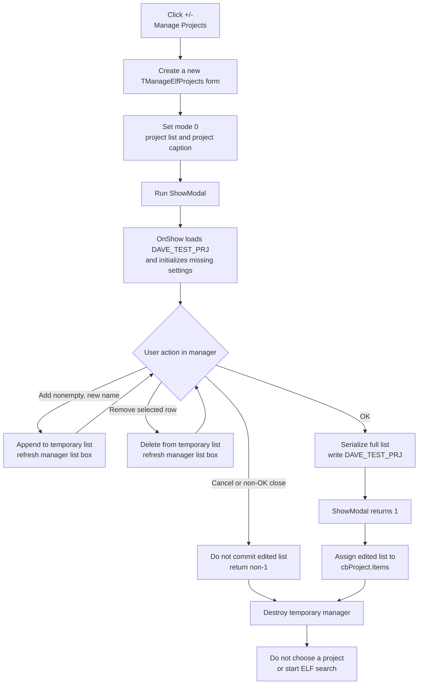

# Manage Eclipse project names

> Analysis status: Evidence-backed source review complete.

## Control

| Property | Recovered value |
| --- | --- |
| Form | ElfMCUSelect |
| Form caption | Refresh Eclipse Project |
| Component path | ElfMCUSelect.bManageProjects |
| Control class | TButton |
| Caption | +/- |
| Hint | Manage Projects |
| Handler name | bManageProjectsClick |
| Handler address | 015e5f30 |
| Graph node | `resource:dfm:ElfMCUSelect/ElfMCUSelect.bManageProjects` |
| Handler node | `function:015e5f30` |
| Graph layer | UI |

The caption gives only an add/remove symbol. The hint identifies projects, and the recovered handler proves that this button opens the common project/workspace list manager in project mode. The control has no recovered action, image reference, or glyph.

## What happens when clicked

`FUN_015e5f30` creates a new `TManageElfProjects` form with the application as owner. It calls `FUN_015e5710` with mode `0`, which selects the project-list mode and a project-specific form caption. It then invokes VCL virtual slot `+0x2D0`, the recovered `ShowModal` path. The manager is therefore modal: the ElfMCUSelect handler waits for it to close. It is not a modeless window and it is not reused between clicks.

When `ShowModal` returns:

- Result `1` (`mrOk`) makes the handler assign the manager's edited backing list at `+0x6F8` to `ElfMCUSelect.cbProject.Items`.
- Any other result, including the built-in Cancel result or a window close that does not accept the dialog, skips this copy.
- The handler destroys the temporary manager after either normal result.

The accepted path refreshes the Project combo's item collection. It does not call an ItemIndex setter, restore the previous project by name, choose the first item, refresh the MCU Component combo, or start the ELF search. Any selection change caused by replacing `cbProject.Items` remains VCL collection behavior; the recovered handler has no explicit selection policy.

## Manager working list

The manager form contains a list box, a new-item edit, Add and Remove buttons, and built-in OK and Cancel buttons. Its OnShow path uses the mode set before `ShowModal`:

- Mode `0` parses the current-user registry value `DAVE_TEST_PRJ` into a temporary string list and assigns it to the list box.
- Nonzero mode parses `DAVE_TEST_REPO` for the sibling workspace manager.

The shared loader reads both list values and both saved selection indexes on every show. If one of those four registry values does not exist, it creates that value with an empty string or zero default. Opening this manager can therefore initialize missing project, workspace, or index settings even when the user later selects Cancel. This initialization is separate from committing an edited list.

`FUN_015e5310`, the manager's Add handler, reads the edit text. It does nothing for an empty value or an exact value already in the temporary list. Otherwise, it appends the text and refreshes the list box. `FUN_015e5490`, the Remove handler, does nothing when no list row is selected. Otherwise, it removes the selected string from the temporary list and refreshes the list box.

These Add and Remove operations change only the manager's temporary list. They do not update `ElfMCUSelect.cbProject` and do not write the registry by themselves.

## Persistence and commit boundaries

The manager's `bOK` has `Kind = bkOK`. Its handler `FUN_015e5420` serializes the complete temporary list as comma-delimited text and calls `FUN_016056c0` with the current mode. For project mode, that writer opens the application's `HKEY_CURRENT_USER` registry subkey and writes `DAVE_TEST_PRJ`. The VCL then returns modal result `1`, and `FUN_015e5f30` copies the same list to the visible Project combo.

The writer removes all double-quote characters from the serialized value before the registry write. The loader later uses comma as the delimiter. The manager does not reject commas or quotes in an added name. A name that needs delimiter quoting can therefore lose that grouping when it is saved and loaded again.

There are two separate commit boundaries:

1. The manager's OK button persists the edited project-name list before its `ShowModal` call returns.
2. The outer ElfMCUSelect OK button later accepts the selected workspace, project, and MCU component for the ELF assignment workflow.

Thus, Cancel in the project manager discards the temporary list edits. It does not undo any missing-value defaults that the OnShow loader created. In contrast, selecting OK in the project manager persists the edited list immediately. A later Cancel in ElfMCUSelect does not roll that list edit back. The later selection workflow stores workspace and project indexes separately and consumes the selected workspace and project together when it searches for a `Debug` directory and an ELF file.

## Project and workspace relationship

The recovered storage is two independent global lists:

- `DAVE_TEST_REPO` supplies `ElfMCUSelect.cbRepo`, labeled Workspace.
- `DAVE_TEST_PRJ` supplies `ElfMCUSelect.cbProject`, labeled Project.

The project manager does not read the currently selected workspace, filter projects for that workspace, store a workspace-to-project map, or change the workspace list. Its accepted copy targets only `cbProject.Items`. The later ELF-selection path uses both selected strings to locate project output, but the manager itself treats the lists independently.

## Cancel, repeated use, and errors

- Cancel or another non-OK modal result causes no parent combo copy and no edited-list write. On the first open, the shared loader can still create missing registry values with empty or zero defaults.
- Reopening the manager constructs a new form and reloads the current registry list. There is no retained manager instance.
- Repeated OK with an unchanged list serializes and writes the same list again, then replaces the Project combo items again.
- The handler has no confirmation prompt, selection guard, local exception handler, transaction, or rollback.
- If the current-user registry subkey cannot be opened during the OK write, `FUN_016056c0` skips the write and returns no success value. The modal result can still be OK, so the parent Project combo can receive the edited list even though that list was not persisted.
- The shared list loader follows a Delphi runtime error path with a `HKEY_CURRENT_USER\\...: not found` message if it cannot open the configured subkey. The recovered click path does not catch that failure.
- If construction, setup, modal execution, serialization, or an invoked VCL operation raises, no later state update or rollback is recovered in this handler. The normal copy-back and explicit destruction statements run only after `ShowModal` returns normally.

## Click flow

## Source evidence

- Project-manager launcher and accepted-result copy: [FUN_015e5f30](../../../DecompiledSources/Tina16/functions/00000000015E5F30__FUN_015e5f30.c)
- Shared project/workspace mode setup: [FUN_015e5710](../../../DecompiledSources/Tina16/functions/00000000015E5710__FUN_015e5710.c)
- Mode-based manager OnShow data load: [FUN_015e55a0](../../../DecompiledSources/Tina16/functions/00000000015E55A0__FUN_015e55a0.c)
- Manager Add and Remove operations: [FUN_015e5310](../../../DecompiledSources/Tina16/functions/00000000015E5310__FUN_015e5310.c) and [FUN_015e5490](../../../DecompiledSources/Tina16/functions/00000000015E5490__FUN_015e5490.c)
- Manager OK serialization and persistence call: [FUN_015e5420](../../../DecompiledSources/Tina16/functions/00000000015E5420__FUN_015e5420.c)
- Registry-list load and mode-based write: [FUN_01604ed0](../../../DecompiledSources/Tina16/functions/0000000001604ED0__FUN_01604ed0.c) and [FUN_016056c0](../../../DecompiledSources/Tina16/functions/00000000016056C0__FUN_016056c0.c)
- Outer dialog population, saved indexes, accepted selection, and downstream use: [FUN_01607d20](../../../DecompiledSources/Tina16/functions/0000000001607D20__FUN_01607d20.c)
- Recovered form controls, captions, button kinds, and event bindings: [ui-evidence.json](../../../DecompiledSources/Tina16/resources/dfm/ui-evidence.json)

## Annotation ownership

This Bead owns the unique launcher `FUN_015e5f30` and the shared manager functions `FUN_015e5710`, `FUN_015e55a0`, `FUN_015e5420`, and `FUN_016056c0`. Bead `.465` must cite these shared annotations and omit them. The manager Add and Remove handlers, the shared registry loader, the outer selection workflow, VCL construction, `ShowModal`, list operations, and object destruction remain evidence-only here.
