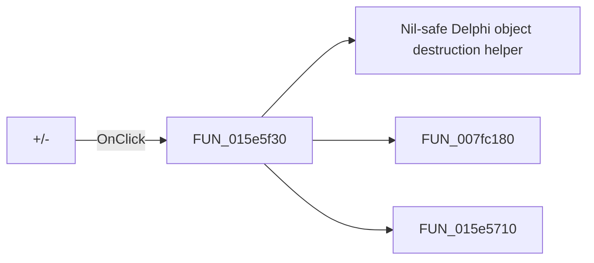

# +/-

> Analysis status: Pending individual source review.

## Control

| Property | Recovered value |
| --- | --- |
| Form | ElfMCUSelect |
| Component path | ElfMCUSelect.bManageProjects |
| Control class | TButton |
| Caption | +/- |
| Hint | Manage Projects |
| Text | Not present in the recovered resource. |
| Handler name | bManageProjectsClick |
| Handler address | 015e5f30 |
| Graph node | `resource:dfm:ElfMCUSelect/ElfMCUSelect.bManageProjects` |
| Handler node | `function:015e5f30` |
| Graph layer | UI |

## What happens when clicked

Pending individual analysis. An agent must read the recovered handler source and its relevant callees before it replaces this text.

## Click flow

## Handler evidence

- Source: [DecompiledSources/Tina16/functions/00000000015E5F30__FUN_015e5f30.c](../../../DecompiledSources/Tina16/functions/00000000015E5F30__FUN_015e5f30.c)
- Recovered role: Not present in the recovered resource.
- Current graph summary: Handles 1 Delphi UI event: ElfMCUSelect.bManageProjects.OnClick.
- Current graph behavior: Not present in the recovered resource.
- Current graph evidence: Not present in the recovered resource.
- Complexity: complex
- Distinct outgoing calls: 3

## Direct calls

- `function:00410f20` — Nil-safe Delphi object destruction helper
- `function:007fc180` — FUN_007fc180
- `function:015e5710` — FUN_015e5710

## Resource evidence

- Kind: Not present in the recovered resource.
- Modal result: Not present in the recovered resource.
- Checked state: Not present in the recovered resource.
- List items: Not present in the recovered resource.
- Image reference: Not present in the recovered resource.
- Extracted glyph: None.

## Nearby label candidates

Nearby labels are layout candidates only. They are not proof of behavior.

- Rank 1: Project: at distance 454.
- Rank 2: MCU Component: at distance 484.
- Rank 3: Workspace: at distance 507.

## Analysis limits

- Do not infer behavior from the control class, caption, hint, glyph, or nearby label alone.
- Do not replace the pending status until the handler source and relevant call path provide enough evidence.
