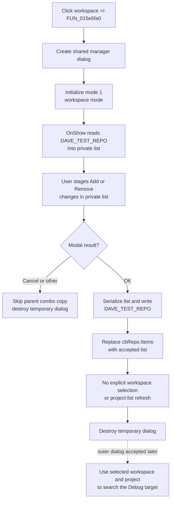

# Manage the saved Eclipse workspace list

> Analysis status: Evidence-backed source review complete.

## Control

| Property | Recovered value |
| --- | --- |
| Form | ElfMCUSelect |
| Form caption | Refresh Eclipse Project |
| Component path | ElfMCUSelect.bManageWorkspaces |
| Control class | TButton |
| Caption | +/- |
| Hint | Manage Workspaces |
| Handler name | bManageWorkspacesClick |
| Handler address | 015e5fa0 |
| Graph node | `resource:dfm:ElfMCUSelect/ElfMCUSelect.bManageWorkspaces` |
| Handler node | `function:015e5fa0` |
| Graph layer | UI |

The button is beside the `Workspace:` combo box named `cbRepo`. The `Project:` combo and its own +/- button are separate controls.

## What happens when clicked

`TElfMCUSelect.bManageWorkspacesClick` creates a fresh `TManageElfProjects` dialog owned by the application. Despite that recovered class and DFM name, the form is shared for both project and workspace management. The handler initializes it with mode `1`, which selects workspace mode and applies the workspace-mode form caption.

When the modal form opens, its `OnShow` path reads the saved workspace and project settings. Workspace mode converts the comma-separated `DAVE_TEST_REPO` value into a private string list at dialog field `+0x6f8` and assigns that list to `lItems`.

Inside the manager:

- **Add** ignores empty text and a value that the string list already finds. Otherwise, it appends the entered text to the private list and refreshes `lItems`.
- **Remove** does nothing when no row is selected. Otherwise, it removes the selected row from the private list and refreshes `lItems`.
- These operations do not check whether an entry is an existing directory or an Eclipse workspace.

The outer click handler waits for the modal result. It copies the manager's private list into `ElfMCUSelect.cbRepo.Items` only when the result is `1`, the OK result. It then destroys the temporary manager on the normal return path.

## OK, Cancel, and refresh behavior

The manager's **OK** click serializes its private list as comma-separated text, removes double-quote characters, and calls the shared mode-based registry writer. Mode `1` writes the value named `DAVE_TEST_REPO`. The built-in OK button then returns modal result `1`, and the outer handler replaces the workspace combo's items with the same list.

The manager's built-in **Cancel** button does not call the OK handler. The outer handler sees a result other than `1`, skips the item copy, and destroys the dialog. Normal Add and Remove changes are therefore discarded because they existed only in the temporary list.

The accepted copy refreshes only `cbRepo.Items`. The handler does not:

- write `cbRepo.ItemIndex` or its displayed text;
- reload or clear the project combo;
- choose a replacement workspace when the current item was removed;
- persist the selected workspace index; or
- trigger project or component discovery.

Any selection effect caused internally by VCL while it replaces the combo items is not visible in the recovered handler. The selected workspace and project indexes are written later only when the outer `ElfMCUSelect` workflow finishes.

## Workspace and project relationship

The workspace and project lists are saved separately. `DAVE_TEST_REPO` stores workspaces, while `DAVE_TEST_PRJ` stores project names. The workspace manager changes only the first list.

When the outer `ElfMCUSelect` dialog is later accepted, its caller reads the selected workspace text and selected project text. The downstream assignment path combines them as a directory path, searches below that project for a `Debug` output directory, and looks for an ELF file. This matches the form's recovered note, `(It will search for the Debug target)`.

This later consumer establishes why a workspace and project must form a valid pair. The workspace manager does not enforce that relationship. It can save a workspace entry that has no matching project, no `Debug` directory, or no ELF output. Those failures are reported only in the later assignment path.

## Click flow

The dotted edge is later consumer behavior. It is not a direct call from this button handler.

## Configuration and filesystem boundaries

- The settings loader and writer use `HKEY_CURRENT_USER` and an application registry path held in shared state. The full application key text is not recovered in these function bodies.
- The workspace list is stored under `DAVE_TEST_REPO`. The project list and the selected workspace and project indexes use separate values.
- Opening the manager reloads the registry-backed list. It does not use the current parent combo as its source.
- If the application registry key exists but a list or index value is missing, the shared loader creates an empty string or zero default. This initialization can occur before the user accepts the manager.
- Manager OK persists the workspace list before the outer handler copies it. If the user later cancels `ElfMCUSelect`, that outer cancellation does not undo the manager's accepted registry write.
- The manager does not create, remove, rename, scan, or validate a workspace directory. It changes configuration text only.
- Removing quote characters before storage means that an entry containing a comma has no proven round-trip representation. The Add handler does not reject commas.

## No-op and error behavior

- Manager Cancel is a normal no-op for the parent workspace combo and for the accepted list write, apart from any missing-value defaults created during settings loading.
- Add with empty text or a value already found by the string list is a no-op. Remove with no selected row is a no-op.
- If the shared registry key cannot be opened during the manager's `OnShow` load, the loader raises an error that includes the missing key path. The outer click handler has no local recovery path.
- If the key cannot be opened during the OK writer, the recovered writer skips its value write. The dialog can still return OK and the outer handler can still refresh the in-memory combo list.
- Lower registry, VCL, allocation, modal-dialog, list-copy, or destruction failures have no local message, retry, rollback, or catch block in `FUN_015e5fa0`. An exception can propagate.
- The normal path destroys the temporary dialog. The decompiled body does not prove cleanup behavior for every exceptional unwind.
- A failure after the manager's registry write but before the parent item copy can leave the saved workspace list changed while the visible parent combo is stale.

## Recovered evidence

- [`FUN_015e5fa0`](../../../DecompiledSources/Tina16/functions/00000000015E5FA0__FUN_015e5fa0.c) constructs the shared dialog, initializes mode `1`, calls `ShowModal`, copies dialog field `+0x6f8` into `cbRepo.Items` only for modal result `1`, and destroys the dialog.
- [`FUN_015e5710`](../../../DecompiledSources/Tina16/functions/00000000015E5710__FUN_015e5710.c) stores the mode and applies the project- or workspace-mode caption. Bead `.464` owns this shared helper.
- [`FUN_015e5590`](../../../DecompiledSources/Tina16/functions/00000000015E5590__FUN_015e5590.c) and [`FUN_015e55a0`](../../../DecompiledSources/Tina16/functions/00000000015E55A0__FUN_015e55a0.c) implement the manager `OnShow` path. It reloads settings, selects the mode-specific list, splits it, and assigns it to `lItems`. Bead `.464` owns the shared loader annotation.
- [`FUN_015e5310`](../../../DecompiledSources/Tina16/functions/00000000015E5310__FUN_015e5310.c) stages a nonempty, nonduplicate item. [`FUN_015e5490`](../../../DecompiledSources/Tina16/functions/00000000015E5490__FUN_015e5490.c) removes the selected item. Both update `lItems` from the private list.
- [`FUN_015e5420`](../../../DecompiledSources/Tina16/functions/00000000015E5420__FUN_015e5420.c) is the manager OK handler. It serializes the list and passes it with the mode to [`FUN_016056c0`](../../../DecompiledSources/Tina16/functions/00000000016056C0__FUN_016056c0.c). Mode `1` writes `DAVE_TEST_REPO`. Bead `.464` owns these shared functions.
- [`FUN_004b37d0`](../../../DecompiledSources/Tina16/functions/00000000004B37D0__FUN_004b37d0.c) temporarily uses comma as the delimiter and a double quote as the quote character during serialization. [`FUN_01605430`](../../../DecompiledSources/Tina16/functions/0000000001605430__FUN_01605430.c) removes double quotes before the registry write.
- [`FUN_01604ed0`](../../../DecompiledSources/Tina16/functions/0000000001604ED0__FUN_01604ed0.c) reads `DAVE_TEST_REPO`, `DAVE_TEST_PRJ`, and their saved indexes from the application key under `HKEY_CURRENT_USER`. [`FUN_01b21190`](../../../DecompiledSources/Tina16/functions/0000000001B21190__FUN_01b21190.c) splits the saved strings on commas.
- [`FUN_01607d20`](../../../DecompiledSources/Tina16/functions/0000000001607D20__FUN_01607d20.c) loads both lists and indexes into `ElfMCUSelect`, reads the accepted workspace and project selections, saves their indexes, and passes both texts to the downstream assignment path.
- [`FUN_016052c0`](../../../DecompiledSources/Tina16/functions/00000000016052C0__FUN_016052c0.c) persists only the selected indexes. [`FUN_01606940`](../../../DecompiledSources/Tina16/functions/0000000001606940__FUN_01606940.c) combines the selected workspace and project and searches the project output for a `Debug` directory and ELF file.
- [`ui-evidence.json`](../../../DecompiledSources/Tina16/resources/dfm/ui-evidence.json) supplies the parent form, Workspace and Project controls, hints, event binding, manager form, list editor, Add/Remove controls, and built-in OK and Cancel buttons. The +/- button has no image or glyph.

## Analysis limits

The recovered manager class is named `TManageElfProjects` because one form serves both modes. The original Delphi names for the private string-list field and the application registry key path are not recovered. No explicit `cbRepo.ItemIndex` write follows the accepted list replacement, so this article does not claim how VCL preserves or clears the current workspace selection. Shared manager setup, load, OK, and registry-write functions remain evidence-only under Bead `.464`; `.465` owns only `FUN_015e5fa0`.
