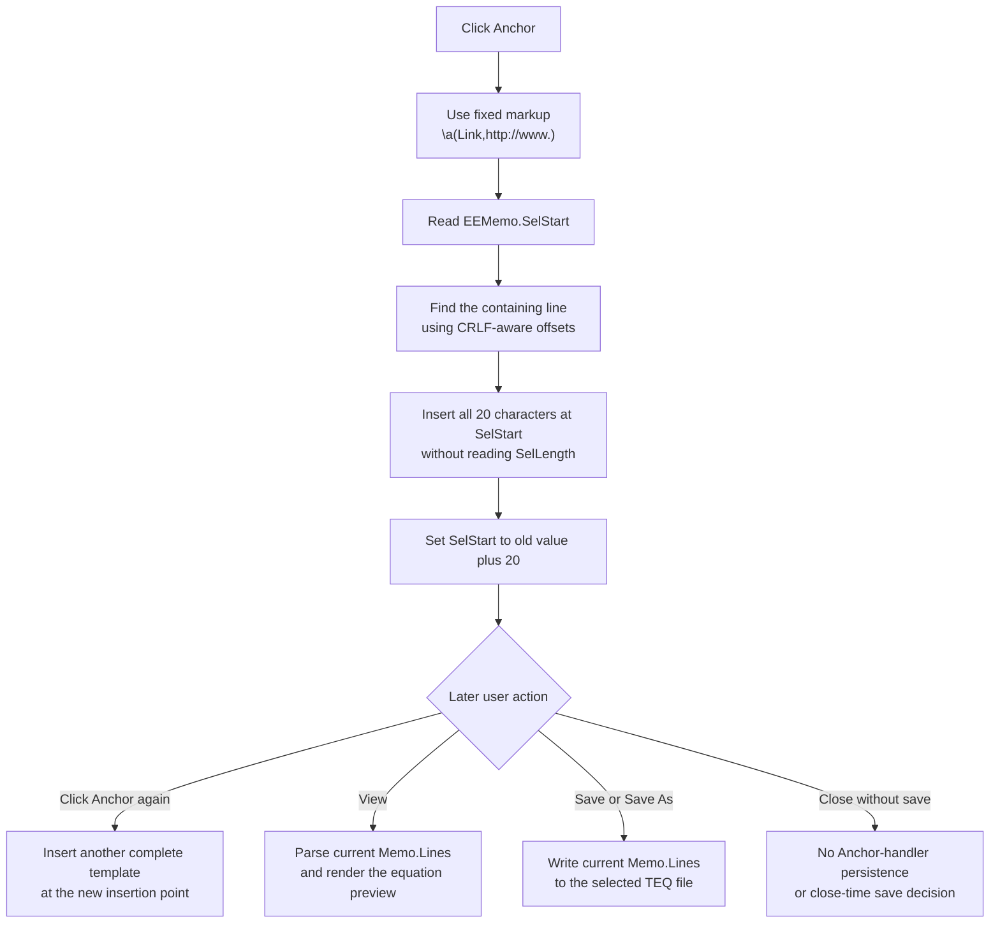

# Insert an external-link anchor template

> Analysis status: Complete. The recovered handler, shared insertion helper, parallel markup use, and Equation Editor render and save paths establish the text, caret, preview, and persistence boundaries.

## Control

| Property | Recovered value |
| --- | --- |
| Form | EquEditor |
| Form caption | Equation Editor |
| Component path | EquEditor.EETPanel.EEAnchorBtn |
| Control class | TSpeedButton |
| Caption | Not present in the recovered resource. |
| Hint | Anchor |
| Handler name | EEAnchorBtnClick |
| Handler address | 01464530 |
| Graph node | `resource:dfm:EquEditor/EquEditor.EETPanel.EEAnchorBtn` |
| Handler node | `function:01464530` |
| Graph layer | UI |

## What happens when clicked

`FUN_01464530` passes one fixed 20-character Unicode string to the Equation Editor's shared memo-insertion helper:

`\a(Link,http://www.)`

This is TINA action-link markup in the form `\a(display,target)`. The independent system-text editor inserts the identical literal and its recovered formatter treats `Link` as the displayed text and `http://www.` as the target. The Equation Editor later sends its memo lines through the TINA equation parser and renderer when the user changes to View.

The button does not open the target when clicked. It also does not ask for a URL, complete the placeholder, select either argument, or switch to View. The literal target ends after the final dot, so the user must edit it to make a more specific URL.

## Insertion and selection behavior

`FUN_014641a0` performs the insertion against `EquEditor.EEMemo`:

1. It reads the memo's absolute `SelStart`.
2. It walks `EEMemo.Lines`, adding each line length and two characters for the CRLF separator, until it finds the line that contains the insertion point.
3. It converts the absolute position to a one-based position in that line.
4. It inserts the complete token into a local copy of the line and assigns that line back to `EEMemo.Lines`.
5. It sets `SelStart` to the old value plus 20.

With a normal zero-length selection, the caret ends immediately after the closing parenthesis. The helper never reads `SelLength` and does not call a selected-text replacement operation. Therefore, it does not deliberately remove selected characters; it inserts at the selection start. The recovered code proves the new selection-start value, but it does not prove whether the VCL line assignment and later setter clear or retain an existing nonzero selection highlight.

## Not an anchor-state or attachment toggle

The recovered DFM does not assign `GroupIndex`, `Down`, `AllowAllUp`, an action, or a checked state to this speed button. The click handler does not read the sender or button state and does not write an equation-object alignment, attachment, selection, or anchor flag. It only supplies the fixed text token to the shared insertion helper.

The neighboring Fraction, Exponent, Index, Symbol, and Special character buttons call the same helper with different equation-markup templates. This parallel use confirms that Anchor is one of the text-template insertion commands. It is not the View/Edit mode selector and it does not attach the current equation to another object.

## Later preview and persistence

The click changes the live `EEMemo.Lines` text immediately. It does not invoke the Equation Editor parser or redraw the rendered equation.

When the user later selects View, `FUN_01463d20` enters view mode and calls `FUN_014635d0`. That function calls `FUN_01463140`, which copies the current memo lines into the internal equation object, parses them, calculates the rendered size, and draws the result before it hides the memo and shows the preview controls. Thus, a later View operation consumes the inserted markup. The recovered Anchor path does not establish that clicking a rendered link inside the Equation Editor preview performs navigation; it establishes only insertion and later rendering.

The click does not update a caller-owned object, write a file, set a current document path, or mark a recovered application model as saved. The separate Save and Save As handler writes the complete current `EEMemo.Lines` text to a user-selected `.teq` file. The form-close handler allows closing without a save decision. Therefore, the inserted anchor becomes durable only through a later explicit save; no auto-save or close-time commit is present in this path.

## Click and later-use flow

## Source evidence

- Anchor handler: [FUN_01464530](../../../DecompiledSources/Tina16/functions/0000000001464530__FUN_01464530.c)
- Shared Equation Editor insertion helper: [FUN_014641a0](../../../DecompiledSources/Tina16/functions/00000000014641A0__FUN_014641a0.c)
- Unicode string insertion primitive: [FUN_00416ea0](../../../DecompiledSources/Tina16/functions/0000000000416EA0__FUN_00416ea0.c)
- View command: [FUN_01463d20](../../../DecompiledSources/Tina16/functions/0000000001463D20__FUN_01463d20.c)
- View layout and render entry: [FUN_014635d0](../../../DecompiledSources/Tina16/functions/00000000014635D0__FUN_014635d0.c)
- Equation parse and render path: [FUN_01463140](../../../DecompiledSources/Tina16/functions/0000000001463140__FUN_01463140.c)
- Save and Save As handler: [FUN_01463980](../../../DecompiledSources/Tina16/functions/0000000001463980__FUN_01463980.c)
- Form-close handler: [FUN_01464e40](../../../DecompiledSources/Tina16/functions/0000000001464E40__FUN_01464e40.c)
- Independent identical action-link template: [CSysTextDlg Anchor handler](../../../DecompiledSources/Tina16/functions/00000000014698A0__FUN_014698a0.c)
- Recovered form and control properties: [ui-evidence.json](../../../DecompiledSources/Tina16/resources/dfm/ui-evidence.json)

## Direct call

- `function:014641a0` - Inserts supplied equation markup into `EEMemo.Lines` at `SelStart` and advances `SelStart` by the inserted length. This Bead owns its canonical annotation; the Fraction, Exponent, Index, Symbol, and Special character articles cite the same helper.

## Resource and image evidence

- The control is a 31 by 31 `TSpeedButton` on `EquEditor.EETPanel`.
- Its recovered hint is `Anchor`. It has no caption, action, image-list reference, button kind, checked state, or same-parent label candidate.
- Extracted glyph: [`0143_EquEditor_EquEditor_EETPanel_EEAnchorBtn_Glyph_Data.png`](../../../glyph/0143_EquEditor_EquEditor_EETPanel_EEAnchorBtn_Glyph_Data.png)
- The glyph is a 21 by 21 chain-link image extracted from a 374-byte Delphi BMP as a 242-byte PNG. It supports the link meaning, while the handler literal and insertion path establish the behavior.

## Repeated clicks, guards, and errors

- The handler has no intentional no-op branch. Its source text is fixed and nonempty, so each click attempts to insert a complete template.
- After a successful normal insertion, the moved `SelStart` makes a repeated click insert the next template immediately after the first. No duplicate check or separator is added.
- The handler does not validate the current text, URL, markup syntax, line index, or selection. The helper relies on the VCL to provide a `SelStart` that maps to a memo line.
- The Unicode insertion primitive clamps its one-based in-line position to the current line bounds and raises on a combined string-length overflow.
- The handler and helper have no local exception handler, message, retry, or rollback. Allocation and line-read failures before the line assignment leave the memo unchanged. A failure after the line assignment but before or during the final `SelStart` update can leave the token inserted without the requested caret move.
- The source does not establish final `SelLength` after inserting into a nonzero selection, successful resolution of the placeholder URL, or link activation from the Equation Editor preview.
