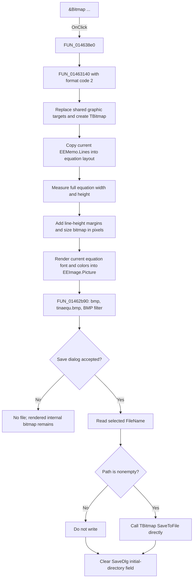

# &Bitmap ...

> Analysis status: Complete. The recovered dispatcher, bitmap writer, dialog setup, and equation renderer support this explanation.

## Control

| Property | Recovered value |
| --- | --- |
| Form | EquEditor |
| Component path | EquEditor.EEMenu.EEFileMnu.EEExportMnu.EEBMPMnu |
| Control class | TMenuItem |
| Caption | &Bitmap ... |
| Hint | Not present in the recovered resource. |
| Handler name | ExportBmpClick |
| Handler address | 014638e0 |
| Graph node | `resource:dfm:EquEditor/EquEditor.EEMenu.EEFileMnu.EEExportMnu.EEBMPMnu` |
| Handler node | `function:014638e0` |
| Graph layer | UI |

## What happens when clicked

`FUN_014638e0` calls the shared EquEditor graphics dispatcher `FUN_01463140` with format code `2`. This code selects the bitmap export branch.

The dispatcher renders before it opens the Save dialog. It destroys and replaces the three shared graphic targets used by the EquEditor export system, including a new VCL `TBitmap`. It copies the current `EEMemo.Lines` into the equation-layout object and resets that object's cached bounds. It measures the complete equation content, not the visible scroll-box rectangle, and sizes the bitmap as follows:

- width = measured equation width + two current line heights;
- height = measured equation height + three current line heights.

Both dimensions are clamped to at least zero by the recovered maximum helper. The equation renderer starts at offsets equal to one current line height in both axes. This gives the rendered content a left and top margin, with the remaining measured padding at the right and bottom.

The renderer assigns the current equation font to the bitmap canvas and applies the font's current color to its drawing properties. It also chooses a drawing width of one or two pixels from the recovered font-size threshold. The bitmap branch does not set a separate scale factor, crop rectangle, selected-only region, background color, pixel format, transparency mode, compression mode, or DPI value. The output therefore uses the calculated pixel dimensions and the current equation formatting. The exact BMP color depth and DPI metadata remain VCL bitmap defaults.

The rendered bitmap is assigned to the hidden `EquEditor.EEScrollBox.EEImage.Picture`. `FUN_01462b90` then configures `EquEditor.SaveDlg` with:

| Setting | Value |
| --- | --- |
| Default extension | `bmp` |
| Default file name | `tinaequ.bmp` |
| Filter | `Bitmap file (*.bmp)\|*.bmp` |
| Initial directory | Seeded during EquEditor setup from the shared application path; this handler does not calculate a new folder. |

If the user accepts, the wrapper gets `SaveDlg.FileName`. A nonempty path is passed directly to the bitmap object's one-argument virtual `SaveToFile` method. The file is a VCL bitmap serialization; no JPEG, metafile, SVG, text, or sidecar output is produced. After the accepted branch, the wrapper clears the Save dialog's initial-directory field. It does not store the selected path in an EquEditor document field or application setting.

## Cancel, overwrite, and failure behavior

- Cancel skips the filename read and `SaveToFile`. It creates no output file and shows no cancel message.
- Rendering occurs before the dialog. Cancel therefore leaves the new internal bitmap assigned to `EEImage.Picture` and in the shared export target. The next export replaces that target, and EquEditor cleanup destroys it.
- The recovered DFM and handler do not establish `SaveDlg.Options`. The application does not perform its own file-existence test or overwrite question. Any native overwrite prompt is delegated to the Save dialog.
- After acceptance, the handler calls the bitmap writer directly. It has no temporary-file name, backup, atomic rename, retry, returned-status check, rollback, or partial-file deletion path. The lower-level VCL writer owns creation and replacement. If it fails after it starts the output, this handler does not repair or remove a partial file.
- There is no local exception handler or error dialog. A dialog, path, allocation, render, or bitmap-write exception propagates through the Delphi runtime.

## Empty editor behavior

There is no empty-content guard. The shared path still creates a bitmap, calculates dimensions from the equation renderer's empty measurements and line-height margins, opens the Save dialog, and can save the resulting blank or margin-only BMP. It does not warn that the editor is empty.

## State and persistence

- The command reads the current memo lines and equation font. It does not change the memo, selection, caret, scroll position, equation model, or document filename.
- It refreshes internal render objects and the hidden `EEImage.Picture` before the Save dialog result is known.
- A successful save writes only the selected BMP output through the VCL writer.
- No recovered INI, registry, project serializer, recent-file list, dirty flag, or undo operation is used.

## Click flow

## Source evidence

- Menu wrapper: [FUN_014638e0](../../../DecompiledSources/Tina16/functions/00000000014638E0__FUN_014638e0.c)
- Shared graphics dispatcher: [FUN_01463140](../../../DecompiledSources/Tina16/functions/0000000001463140__FUN_01463140.c)
- BMP Save dialog and writer: [FUN_01462b90](../../../DecompiledSources/Tina16/functions/0000000001462B90__FUN_01462b90.c)
- Equation width measurement: [FUN_01d1b660](../../../DecompiledSources/Tina16/functions/0000000001D1B660__FUN_01d1b660.c)
- Equation height measurement: [FUN_01d1bfb0](../../../DecompiledSources/Tina16/functions/0000000001D1BFB0__FUN_01d1bfb0.c)
- Equation drawing: [FUN_01d1c9d0](../../../DecompiledSources/Tina16/functions/0000000001D1C9D0__FUN_01d1c9d0.c)
- Picture assignment and bitmap access: [FUN_00603cf0](../../../DecompiledSources/Tina16/functions/0000000000603CF0__FUN_00603cf0.c) and [FUN_00603c60](../../../DecompiledSources/Tina16/functions/0000000000603C60__FUN_00603c60.c)
- Default-name setter: [FUN_00724380](../../../DecompiledSources/Tina16/functions/0000000000724380__FUN_00724380.c)
- Accepted filename reader: [FUN_00724270](../../../DecompiledSources/Tina16/functions/0000000000724270__FUN_00724270.c)
- Dialog initial-directory setter: [FUN_00724420](../../../DecompiledSources/Tina16/functions/0000000000724420__FUN_00724420.c)
- EquEditor setup and shared-target cleanup: [FUN_01463690](../../../DecompiledSources/Tina16/functions/0000000001463690__FUN_01463690.c) and [FUN_01463c80](../../../DecompiledSources/Tina16/functions/0000000001463C80__FUN_01463c80.c)

## Analysis limits

- The recovered code proves the pixel-size formulas but does not name a physical DPI or print scale.
- The VCL bitmap writer is reached through a virtual call. Its exact header fields, color depth, compression flags, file-open sequence, and exception text are not direct graph edges in this export.
- `FUN_01463140` is shared by bitmap, JPEG, Windows Metafile, SVG, clipboard, and on-screen rendering. The format-specific sibling articles own their encoder or Save-dialog wrappers. Generic image and equation-layout helpers remain evidence-only here because other forms also call them.
