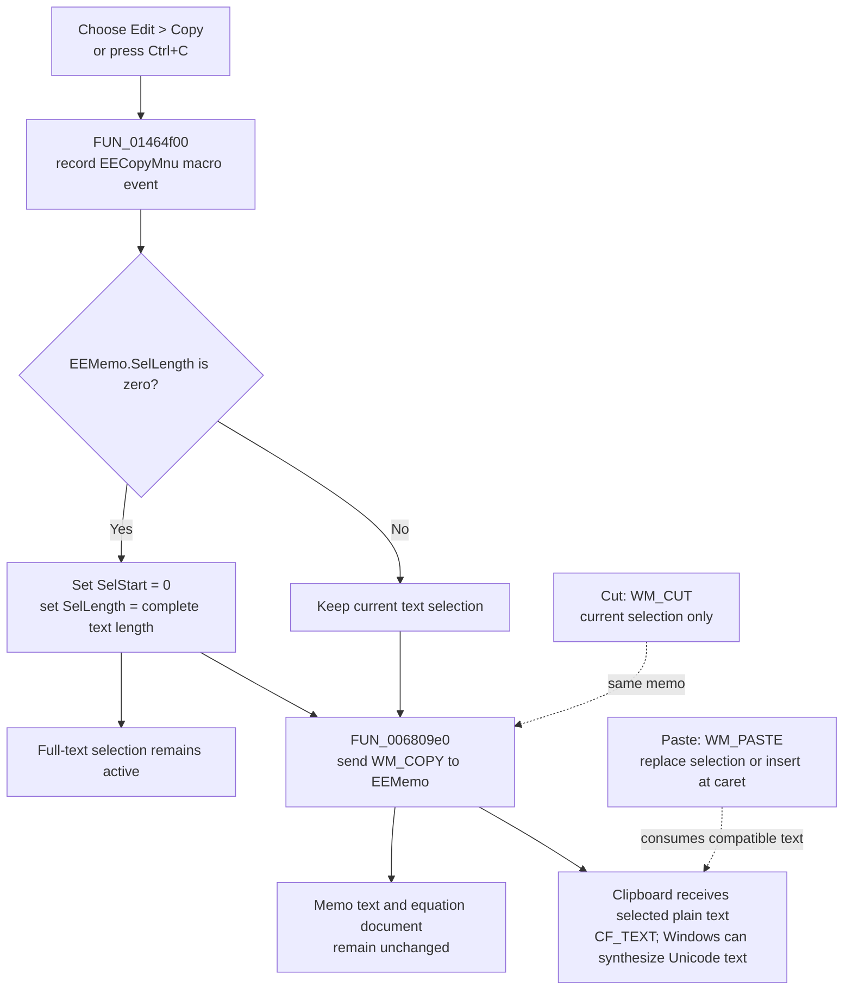

# Copy selected or complete equation text

> Analysis status: Reviewed from the recovered Equation Editor resources, menu handler, memo selection APIs, Win32 clipboard wrapper, macro-event recorder, toolbar caller, and adjacent Cut and Paste handlers.

## Control

| Property | Recovered value |
| --- | --- |
| Form | EquEditor |
| Form caption | Equation Editor |
| Component path | EquEditor.EEMenu.EEEditMnu.EECopyMnu |
| Control class | TMenuItem |
| Caption | &Copy |
| Shortcut | Ctrl+C (`16451`, or `0x4043`) |
| Target control | EquEditor.EEMemo (`TMemo`) |
| Handler name | EECopyMnuClick |
| Handler address | 01464f00 |
| Graph node | `resource:dfm:EquEditor/EquEditor.EEMenu.EEEditMnu.EECopyMnu` |
| Handler node | `function:01464f00` |
| Graph layer | UI |

The resource has no hint, action, image reference, or glyph for this menu item.

## What happens when Copy is selected

[`FUN_01464f00`](../../../DecompiledSources/Tina16/functions/0000000001464F00__FUN_01464f00.c) always targets `EquEditor.EEMemo`, the form's native multiline edit control.

The handler performs these steps:

1. It builds an `EECopyMnu` macro-event identifier from the menu-command class value `0x406`, the form identifier at `+0x6b8`, and the command name. It sends this identifier to the optional macro-event recorder.
2. It reads `EEMemo.SelLength` through virtual slot `+0x270`.
3. If the selection length is zero, it sets `SelStart` to 0 through slot `+0x290`, gets the complete memo text length through [`FUN_0064dc90`](../../../DecompiledSources/Tina16/functions/000000000064DC90__FUN_0064dc90.c), and sets `SelLength` to that value through slot `+0x288`.
4. It calls the canonical VCL Copy-to-Clipboard wrapper [`FUN_006809e0`](../../../DecompiledSources/Tina16/functions/00000000006809E0__FUN_006809e0.c). That wrapper gets the memo's native window handle and sends `WM_COPY` (`0x0301`) with zero message parameters.

Therefore, Copy has two input cases:

- If text is selected, it copies exactly that selection.
- If no text is selected, it selects and copies the complete memo text. The full-text selection remains active because the handler does not restore the old caret or selection.

If the memo is empty, the calculated full selection also has length zero. The handler still sends `WM_COPY`; it has no special empty-document result.

## Clipboard content and formats

The direct menu path does not serialize an equation object and does not register an application-specific format. It delegates to the Windows edit control. Microsoft documents `WM_COPY` as copying the current edit-control selection to the clipboard in `CF_TEXT` format. Windows can synthesize `CF_OEMTEXT` and `CF_UNICODETEXT` from that text when a receiver requests them. See the official [WM_COPY message](https://learn.microsoft.com/en-us/windows/win32/dataxchg/wm-copy) and [clipboard format conversion](https://learn.microsoft.com/en-us/windows/win32/dataxchg/clipboard-formats) documentation.

The content is the memo's plain selected text, including any line separators inside the selection. The menu path does not put bitmap, metafile, HTML, RTF, equation-tree, or file data on the clipboard.

There is one caller-specific extension. The **Copy** toolbar handler [`FUN_01463ea0`](../../../DecompiledSources/Tina16/functions/0000000001463EA0__FUN_01463ea0.c) can prepare a registered clipboard format named `Tina &text` and then call this menu handler to add the plain-text representation. That custom-format payload belongs to the toolbar caller, not to a direct **Edit > Copy** command. In the toolbar handler's other mode, it calls the VCL copy wrapper directly and bypasses this handler's select-all fallback.

## Cut and Paste interoperability

The adjacent commands operate on the same `EEMemo` native edit control:

- [`FUN_01464e50`](../../../DecompiledSources/Tina16/functions/0000000001464E50__FUN_01464e50.c), **Cut**, sends `WM_CUT`. It copies and removes the current selection. It does not select the full memo when the selection is empty.
- [`FUN_01465000`](../../../DecompiledSources/Tina16/functions/0000000001465000__FUN_01465000.c), **Paste**, sends `WM_PASTE`. The native edit control replaces the current selection or inserts compatible clipboard text at the caret.

Plain text produced by Copy can therefore be pasted back through the Equation Editor Paste command or into another text consumer. The recovered Paste handler has no reader for the `Tina &text` custom format; it relies on native edit-control text paste. Cut and Paste have their own macro-event records and do not call `FUN_01464f00`.

## Copy flow

## Mutation and persistence boundaries

- The direct Copy command changes the system clipboard.
- When no text was selected, it also changes transient memo selection state to select all text.
- It does not change the memo text, equation data, modified flag, file path, undo history, or saved document.
- The handler does not call a document serializer, settings writer, file API, or modified-state setter.
- If macro-event recording is enabled, the command identifier can be appended to that recorder before the copy. This is separate from the equation document.
- Repeated Copy commands replace the clipboard text with the selection that is current at that time. After the first no-selection copy, the memo remains fully selected, so a repeated copy uses that full selection.

## No-op and error boundaries

- There is no disabled-state, read-only, password, or valid-document guard in the handler. It always reaches the selection test and `WM_COPY` after macro-event recording.
- An empty memo leaves a zero-length selection. The recovered application code does not define whether the native control preserves or replaces prior clipboard content for this case.
- The handler does not inspect a clipboard format before copying. It also does not inspect the `WM_COPY` result; the Win32 message is documented to return zero.
- Clipboard ownership, allocation, text conversion, and clipboard-open failures belong to the native edit control. This handler has no local error message, retry, exception handler, or rollback.
- Macro-event construction and recording occur first. If either raises an exception, the copy call is not reached. If copying later fails, a macro event can already have been recorded.
- Setting the selection can fail through the underlying VCL or window-control path. The handler does not restore the prior caret or selection after a partial failure.

## Evidence

- Direct Copy handler: [FUN_01464f00](../../../DecompiledSources/Tina16/functions/0000000001464F00__FUN_01464f00.c)
- VCL text-length query: [FUN_0064dc90](../../../DecompiledSources/Tina16/functions/000000000064DC90__FUN_0064dc90.c)
- Canonical VCL `WM_COPY` wrapper: [FUN_006809e0](../../../DecompiledSources/Tina16/functions/00000000006809E0__FUN_006809e0.c)
- Macro-event identifier builder: [FUN_01aee720](../../../DecompiledSources/Tina16/functions/0000000001AEE720__FUN_01aee720.c)
- Optional macro-event recorder: [FUN_01aed550](../../../DecompiledSources/Tina16/functions/0000000001AED550__FUN_01aed550.c)
- Cut handler and `WM_CUT` wrapper: [FUN_01464e50](../../../DecompiledSources/Tina16/functions/0000000001464E50__FUN_01464e50.c), [FUN_00680a10](../../../DecompiledSources/Tina16/functions/0000000000680A10__FUN_00680a10.c)
- Paste handler and `WM_PASTE` wrapper: [FUN_01465000](../../../DecompiledSources/Tina16/functions/0000000001465000__FUN_01465000.c), [FUN_00680a40](../../../DecompiledSources/Tina16/functions/0000000000680A40__FUN_00680a40.c)
- Toolbar Copy caller: [FUN_01463ea0](../../../DecompiledSources/Tina16/functions/0000000001463EA0__FUN_01463ea0.c)
- `Tina &text` format registration: [FUN_01465600](../../../DecompiledSources/Tina16/functions/0000000001465600__FUN_01465600.c)
- Recovered form resources: [ui-evidence.json](../../../DecompiledSources/Tina16/resources/dfm/ui-evidence.json)

## Analysis limits

- The VCL method symbols for virtual slots `+0x270`, `+0x288`, and `+0x290` are not present in the decompilation. Their getter/setter use and the insertion caller establish `SelLength` and `SelStart` behavior.
- The direct handler does not expose the bytes or type schema stored by the toolbar caller under `Tina &text`. This article does not assign an unsupported equation serialization format to that payload.
- `TIARA-diz.6.7.143` owns the canonical VCL Copy, Cut, and Paste wrappers. The Cut and Paste control articles own their handlers. This article owns only the Equation Editor Copy menu handler.
