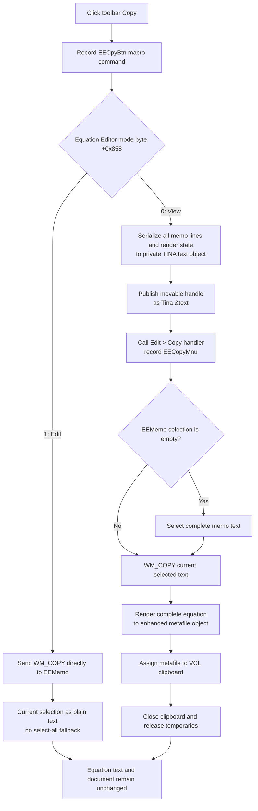

# Copy the equation in mode-specific clipboard formats

> Analysis status: Complete. The recovered toolbar handler, Equation Editor mode controls, menu Copy handler, private serializer, clipboard wrapper, render coordinator, and glyph support this explanation.

## Control

| Property | Recovered value |
| --- | --- |
| Form | `EquEditor` (`TEquEditor`) |
| Form caption | Equation Editor |
| Component path | `EquEditor.EETPanel.EECpyBtn` |
| Control class | `TSpeedButton` |
| Caption | Not present in the recovered resource. |
| Hint | `Copy` |
| Handler name | `EECpyBtnClick` |
| Handler address | `01463ea0` |
| Graph node | `resource:dfm:EquEditor/EquEditor.EETPanel.EECpyBtn` |
| Handler node | `function:01463ea0` |
| Graph layer | UI |

The extracted two-frame glyph shows overlapping pages, which supports the Copy hint. The DFM gives this speed button no group index, down state, or check state. It is a momentary command, not a mode toggle.

## Mode decision

[`FUN_01463ea0`](../../../DecompiledSources/Tina16/functions/0000000001463EA0__FUN_01463ea0.c) first records an `EECpyBtn` toolbar command for optional macro capture. It then reads the Equation Editor mode byte at form offset `+0x858`.

- **View mode (`+0x858 = 0`):** the View button handler [`FUN_01463d20`](../../../DecompiledSources/Tina16/functions/0000000001463D20__FUN_01463d20.c) and view transition [`FUN_014635d0`](../../../DecompiledSources/Tina16/functions/00000000014635D0__FUN_014635d0.c) write this value. This mode shows the rendered expression and hides `EEMemo`.
- **Edit mode (`+0x858 = 1`):** the Edit button handler [`FUN_01463de0`](../../../DecompiledSources/Tina16/functions/0000000001463DE0__FUN_01463de0.c) and edit transition [`FUN_01462ae0`](../../../DecompiledSources/Tina16/functions/0000000001462AE0__FUN_01462ae0.c) write this value. This mode shows `EEMemo` and hides the rendered preview.

Copy reads this byte but does not change it. It does not press the View or Edit button and does not change the Copy button state.

## View-mode copy

View mode builds three clipboard representations from the current equation.

### Private `Tina &text` representation

The handler copies all current `EEMemo.Lines` into a newly constructed TINA text-object instance. It also copies the live Equation Editor render and style state into that object and asks the object's serializer to write to a memory stream.

It then:

1. gets the stream byte count;
2. allocates movable global memory with `GlobalAlloc` flag `GMEM_MOVEABLE`;
3. locks the handle and copies the complete stream into it;
4. opens the process-wide VCL clipboard wrapper; and
5. publishes the handle through `SetClipboardData` under the registered format named `Tina &text`.

[`FUN_01465600`](../../../DecompiledSources/Tina16/functions/0000000001465600__FUN_01465600.c) registers that format name during application initialization. The serialized object is made from all memo lines, not from only the selected text. The recovered code establishes a serialized TINA text object, but it does not expose a public schema for the private byte stream.

### Plain-text representation and selection fallback

While the clipboard is open, the toolbar handler calls the shared menu Copy handler [`FUN_01464f00`](../../../DecompiledSources/Tina16/functions/0000000001464F00__FUN_01464f00.c). That handler targets `EEMemo`:

- if `SelLength` is nonzero, it sends `WM_COPY` for the existing selection;
- if `SelLength` is zero, it sets `SelStart` to 0, sets `SelLength` to the complete memo text length, and then sends `WM_COPY`.

The menu article documents the canonical native text path as `CF_TEXT`, with Windows-provided conversion to `CF_OEMTEXT` or `CF_UNICODETEXT` when requested. The complete-text fallback remains selected after the copy because neither handler restores the prior caret or selection.

The private object and graphic always represent the complete equation. Therefore, when a partial memo selection exists, the plain-text format contains only that selection while the private and graphic formats contain the complete equation.

Calling the menu handler also records its `EECopyMnu` macro command. A View-mode toolbar click can therefore record both `EECpyBtn` and `EECopyMnu`, in that order.

### Rendered graphic representation

The toolbar then calls the shared render coordinator [`FUN_01463140`](../../../DecompiledSources/Tina16/functions/0000000001463140__FUN_01463140.c) with output mode `0`. The coordinator replaces its shared graphic work objects, copies all memo lines into the equation-layout object, measures the complete equation, and renders it into the same enhanced-metafile object used by the EMF export path. It passes that object to the VCL clipboard graphic-assignment method.

Recovered graphics registration and paste paths support `CF_ENHMETAFILE` and `CF_METAFILEPICT`. The source does not show which of these two standard metafile identifiers the VCL assignment selects for this object. It does prove that this branch adds a rendered metafile representation, not a raster screenshot.

The outer clipboard scope stays open until the private, plain-text, and graphic steps have run. The handler then closes it, unlocks the transferred global-memory handle, and destroys the temporary stream. On a successful `SetClipboardData`, Windows owns that global-memory handle, so the handler does not free it.

## Edit-mode copy

Edit mode bypasses the menu handler and calls the canonical VCL copy wrapper [`FUN_006809e0`](../../../DecompiledSources/Tina16/functions/00000000006809E0__FUN_006809e0.c) directly for `EEMemo`. The wrapper sends `WM_COPY` to the native multiline edit control.

This branch has these exact differences from View mode:

- it copies only the current memo selection;
- a zero-length selection does not trigger select all;
- it does not serialize `Tina &text`;
- it does not render or publish a metafile;
- it does not call or record `EECopyMnu`; and
- it does not recalculate the shared Equation Editor graphic work objects.

The handler does not inspect the native message result. For an empty selection, the recovered application code does not establish whether the native edit control preserves or replaces older clipboard content.

## Document, selection, and button state

- Neither branch changes `EEMemo` text, the equation-document path, undo history, a modified flag, or saved data.
- View mode can change selection state through the menu handler's select-all fallback. Edit mode leaves the current selection and caret unchanged.
- View-mode rendering replaces transient global bitmap, enhanced-metafile, and encoded-image work objects and resets equation-layout measurement state. These are render/export caches, not document content.
- The button has no latch or checked state. The handler does not enable, disable, press, or release it.
- Repeated successful copies replace the system clipboard with data built from the state at that click. A first View-mode copy with no selection leaves all memo text selected, so the next View-mode copy uses that selection for its plain-text part.
- There is no file, INI, registry, recent-item, or project persistence call. Clipboard data remains under system clipboard ownership; renderer work objects remain process-local until another render or cleanup replaces them.

## Empty and failure paths

- There is no empty-equation guard. In View mode, the handler still serializes the empty text object, asks the menu handler to copy a zero-length selection, and renders the empty or margin-only equation graphic. In Edit mode, it sends `WM_COPY` with the empty selection.
- The source does not check `GlobalAlloc`, `GlobalLock`, the byte copy, `SetClipboardData`, native `WM_COPY`, or VCL graphic-assignment results. It shows no message, retry, or success status.
- The private-handle setter clears the clipboard before publication. A failure after that step can leave no usable old data or only some of the new formats. There is no transaction that restores the previous clipboard.
- The toolbar macro event is recorded before the mode branch. In View mode, the private format is attempted before the menu macro and plain text, and the graphic is last. A later failure can therefore leave an earlier macro event or clipboard format in place.
- The recovered handler has no local exception handler or rollback. Normal completion closes the outer clipboard scope and releases temporary objects. An exception before those statements does not have a recovered local cleanup guarantee; Delphi's outer UI exception mechanism receives the exception.
- `FUN_006a5e10` does not return the `SetClipboardData` result. If publication fails, this handler does not establish whether the still-allocated global handle is released.

## Copy flow

## Evidence

- [Toolbar Copy handler `FUN_01463ea0`](../../../DecompiledSources/Tina16/functions/0000000001463EA0__FUN_01463ea0.c) contains the macro record, exact mode-byte test, private serialization and global-memory publication, menu Copy call, mode-0 renderer call, and direct Edit-mode `WM_COPY` branch.
- [Menu Copy handler `FUN_01464f00`](../../../DecompiledSources/Tina16/functions/0000000001464F00__FUN_01464f00.c) proves the no-selection select-all fallback and plain-text copy. Its [control article](eecopymnu-602d8d59f1.md) owns the complete handler explanation and canonical annotation.
- [VCL `WM_COPY` wrapper `FUN_006809e0`](../../../DecompiledSources/Tina16/functions/00000000006809E0__FUN_006809e0.c) gets the edit-control handle and sends native message `0x0301`.
- [Private format registration `FUN_01465600`](../../../DecompiledSources/Tina16/functions/0000000001465600__FUN_01465600.c) passes `Tina &text` to the recovered `RegisterClipboardFormatW` thunk.
- [Clipboard singleton `FUN_006a6030`](../../../DecompiledSources/Tina16/functions/00000000006A6030__FUN_006a6030.c) and [native-handle setter `FUN_006a5e10`](../../../DecompiledSources/Tina16/functions/00000000006A5E10__FUN_006a5e10.c) prove the open, clear, `SetClipboardData`, and close path. Their canonical annotations belong to the DFWindow Copy analysis.
- [Memory copy `FUN_00409a70`](../../../DecompiledSources/Tina16/functions/0000000000409A70__FUN_00409a70.c) moves the serialized stream bytes into locked global memory.
- [TINA text-object constructor `FUN_01a5d940`](../../../DecompiledSources/Tina16/functions/0000000001A5D940__FUN_01a5d940.c), [render-state copy `FUN_01d12000`](../../../DecompiledSources/Tina16/functions/0000000001D12000__FUN_01d12000.c), and [serializer constructor `FUN_01d30b30`](../../../DecompiledSources/Tina16/functions/0000000001D30B30__FUN_01d30b30.c) establish the private object-serialization path.
- [Shared graphics coordinator `FUN_01463140`](../../../DecompiledSources/Tina16/functions/0000000001463140__FUN_01463140.c) proves complete-line measurement, enhanced-metafile rendering, and VCL clipboard graphic assignment for mode 0. `TIARA-diz.6.7.472` owns its canonical annotation.
- [Enhanced-metafile constructor `FUN_00605cc0`](../../../DecompiledSources/Tina16/functions/0000000000605CC0__FUN_00605cc0.c) and [metafile-canvas constructor `FUN_006056e0`](../../../DecompiledSources/Tina16/functions/00000000006056E0__FUN_006056e0.c) identify the mode-0 render target.
- [View handler](../../../DecompiledSources/Tina16/functions/0000000001463D20__FUN_01463d20.c), [view transition](../../../DecompiledSources/Tina16/functions/00000000014635D0__FUN_014635d0.c), [Edit handler](../../../DecompiledSources/Tina16/functions/0000000001463DE0__FUN_01463de0.c), and [edit transition](../../../DecompiledSources/Tina16/functions/0000000001462AE0__FUN_01462ae0.c) establish the `+0x858` mode values and visible surfaces.
- [Recovered UI evidence](../../../DecompiledSources/Tina16/resources/dfm/ui-evidence.json) supplies the control type, hint, event binding, dimensions, and two-frame glyph metadata. The [extracted glyph](../../../glyph/0141_EquEditor_EquEditor_EETPanel_EECpyBtn_Glyph_Data.png) shows the overlapping-page Copy symbol.

## Analysis limits and annotation ownership

- The private `Tina &text` byte schema is not recovered. No Equation Editor Paste reader for this format is present, so this article does not claim that the local Paste command can reconstruct it.
- The exact standard metafile format selected by the VCL graphic assignment is not explicit. The recovered graphics registration and Paste paths support enhanced and classic metafile identifiers.
- This Bead owns only `FUN_01463ea0`. `TIARA-diz.6.7.466` owns the menu Copy handler. `TIARA-diz.6.7.143` owns the native edit-copy wrapper. `TIARA-diz.6.7.274` owns the shared clipboard wrapper functions, and `TIARA-diz.6.7.472` owns the graphics coordinator. Those functions are evidence-only here.
