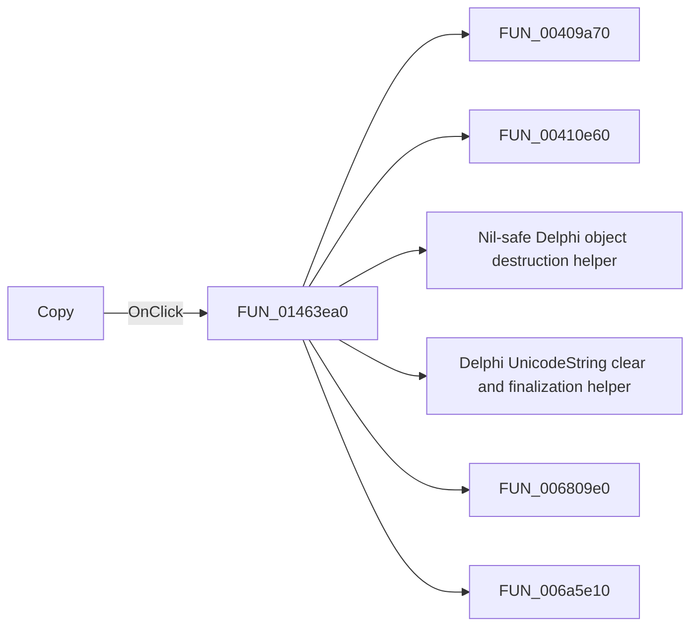

# Copy

> Analysis status: Pending individual source review.

## Control

| Property | Recovered value |
| --- | --- |
| Form | EquEditor |
| Component path | EquEditor.EETPanel.EECpyBtn |
| Control class | TSpeedButton |
| Caption | Not present in the recovered resource. |
| Hint | Copy |
| Text | Not present in the recovered resource. |
| Handler name | EECpyBtnClick |
| Handler address | 01463ea0 |
| Graph node | `resource:dfm:EquEditor/EquEditor.EETPanel.EECpyBtn` |
| Handler node | `function:01463ea0` |
| Graph layer | UI |

## What happens when clicked

Pending individual analysis. An agent must read the recovered handler source and its relevant callees before it replaces this text.

## Click flow

## Handler evidence

- Source: [DecompiledSources/Tina16/functions/0000000001463EA0__FUN_01463ea0.c](../../../DecompiledSources/Tina16/functions/0000000001463EA0__FUN_01463ea0.c)
- Recovered role: Not present in the recovered resource.
- Current graph summary: Handles 1 Delphi UI event: EquEditor.EETPanel.EECpyBtn.OnClick.
- Current graph behavior: Not present in the recovered resource.
- Current graph evidence: Not present in the recovered resource.
- Complexity: complex
- Distinct outgoing calls: 14

## Direct calls

- `function:00409a70` — FUN_00409a70
- `function:00410e60` — FUN_00410e60
- `function:00410f20` — Nil-safe Delphi object destruction helper
- `function:00414480` — Delphi UnicodeString clear and finalization helper
- `function:006809e0` — FUN_006809e0
- `function:006a5e10` — FUN_006a5e10
- `function:006a6030` — FUN_006a6030
- `function:01463140` — FUN_01463140
- `function:01464f00` — Handles 1 Delphi UI event: EquEditor.EEMenu.EEEditMnu.EECopyMnu.OnClick.
- `function:01a5d940` — FUN_01a5d940
- `function:01aed550` — FUN_01aed550
- `function:01aee720` — FUN_01aee720
- `function:01d12000` — FUN_01d12000
- `function:01d30b30` — FUN_01d30b30

## Resource evidence

- Kind: Not present in the recovered resource.
- Modal result: Not present in the recovered resource.
- Checked state: Not present in the recovered resource.
- List items: Not present in the recovered resource.
- Image reference: Not present in the recovered resource.
- Extracted glyph: [`0141_EquEditor_EquEditor_EETPanel_EECpyBtn_Glyph_Data.png`](../../../glyph/0141_EquEditor_EquEditor_EETPanel_EECpyBtn_Glyph_Data.png)

## Nearby label candidates

Nearby labels are layout candidates only. They are not proof of behavior.

- No same-parent label candidate is available.

## Analysis limits

- Do not infer behavior from the control class, caption, hint, glyph, or nearby label alone.
- Do not replace the pending status until the handler source and relevant call path provide enough evidence.
