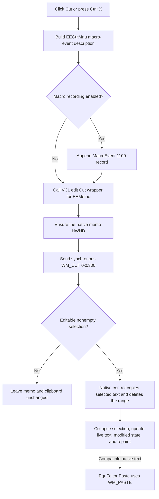

# Cut the selected equation text

## Control

| Property | Recovered value |
| --- | --- |
| Form | EquEditor |
| Component path | EquEditor.EEMenu.EEEditMnu.EECutMnu |
| Control class | TMenuItem |
| Caption | Cu&t |
| Shortcut | Ctrl+X (`ShortCut = 16472`) |
| Target | EquEditor.EEMemo (`TMemo`) |
| Handler name | EECutMnuClick |
| Handler address | 01464e50 |
| Graph node | `resource:dfm:EquEditor/EquEditor.EEMenu.EEEditMnu.EECutMnu` |
| Handler node | `function:01464e50` |
| Graph layer | UI |

## What happens when clicked

Cut records the menu action for the macro recorder and then sends the native `WM_CUT` message to `EEMemo`. It is one native edit-control Cut command, not an application sequence that calls Copy and then separately deletes text.

The handler first builds a macro-event description from the application resource IDs, the form's context value at `+0x6B8`, and the token `EECutMnu`. The macro logger appends a `[MacroEvent(1100,...)]` record only when macro recording is enabled. The handler then passes `EEMemo` at form offset `+0x750` to the shared VCL edit Cut wrapper. That wrapper ensures that the memo has a window handle and synchronously sends message `0x0300`, `WM_CUT`, with zero message parameters.

For an editable, nonempty selection, the Windows memo control places the selected equation text on the native text clipboard and removes that range. The caret and empty selection collapse at the removed range. The live memo text and its native modified state change, and the control repaints through its normal edit-control processing. The handler does not parse, recalculate, render, save, or otherwise interpret the equation after the cut.

## Clipboard and selection behavior

- The application does not read `SelStart`, `SelLength`, or `SelText` and does not allocate its own clipboard object.
- It does not publish an equation-specific clipboard format. The native Unicode memo control owns the text formats that it places on the Windows clipboard. The exact format set is not visible in the recovered handler.
- A successful Cut replaces the previous clipboard text with the current selection. It does not include unselected memo text.
- The handler does not clear the clipboard before `WM_CUT`.
- With an empty selection, the native command has no range to copy or delete. The text, caret, and existing clipboard remain unchanged.
- A read-only memo refuses the native text mutation. The wrapper has no Copy-only fallback and reports no result to EquEditor.

## Copy and Paste interoperability

The neighboring commands use the same native edit-control family:

- Copy sends `WM_COPY` (`0x0301`). Unlike Cut, the recovered EquEditor Copy handler selects the complete memo when `SelLength` is zero, and then copies it. Cut has no select-all fallback.
- Paste sends `WM_PASTE` (`0x0302`). The native memo inserts compatible clipboard text at the caret or replaces its current selection when editing is allowed.
- Text produced by this Cut is therefore available to EquEditor Paste and other native text consumers. No application conversion or equation-object serialization occurs between the two commands.

## Document state and persistence

A successful native Cut changes only the in-memory `EEMemo` document. It does not set an EquEditor-specific project-dirty field in this handler, write the `.teq` file, update a saved path, or persist settings. The separate Save or Save As handler later serializes the memo lines when the user requests it. The form's recovered `OnClose` handler accepts closure without a save prompt, so this Cut path does not provide loss prevention by itself.

An empty-selection or read-only no-op does not change the memo's native modified state. Macro recording is independent: a Cut macro event can be recorded even when the native edit action changes nothing.

## Click flow

## Error ordering and partial behavior

- Macro-event construction and recording occur before `WM_CUT`. If either step raises an exception, the native Cut is not sent.
- If handle creation or native message dispatch fails after recording, the macro stream can contain the Cut event while the memo and clipboard remain unchanged.
- The application does not split Cut into copy and deletion phases. Clipboard access, data transfer, and deletion ordering are inside the synchronous native control message.
- The wrapper does not inspect a return value. There is no clipboard-busy branch, retry, rollback, status message, or error dialog in this handler.
- The local Unicode macro-event description is finalized only on the normal path. The handler has no local exception recovery.

## Handler evidence

- [EquEditor Cut handler `FUN_01464e50`](../../../DecompiledSources/Tina16/functions/0000000001464E50__FUN_01464e50.c) builds and records the macro-event description before it calls the native Cut wrapper for form field `+0x750`.
- [VCL Cut wrapper `FUN_00680a10`](../../../DecompiledSources/Tina16/functions/0000000000680A10__FUN_00680a10.c) obtains the target edit handle and sends message `0x0300`, `WM_CUT`.
- [Macro-event formatter `FUN_01aee720`](../../../DecompiledSources/Tina16/functions/0000000001AEE720__FUN_01aee720.c) combines the two resource strings and the handler token. [Macro recorder `FUN_01aed550`](../../../DecompiledSources/Tina16/functions/0000000001AED550__FUN_01aed550.c) wraps the value as event 1100 and appends it only while recording is enabled.
- [EquEditor Copy handler `FUN_01464f00`](../../../DecompiledSources/Tina16/functions/0000000001464F00__FUN_01464f00.c) selects the whole memo only when the current selection length is zero and then calls the [native `WM_COPY` wrapper](../../../DecompiledSources/Tina16/functions/00000000006809E0__FUN_006809e0.c).
- [EquEditor Paste handler `FUN_01465000`](../../../DecompiledSources/Tina16/functions/0000000001465000__FUN_01465000.c) calls the [native `WM_PASTE` wrapper](../../../DecompiledSources/Tina16/functions/0000000000680A40__FUN_00680a40.c) for the same memo.
- [Save handler `FUN_01463980`](../../../DecompiledSources/Tina16/functions/0000000001463980__FUN_01463980.c) writes the memo lines to a selected `.teq` file. Cut does not call it.
- [Form OnClose handler `FUN_01464e40`](../../../DecompiledSources/Tina16/functions/0000000001464E40__FUN_01464e40.c) sets the close action to `caHide` and has no save check.
- [Recovered Delphi resource evidence](../../../DecompiledSources/Tina16/resources/dfm/ui-evidence.json) identifies `EEMemo` as a `TMemo`, binds `Cu&t` to this handler, and supplies the Ctrl+X shortcut.

## Direct calls

- `FUN_01aee720` builds the macro-event description.
- `FUN_01aed550` conditionally records that event.
- `FUN_00680a10` sends native `WM_CUT` to `EEMemo`.
- `FUN_00414480` finalizes the temporary Unicode description.

## Resource evidence

- `EECutMnu` is a `TMenuItem` with caption `Cu&t` and Ctrl+X shortcut.
- The target `EEMemo` is a multiline `TMemo` in the Equation Editor.
- No hint, glyph, selection-dependent enabled state, or edit-menu popup event is recovered for the Cut command.
- Copy and Paste are sibling menu items with their own native edit-control handlers.

## Analysis limits

- The exact set and priority of clipboard text formats are implemented by the native Unicode memo control, not by recovered application code.
- Native behavior for an operating-system clipboard failure is not reported through this wrapper.
- The handler has no application-level equation validation or dirty-document policy after a successful Cut.
