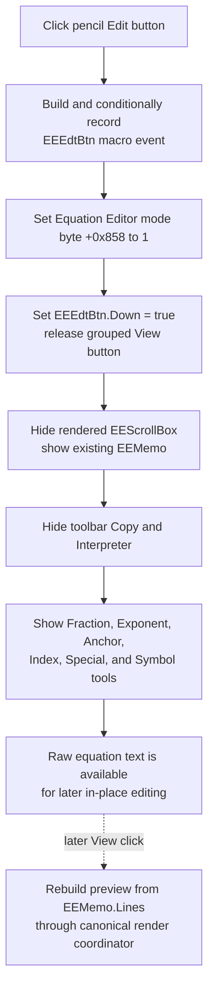

# Switch the Equation Editor to text-edit mode

> Analysis status: Reviewed from the recovered toolbar resource, handler, grouped speed-button helper, edit/view surface helpers, Copy mode branch, markup insertion path, and render coordinator.

## Control

| Property | Recovered value |
| --- | --- |
| Form | EquEditor |
| Form caption | Equation Editor |
| Component path | EquEditor.EETPanel.EEEdtBtn |
| Control class | TSpeedButton |
| Caption | Not present in the recovered resource. |
| Hint | Edit |
| Group index | 1, shared with `EEExprBtn` (**View**) |
| Handler name | EEEdtBtnClick |
| Handler address | 01463de0 |
| Graph node | `resource:dfm:EquEditor/EquEditor.EETPanel.EEEdtBtn` |
| Handler node | `function:01463de0` |
| Graph layer | UI |

The extracted [17 by 17 glyph](../../../glyph/0138_EquEditor_EquEditor_EETPanel_EEEdtBtn_Glyph_Data.png) shows a pencil. The glyph and **Edit** hint support the mode name. The source establishes the actual surface and toolbar changes.

## What happens when clicked

[`FUN_01463de0`](../../../DecompiledSources/Tina16/functions/0000000001463DE0__FUN_01463de0.c) performs an immediate mode switch:

1. It builds an `EEEdtBtn` macro-event identifier from toolbar command class `0x410`, the form context at `+0x6b8`, and the control name. It sends the identifier to the optional macro-event recorder.
2. It writes `1` to the Equation Editor mode byte at form offset `+0x858`.
3. It passes `true` to the shared VCL speed-button state helper for `EEEdtBtn` at form offset `+0x778`. Because **Edit** and **View** have group index 1, selecting Edit releases the View button through the VCL speed-button group path.
4. It calls [`FUN_01462ae0`](../../../DecompiledSources/Tina16/functions/0000000001462AE0__FUN_01462ae0.c), which applies the complete edit-mode surface and toolbar visibility state.
5. It finalizes the temporary Unicode macro-event string after the mode transition returns.

This is an in-place text-edit mode switch. It does not edit one selected equation element and does not open an editor dialog.

## Edit surface and toolbar state

The edit-mode helper applies these states through the recovered VCL `Visible` setter:

| Component | Edit-mode state | Evidence |
| --- | --- | --- |
| `EEScrollBox` rendered preview | Hidden | Form field `+0x758` receives `false`. |
| `EEMemo` raw equation text | Visible | Form field `+0x750` receives `true`. |
| `EECpyBtn` toolbar Copy | Hidden | Field `+0x818` receives `false`. |
| `EEInterpreterBtn` | Hidden | Field `+0x820` receives `false`. |
| `EEFractBtn` and `EEExponBtn` | Visible | Fields `+0x808` and `+0x810` receive `true`. |
| `EEAnchorBtn`, `EEIndxBtn`, `EESpecBtn`, and `EESymbolBtn` | Visible | Fields `+0x828` through `+0x840` receive `true`. |

The field mapping is confirmed by the DFM component order, the controls' paired or distinct toolbar coordinates, their event handlers, and the inverse states in the View helper [`FUN_014635d0`](../../../DecompiledSources/Tina16/functions/00000000014635D0__FUN_014635d0.c). Copy and Interpreter occupy the same first two edit-tool positions as Fraction and Exponent, so the visibility swap prevents overlapping active controls.

The helper also writes mode byte `+0x858` to `1` again. The duplicate write keeps direct callers of the helper consistent with this click handler.

## Text, selection, model, and rendering

- The handler does not read `EEMemo.Text`, `EEMemo.Lines`, `SelStart`, `SelLength`, or a rendered equation element.
- It does not change the memo text, selection, caret, scroll position, or focus. It only reveals the existing memo control.
- It does not call a text replacement method, equation parser, model assignment, layout calculation, renderer, or invalidation routine.
- It does not destroy the existing render object at form offset `+0x860`. The preview surface becomes hidden, but its backing state remains allocated.
- The now-visible Fraction, Exponent, Anchor, Index, Special-character, and Symbol buttons perform later text insertions. Their handlers use the shared insertion path owned by `TIARA-diz.6.7.483`; this mode switch itself inserts no markup.
- When the user later selects **View**, `FUN_014635d0` first calls the canonical render coordinator [`FUN_01463140`](../../../DecompiledSources/Tina16/functions/0000000001463140__FUN_01463140.c) with display mode 1. That separate path consumes the then-current memo lines, rebuilds the rendered equation, hides the memo, and shows the preview.

Mode byte `+0x858` is a display/edit selector, not a document-modified flag. The toolbar Copy handler [`FUN_01463ea0`](../../../DecompiledSources/Tina16/functions/0000000001463EA0__FUN_01463ea0.c) tests it: value 0 copies the rendered equation through the graphics clipboard path, while value 1 uses native memo text copy.

## Modified, undo, and persistence boundaries

The normal Edit click changes transient form and control state only:

- It does not modify memo content, so this handler does not add an edit operation to the memo's native Undo state or set its native text-modified flag.
- It does not clear an existing Undo record or modified flag. Those states remain owned by the memo and can change during later typing, Cut, Paste, or markup insertion.
- It does not set an application document-dirty field, save a `.teq` file, update a current path, write settings, or persist the selected mode.
- It does not validate the current equation before revealing the raw text. Validation and rendering occur only when a later command consumes the memo.

## Edit-mode flow

## Repeated, guard, and error behavior

- The handler has no selected-text, selected-element, nonempty-document, valid-equation, read-only, or current-mode guard.
- On a repeated click, the mode byte is written again. The speed-button and visibility setters keep values that already match. The macro event can still be recorded for each click.
- Macro-event construction and recording occur before any mode change. If either raises an exception, the edit-mode write is not reached.
- The first mode-byte write occurs before the speed-button and surface changes. If a later call fails, the form can report edit mode while the old grouped-button or visibility state remains.
- The edit-mode helper applies visibility changes in sequence. It has no local transaction or rollback, so an exception can leave a partially swapped toolbar or only one of the memo and preview surfaces visible.
- Neither the handler nor the helper has a local exception handler, user-facing error message, retry, or status result.
- The form fields are used without null checks. Their construction is an invariant of the streamed `TEquEditor` form.

## Evidence

- [Edit handler `FUN_01463de0`](../../../DecompiledSources/Tina16/functions/0000000001463DE0__FUN_01463de0.c) records `EEEdtBtn`, writes mode 1, selects form field `+0x778`, and calls the edit-mode helper.
- [Edit-mode helper `FUN_01462ae0`](../../../DecompiledSources/Tina16/functions/0000000001462AE0__FUN_01462ae0.c) shows `EEMemo`, hides `EEScrollBox`, repeats mode 1, and applies the edit-toolbar visibility set.
- [Inverse View helper `FUN_014635d0`](../../../DecompiledSources/Tina16/functions/00000000014635D0__FUN_014635d0.c) rebuilds the preview, hides `EEMemo`, shows `EEScrollBox`, writes mode 0, and reverses every toolbar visibility value.
- [VCL speed-button state helper `FUN_0082a6c0`](../../../DecompiledSources/Tina16/functions/000000000082A6C0__FUN_0082a6c0.c) checks group index, updates the Down state, and notifies grouped sibling buttons.
- [VCL visibility setter `FUN_0064dbe0`](../../../DecompiledSources/Tina16/functions/000000000064DBE0__FUN_0064dbe0.c) changes a control only when its requested state differs and emits the VCL visible-changed message.
- [Toolbar Copy handler `FUN_01463ea0`](../../../DecompiledSources/Tina16/functions/0000000001463EA0__FUN_01463ea0.c) proves that mode 0 selects rendered-equation copy and mode 1 selects native memo text copy.
- [Fraction insertion handler `FUN_01464370`](../../../DecompiledSources/Tina16/functions/0000000001464370__FUN_01464370.c) and [shared insertion helper `FUN_014641a0`](../../../DecompiledSources/Tina16/functions/00000000014641A0__FUN_014641a0.c) demonstrate one later edit-mode mutation without being part of this click path.
- [Recovered Delphi resource evidence](../../../DecompiledSources/Tina16/resources/dfm/ui-evidence.json) supplies the **Edit** hint, View/Edit group index, component positions, markup-tool hints, handler binding, and embedded glyph metadata.

## Direct calls

- `FUN_01aee720` builds the macro-event identifier.
- `FUN_01aed550` conditionally records the macro event.
- `FUN_0082a6c0` selects the grouped Edit speed button.
- `FUN_01462ae0` applies edit-mode surface and toolbar visibility.
- `FUN_00414480` finalizes the temporary Unicode string.

## Resource evidence

- The Edit speed button has a pencil glyph, the hint **Edit**, and no caption.
- Edit and View have `GroupIndex = 1`, which makes them mutually exclusive mode selectors.
- The resource contains no menu, popup, dialog, modal result, selected-element label, or action object for this button.

## Analysis limits

- The exact Delphi field name for mode byte `+0x858` is not recovered. The paired Edit/View writes and the Copy consumer prove its meaning.
- The handler does not expose the native memo focus, selection, caret, Undo, or modified values after the visibility change. It only proves that it does not explicitly change them.
- `TIARA-diz.6.7.472` owns the canonical render coordinator `FUN_01463140`. `TIARA-diz.6.7.483` owns shared markup insertion helper `FUN_014641a0`. `TIARA-diz.6.7.487` owns inverse View helper `FUN_014635d0`. This article owns `FUN_01463de0` and `FUN_01462ae0`.
