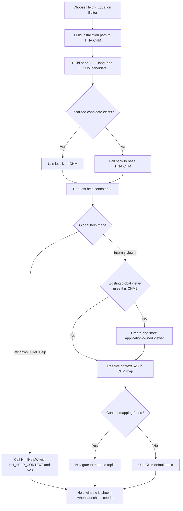

# Open Equation Editor help

> Analysis status: Reviewed from the recovered menu resource, handler, form initialization, localized CHM resolver, and shared external and internal help-viewer paths.

## Control

| Property | Recovered value |
| --- | --- |
| Form | EquEditor |
| Form caption | Equation Editor |
| Component path | EquEditor.EEMenu.EEHelpMnu.EEEquationEditorMnu |
| Control class | TMenuItem |
| Caption | &Equation Editor |
| Hint | Not present in the recovered resource. |
| Handler name | EEEquationEditorMnuClick |
| Handler address | 014650b0 |
| Help file | TINA.CHM |
| Help context | 528 (`0x210`) |
| Graph node | `resource:dfm:EquEditor/EquEditor.EEMenu.EEHelpMnu.EEEquationEditorMnu` |
| Handler node | `function:014650b0` |
| Graph layer | UI |

The menu item has no shortcut, action, image reference, or glyph.

## What happens when selected

[`FUN_014650b0`](../../../DecompiledSources/Tina16/functions/00000000014650B0__FUN_014650b0.c) performs one explicit help request:

1. It concatenates the global TINA installation folder, the recovered path separator, and `TINA.CHM`.
2. It passes that complete path to the shared localized-help resolver [`FUN_01b1def0`](../../../DecompiledSources/Tina16/functions/0000000001B1DEF0__FUN_01b1def0.c).
3. It calls the global application help interface with numeric context `0x210` and the selected CHM path.
4. It finalizes its temporary Unicode strings after the help call returns.

The context is source-backed. Equation Editor form creation in [`FUN_01463690`](../../../DecompiledSources/Tina16/functions/0000000001463690__FUN_01463690.c) assigns the same `0x210` value to the form's VCL `HelpContext`. This establishes the request as the general Equation Editor help context. The recovered files do not include the selected CHM topic map, so the final HTML topic title and file name for context 528 are not proven.

Unlike several Diagram Window help commands, this handler does not build or record a macro-event string. It also does not read the equation text, selection, rendered equation, or current editor mode.

## Localized help-file selection

The canonical resolver builds a candidate with this form:

`<base path>_<current language marker><original extension>`

For the requested base file, this produces a candidate beside `TINA.CHM`, with the current language marker inserted before `.CHM`.

- If the localized candidate exists, the resolver returns it.
- If the candidate does not exist, the resolver silently returns the original installation-folder path to `TINA.CHM`.

The resolver does not verify that the fallback base file exists. That check or failure belongs to the selected viewer path.

## External and internal viewer routing

The global help-context dispatcher [`FUN_01d46890`](../../../DecompiledSources/Tina16/functions/0000000001D46890__FUN_01d46890.c) routes the same CHM path and context through one of two application-wide modes. Bead `TIARA-diz.6.7.291` owns the canonical annotations for this dispatcher and the localized resolver.

### Windows HTML Help mode

The external branch initializes the HTML Help subsystem once, resolves the explicit CHM through the registered help manager, and obtains the registered application help-window owner. It associates the CHM with that owner and calls `HtmlHelpW` with command `0x0f`, `HH_HELP_CONTEXT`, and context 528.

When `HtmlHelpW` returns a help-window handle, the dispatcher requests that window be shown. The Equation Editor handler does not pass an editor-owned handle, retain the returned handle, or inspect success.

### Internal CHM viewer mode

The internal branch uses a process-global viewer object. It reuses that object when its stored CHM path matches the newly selected path. If no viewer exists, or a different CHM path is stored, it constructs a viewer for the selected file and writes the result to the global viewer slot.

The internal viewer creates and shows its form through the global VCL `Application`. It then resolves context 528 through the CHM context map. If a matching entry exists, it navigates to that local topic. If no mapping exists, the recovered resolver retains the CHM default topic as the target.

This viewer is application-owned and modeless from the menu handler's point of view. It is not an Equation Editor child dialog.

## Help flow

## Missing-help and error behavior

- A missing localized CHM is an expected fallback. It does not display an error.
- In external mode, failure to load `hhctrl.ocx`, resolve `HtmlHelpW`, or open the requested help returns zero through the recovered wrapper. The global dispatcher and this menu handler show no control-specific message and do not try the internal viewer.
- In internal mode, the viewer constructor tests the selected CHM path. If the file does not exist, it raises an error whose recovered text ends with ` does not exist.`. This menu handler has no local recovery or alternate-file branch.
- If context 528 has no internal mapping, the viewer uses its recovered default-topic path. If that target cannot be loaded, the navigation helper does not establish a new page.
- The handler has no local exception handler, retry, status update, return-value test, or rollback branch.
- The temporary Unicode path values are finalized only on the normal return path. The decompiled handler has no local cleanup guard around path resolution or help dispatch.

## State mutation and persistence

- The handler itself changes no Equation Editor field, menu state, equation text, selection, rendering option, file path, or saved document.
- External mode can initialize global HTML Help state and show or reuse a Windows help window.
- Internal mode can create or replace the process-global CHM viewer reference, create its application-owned form, and change its current topic.
- Repeated internal requests for the same CHM reuse the stored viewer and navigate it again to context 528.
- No project serializer, `.teq` writer, INI writer, registry writer, or settings commit appears in this call path.

## Evidence

- [Equation Editor help handler `FUN_014650b0`](../../../DecompiledSources/Tina16/functions/00000000014650B0__FUN_014650b0.c) builds the installation-folder path to `TINA.CHM`, resolves it, and invokes context `0x210` on the global help interface.
- [Equation Editor form initialization `FUN_01463690`](../../../DecompiledSources/Tina16/functions/0000000001463690__FUN_01463690.c) assigns the same `0x210` value to the form's VCL `HelpContext`.
- [Localized-help resolver `FUN_01b1def0`](../../../DecompiledSources/Tina16/functions/0000000001B1DEF0__FUN_01b1def0.c) inserts the current language marker, tests that candidate, and falls back to the original path.
- [Global help-context dispatcher `FUN_01d46890`](../../../DecompiledSources/Tina16/functions/0000000001D46890__FUN_01d46890.c) selects external `HtmlHelpW` or the process-global internal viewer.
- [HTML Help wrapper `FUN_0042a560`](../../../DecompiledSources/Tina16/functions/000000000042A560__FUN_0042a560.c) returns zero if the dynamic HTML Help entry point is unavailable and otherwise calls it.
- [Internal viewer constructor `FUN_00b02f00`](../../../DecompiledSources/Tina16/functions/0000000000B02F00__FUN_00b02f00.c) checks that the CHM exists and builds its topic and context indexes.
- [Internal context navigation `FUN_00b046f0`](../../../DecompiledSources/Tina16/functions/0000000000B046F0__FUN_00b046f0.c) creates or shows the viewer form and routes a numeric context.
- [Context-to-topic resolver `FUN_00b04480`](../../../DecompiledSources/Tina16/functions/0000000000B04480__FUN_00b04480.c) uses the CHM default topic unless it finds a matching numeric context.
- [Recovered Delphi resource evidence](../../../DecompiledSources/Tina16/resources/dfm/ui-evidence.json) supplies the menu hierarchy, caption, and `EEEquationEditorMnuClick` binding.

## Direct calls

- `FUN_00416cd0` concatenates the installation folder, path separator, and `TINA.CHM`.
- `FUN_01b1def0` selects an existing localized CHM or the original path.
- `FUN_00414560` finalizes the local Unicode string array.
- The indirect virtual call on the global application help interface dispatches context 528 and the resolved path.

## Analysis limits

- The recovered CHM payload and context map are not present in the source export. The numeric context and general Equation Editor role are proven, but the human-readable topic title is not.
- The Delphi field name of the global internal-versus-external help mode is not recovered.
- The external owner handle comes from the registered global help manager. The recovered path does not prove which visible application form registered that handle at this moment.
- This article cites but does not duplicate the canonical annotations for `FUN_01b1def0` and `FUN_01d46890`, which are owned by `TIARA-diz.6.7.291`.
