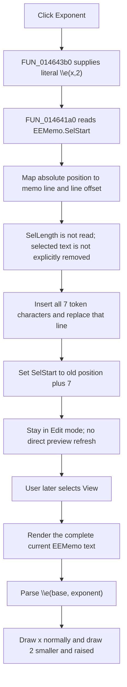

# Insert an exponent template

> Analysis status: Complete. The recovered button wrapper, shared memo-insertion helper, view-mode renderer, resource hint, and glyph support this explanation.

## Control

| Property | Recovered value |
| --- | --- |
| Form | EquEditor |
| Component path | EquEditor.EETPanel.EEExponBtn |
| Control class | TSpeedButton |
| Caption | Not present in the recovered resource. |
| Hint | Exponent |
| Handler name | EEExponBtnClick |
| Handler address | 014643b0 |
| Graph node | `resource:dfm:EquEditor/EquEditor.EETPanel.EEExponBtn` |
| Handler node | `function:014643b0` |
| Graph layer | UI |

## What happens when clicked

`FUN_014643b0` has one operation. It passes the fixed Unicode string `\e(x,2)` to EquEditor's shared insertion helper, `FUN_014641a0`. The seven-character token contains:

- `\e`, which identifies exponent markup;
- `x`, the base placeholder;
- `2`, the exponent placeholder.

The click does not calculate a power, inspect a selected expression, ask for an exponent, or open a dialog. It inserts editable markup with literal `x` and `2` placeholders.

## Insertion, selection, and caret

`FUN_014641a0` reads `EEMemo.SelStart`, a zero-based absolute text position. It walks `EEMemo.Lines` and adds each line length plus two characters for the CR/LF boundary until it finds the line that contains that position. It converts the position to the one-based index used by Delphi's UnicodeString insertion routine.

The helper inserts all seven characters into that line and writes the changed line back to `EEMemo.Lines`. It then sets `EEMemo.SelStart` to the original value plus seven. The new caret start is immediately after the complete token. It does not select either placeholder for immediate replacement.

The helper does not read `EEMemo.SelLength`. An empty selection is a normal caret insertion. A nonempty selection is not explicitly deleted, replaced, or wrapped. Insertion starts at the selection start. The recovered code does not prove the final nonzero selection length after the line setter and `SelStart` setter run.

## Formatted view

The memo keeps the raw `\e(x,2)` text in edit mode. This click does not call the renderer, invalidate the preview, or change EquEditor's edit/view mode.

When the user later selects **View**, `FUN_01463d20` calls `FUN_014635d0`. That path renders the complete current `EEMemo.Lines`, hides the memo and insertion tools, and shows the equation preview. The formatted-text renderer `FUN_01d166e0` recognizes `\e`, splits its two arguments, draws `x` at the normal size, then draws `2` smaller and above the base line. The equation object initializes its exponent scale to `0.75`; settings copied into that object can change the current scale.

## Button, modified, and undo state

- The DFM gives the speed button an **Exponent** hint and an embedded glyph. It does not give it a checked state, group index, `AllowAllUp`, or explicit disabled state.
- The click handler and insertion helper do not write the button's down, enabled, or visible state. They also do not switch to View mode. EquEditor's separate Edit and View paths control the memo, preview, and insertion-tool visibility.
- The helper changes the memo through its `Lines` object. It does not write a recovered document dirty flag or the memo's `Modified` property, and EquEditor has no recovered `EEMemo.OnChange` binding.
- There is no custom undo-stack call or rollback record. The recovered indirect VCL line setter does not establish whether the native Windows memo control records this full-line replacement as an undoable edit.
- The click does not save the equation. A later Save command writes the current raw memo lines to a `.teq` file when the user accepts its Save dialog.

## Empty text, no-op, and failures

- There is no empty-text or empty-selection guard. Each completed click attempts to insert the same nonempty seven-character token.
- The fixed token has the two-argument form that the recovered renderer recognizes. This handler does not validate later user edits to that markup.
- The handler and shared insertion helper have no local exception handler. UnicodeString allocation, line lookup, line replacement, or selection-setting exceptions propagate through the Delphi runtime.
- The line is written before the final `SelStart` update. If that last VCL operation fails, the recovered code has no rollback for the already inserted text.

## Click and render flow

## Source evidence

- Exponent button wrapper: [FUN_014643b0](../../../DecompiledSources/Tina16/functions/00000000014643B0__FUN_014643b0.c)
- Shared EquEditor insertion helper: [FUN_014641a0](../../../DecompiledSources/Tina16/functions/00000000014641A0__FUN_014641a0.c)
- Delphi UnicodeString insertion: [FUN_00416ea0](../../../DecompiledSources/Tina16/functions/0000000000416EA0__FUN_00416ea0.c)
- View button handler: [FUN_01463d20](../../../DecompiledSources/Tina16/functions/0000000001463D20__FUN_01463d20.c)
- View-mode coordinator: [FUN_014635d0](../../../DecompiledSources/Tina16/functions/00000000014635D0__FUN_014635d0.c)
- Edit-mode coordinator: [FUN_01462ae0](../../../DecompiledSources/Tina16/functions/0000000001462AE0__FUN_01462ae0.c)
- Shared equation renderer coordinator: [FUN_01463140](../../../DecompiledSources/Tina16/functions/0000000001463140__FUN_01463140.c)
- Formatted-text renderer: [FUN_01d166e0](../../../DecompiledSources/Tina16/functions/0000000001D166E0__FUN_01d166e0.c)
- Equation-formatting defaults: [FUN_01d11b00](../../../DecompiledSources/Tina16/functions/0000000001D11B00__FUN_01d11b00.c)
- Equation Save command: [FUN_01463980](../../../DecompiledSources/Tina16/functions/0000000001463980__FUN_01463980.c)

## Resource evidence

- Hint: **Exponent**.
- Extracted glyph: [`0140_EquEditor_EquEditor_EETPanel_EEExponBtn_Glyph_Data.png`](../../../glyph/0140_EquEditor_EquEditor_EETPanel_EEExponBtn_Glyph_Data.png)
- The 21 by 21 glyph shows `x` with a smaller `2` above and to its right. The source-proven token and renderer establish that this glyph means exponent formatting.
- The embedded source is a 374-byte Delphi BMP. The extractor stored it as a 242-byte PNG.
- The CSysTextDlg Exponent button uses the same token and an image with the same SHA-256 value. Its separate helper performs the same position-to-line insertion for that dialog's memo.
- Nearby label candidate: None.

## Analysis limits

- The shared insertion helper is used by the Anchor, Fraction, Exponent, Index, Symbol, and Special-character controls. The Anchor control article owns its canonical function annotation; this article cites it without redefining it.
- The recovered helper proves where text is inserted and where `SelStart` is moved. The lower-level VCL line setter owns any native selection normalization, `Modified` state, change notifications, and undo-buffer behavior that are not visible here.
