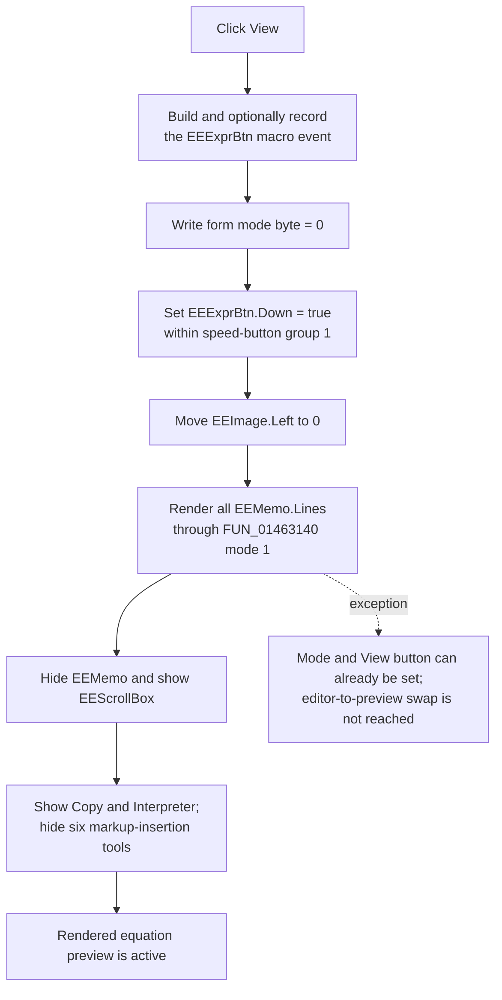

# Render the full equation in View mode

> Analysis status: Reviewed from recovered source, call-tree, form, and glyph evidence.

## Control

| Property | Recovered value |
| --- | --- |
| Form | `EquEditor` (`TEquEditor`) |
| Component path | `EquEditor.EETPanel.EEExprBtn` |
| Control class | `TSpeedButton` |
| Hint | `View` |
| Group index | `1`, shared with `EEEdtBtn` |
| Handler name | `EEExprBtnClick` |
| Handler address | `01463d20` |
| Graph node | `resource:dfm:EquEditor/EquEditor.EETPanel.EEExprBtn` |
| Handler node | `function:01463d20` |
| Graph layer | UI |

The 17 by 17 glyph shows a document-like page. The adjacent `EEEdtBtn` has hint `Edit` and a pencil glyph. These resources support the View/Edit pairing, but the recovered handler and render path establish the behavior.

## What happens when selected

`FUN_01463d20` selects the Equation Editor's rendered-expression mode. It does not insert an expression token or open a template.

The handler performs these operations in order:

1. It builds the `EEExprBtn` macro-event description with event resource `0x410` and conditionally sends it to the macro recorder.
2. It writes `0` to the form mode byte at `+0x858`. The paired Edit handler and the Copy handler establish `0` as rendered View mode and `1` as text Edit mode.
3. It calls the VCL speed-button state setter for `EEExprBtn` at form offset `+0x770` with `Down = true`. Both View and Edit buttons have group index `1`, so the VCL group notification selects View and releases the Edit peer.
4. It calls `FUN_014635d0`, which renders the complete memo and applies the View-mode control layout.

## Full-document render

`FUN_014635d0` first moves `EEImage` to left coordinate zero. It then calls the shared graphics coordinator `FUN_01463140` with mode `1`, the on-screen View mode.

The coordinator:

- replaces its shared bitmap, metafile, and SVG work objects;
- assigns all of `EEMemo.Lines` to the equation-layout object at form offset `+0x860`;
- resets the layout's cached measurements;
- measures the complete equation;
- sizes the bitmap to the measured width plus two line heights and the measured height plus three line heights;
- assigns that bitmap to `EEImage.Picture`; and
- renders the layout with one-line-height horizontal and vertical offsets.

Mode `1` does not take the BMP, JPEG, metafile, SVG, or clipboard dispatch branches. The generated bitmap remains the on-screen preview.

After the render returns, `FUN_014635d0` hides `EEMemo`, shows `EEScrollBox`, writes the mode byte to `0` again, shows the two View-mode tools, and hides the six edit-only markup tools. The DFM identifies the overlapping View tools as **Copy** and **Interpreter** and the edit tools as **Fraction**, **Exponent**, **Index**, **Special character**, **Symbol**, and **Anchor**.

## Text, selection, and markup effects

The handler never reads `SelStart`, `SelLength`, the caret, or selected text. The render coordinator consumes the complete `EEMemo.Lines` collection, not the selected range.

No markup is inserted or replaced. The six template buttons use shared insertion helper `FUN_014641a0` with markup such as `\f(n,d)`, `\e(x,2)`, and `\a(Link,http://www.)`; `EEExprBtnClick` does not call that helper. View therefore renders the text exactly as it exists when clicked.

Because the command does not write the memo, it does not create an application text-edit operation, add an Undo entry, or explicitly change the memo's native `Modified` flag. It also does not reset the hidden memo's caret, selection, or scroll position. Hiding a focused control can affect focus through normal VCL behavior, but the recovered handler does not select a new focus target.

## Default and programmatic use

`EEFormCreate` calls `FUN_01463d20`, which establishes View as the form's initial mode. The form resource itself does not store `Down = true`; the creation call performs the selection and first render.

Four successful analysis-result builders also call this handler after they publish new lines to `EEMemo` and refresh the form layout. This ensures that transfer, AC, DC, and transient result text is shown as a rendered expression. Those callers produce the text; this handler only selects and refreshes View mode.

A repeated click has no mode guard. Setting the already-down View button and already-correct visibility values is normally a VCL no-op, but `FUN_014635d0` still rebuilds and rerenders the preview each time. Empty memo text is not rejected; the coordinator attempts to render the empty layout with its normal margins.

## View flow

## Guards, errors, and partial state

- There is no test for unchanged mode, empty content, selected text, invalid markup, or an existing preview.
- Macro preparation and recording occur before all mode changes. An exception there prevents the View transition.
- The handler writes mode `0` before it changes the speed button or calls the renderer. A later exception can therefore leave the mode byte set to View while the prior surface is still visible.
- The View helper renders before it hides the editor and shows the preview. A render exception can leave replaced or partly prepared graphics objects while the memo remains visible.
- Visibility and tool changes occur one at a time after rendering. There is no transaction or rollback for a VCL notification failure, so mixed visibility is possible.
- No local error dialog or recovery branch is present. Rendering and VCL exceptions follow the normal Delphi exception path.

## Evidence

- [View handler `FUN_01463d20`](../../../DecompiledSources/Tina16/functions/0000000001463D20__FUN_01463d20.c) records `EEExprBtn`, writes form byte `+0x858` to zero, selects the speed button at `+0x770`, and calls the View transition.
- [View transition `FUN_014635d0`](../../../DecompiledSources/Tina16/functions/00000000014635D0__FUN_014635d0.c) positions `EEImage`, renders with mode `1`, hides the memo, shows the preview, repeats mode zero, and applies the two-versus-six tool visibility change.
- [Graphics coordinator `FUN_01463140`](../../../DecompiledSources/Tina16/functions/0000000001463140__FUN_01463140.c) assigns all memo lines, measures and renders them, and uses mode `1` as the non-export on-screen path. Its canonical annotation belongs to `TIARA-diz.6.7.472`.
- [Speed-button state setter `FUN_0082a6c0`](../../../DecompiledSources/Tina16/functions/000000000082A6C0__FUN_0082a6c0.c) updates `Down` when permitted and notifies the parent group for a true state.
- [Edit handler `FUN_01463de0`](../../../DecompiledSources/Tina16/functions/0000000001463DE0__FUN_01463de0.c) writes mode `1`, selects `EEEdtBtn`, and calls the inverse edit-layout helper.
- [Copy-mode consumer `FUN_01463ea0`](../../../DecompiledSources/Tina16/functions/0000000001463EA0__FUN_01463ea0.c) branches on form byte `+0x858`, using the rendered-output path for zero and the memo text-copy path for nonzero.
- [Template insertion helper `FUN_014641a0`](../../../DecompiledSources/Tina16/functions/00000000014641A0__FUN_014641a0.c) inserts supplied markup at the memo caret; six template handlers call it, but View does not. Its canonical annotation belongs to `TIARA-diz.6.7.483`.
- [Form creation `FUN_01463690`](../../../DecompiledSources/Tina16/functions/0000000001463690__FUN_01463690.c) calls the View handler after it creates the rendering objects.
- [Transfer result builder `FUN_0145e790`](../../../DecompiledSources/Tina16/functions/000000000145E790__FUN_0145e790.c), [AC result builder `FUN_0145ecb0`](../../../DecompiledSources/Tina16/functions/000000000145ECB0__FUN_0145ecb0.c), [DC result builder `FUN_0145ef50`](../../../DecompiledSources/Tina16/functions/000000000145EF50__FUN_0145ef50.c), and [transient result builder `FUN_0145f1a0`](../../../DecompiledSources/Tina16/functions/000000000145F1A0__FUN_0145f1a0.c) call View after successful result publication.
- [View glyph](../../../glyph/0137_EquEditor_EquEditor_EETPanel_EEExprBtn_Glyph_Data.png) and [Edit glyph](../../../glyph/0138_EquEditor_EquEditor_EETPanel_EEEdtBtn_Glyph_Data.png) provide the page-versus-pencil visual pairing.
- [Recovered UI evidence](../../../DecompiledSources/Tina16/resources/dfm/ui-evidence.json) supplies the `View` hint, group index, paired Edit control, toolbar layout, event binding, glyph metadata, and component tree.

## Direct calls

- `function:01aee720` - builds the macro-event description.
- `function:01aed550` - conditionally records the macro event.
- `function:0082a6c0` - sets the View speed button down.
- `function:014635d0` - renders and applies the View-mode layout.
- `function:00414480` - finalizes the temporary Delphi UnicodeString.

## Persistence boundary

The command changes live form mode, button, visibility, and preview state. It does not save `.teq` text, write settings, change the stored equation markup, or persist the selected View/Edit mode.

## Annotation ownership

This Bead owns `FUN_01463d20` and the direct View transition `FUN_014635d0`. The renderer, markup insertion helper, macro helpers, speed-button/VCL helpers, result builders, and inverse Edit helper keep their separate canonical ownership.

## Analysis limits

- The source proves whole-memo rendering and no text mutation. It does not expose the parser's detailed diagnostic behavior for invalid markup.
- The handler does not explicitly manage focus or native memo selection state after hiding the editor, so those details remain VCL behavior.
