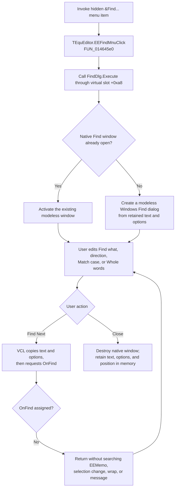

# &Find...

> Analysis status: Evidence-backed source review complete.

## Control

| Property | Recovered value |
| --- | --- |
| Form | EquEditor |
| Component path | EquEditor.EEMenu.EEEditMnu.EEFindMnu |
| Control class | TMenuItem |
| Caption | &Find... |
| Hint | Not present in the recovered resource. |
| Text | Not present in the recovered resource. |
| Handler name | EEFindMnuClick |
| Handler address | 014645e0 |
| Graph node | `resource:dfm:EquEditor/EquEditor.EEMenu.EEEditMnu.EEFindMnu` |
| Handler node | `function:014645e0` |
| Graph layer | UI |

## What happens when clicked

`TEquEditor.EEFindMnuClick` calls the virtual `Execute` method of the form's `TFindDialog` field at offset `+0x7c8`. The dialog is modeless. On the first call, the VCL creates the native Windows Find dialog. If that dialog is already open, `Execute` activates the existing window instead of creating a second one. The handler ignores the Boolean return value.

The recovered DFM sets **&Find...** to `Visible = false`. The normal menu therefore does not show this command in the recovered default form state. This article describes the handler behavior if another path makes the item visible or invokes it.

## Find action is not connected to the equation memo

The `FindDlg` component has no recovered `OnFind` event. This is a decisive omission because the VCL find-dialog dispatcher only calls the assigned `OnFind` callback. It does not search a text control itself. `EEMemo` has no search callback either; its only recovered event is an empty `OnKeyDown` handler.

As a result, the native dialog can accept a search string, but **Find Next** has no application action in `TEquEditor`:

- it does not read or search `EEMemo`;
- it does not define a document, selection, or current-line search scope;
- it does not move the memo caret or change the memo selection;
- it does not wrap at either end of the text;
- it does not show a not-found message.

This differs from the recovered Netlist Viewer and Netlist Editor forms. Those forms bind `OnFind`, map dialog options, call the shared text-search routine, change the editor selection, and show a message when no match exists. The corresponding event link is absent from `TEquEditor`.

## Dialog options and retained state

The VCL component supplies the standard Find dialog controls. Its default option field contains `frDown`. Native dialog messages copy the current direction, match-case, and whole-word choices back to the component before VCL dispatches `OnFind`. These values have no search effect here because no callback consumes them.

The dialog component retains the search text, option flags, and last window position in memory after the user closes the native window. A later click creates another native dialog from that retained component state. There is no recovered wrap option and no application-specific scope option.

This retention lasts only with the `TEquEditor` form instance. The launcher does not write `TINA.INI`, the registry, the equation text, a project, or another file.

## Relationship to Replace

The adjacent hidden **R&eplace...** command uses a separate `TReplaceDialog` component at form offset `+0x7d0`. Its handler also only calls `Execute`. That component has neither `OnFind` nor `OnReplace`, so opening Replace does not supply the missing search path for Find. The two dialogs keep separate component state and neither one commits a change to `EEMemo` in the recovered form.

Bead `.470` owns the Replace launcher annotation. This article cites the sibling to establish the boundary but does not duplicate its function annotation.

## Click flow

## No-op and error behavior

- **Find Next** is a no-op for equation text because `FindDlg.OnFind` is unassigned.
- An empty search string has the same application result. No EquEditor validation runs.
- Repeated menu activation while the dialog is open brings the same native dialog forward. It does not create duplicate dialogs.
- Closing the modeless dialog does not accept, cancel, or roll back equation changes because this path makes no equation change.
- If native dialog creation returns failure, `Execute` returns false. The click handler ignores that result and gives no EquEditor-specific error, retry, or fallback.
- The handler has no local exception handler. VCL application-level handling remains the boundary for an allocation or framework exception.

## Recovered evidence

- [`FUN_014645e0`](../../../DecompiledSources/Tina16/functions/00000000014645E0__FUN_014645e0.c) reads the field at `TEquEditor + 0x7c8` and calls virtual slot `+0xa8`; it performs no other work.
- [`FUN_00726630`](../../../DecompiledSources/Tina16/functions/0000000000726630__FUN_00726630.c) is the VCL common Find/Replace `Execute` path. It creates the native dialog when no window handle exists, otherwise activates the existing handle, and returns whether a window exists.
- [`FUN_00726870`](../../../DecompiledSources/Tina16/functions/0000000000726870__FUN_00726870.c) receives native Find/Replace messages, copies the native option flags into the component, dispatches Find or Replace actions, and stores the last window position when the dialog closes.
- [`FUN_00726770`](../../../DecompiledSources/Tina16/functions/0000000000726770__FUN_00726770.c) is the base Find action dispatcher. It returns without work when the event field at `+0xe0` is null.
- [`FUN_014b61e0`](../../../DecompiledSources/Tina16/functions/00000000014B61E0__FUN_014b61e0.c) is a comparison from the wired Netlist Viewer. It reads `frDown`, `frMatchCase`, and `frWholeWord`, calls the shared text-search routine, and reports no match. `TEquEditor` has no equivalent binding.
- [`FUN_01464e20`](../../../DecompiledSources/Tina16/functions/0000000001464E20__FUN_01464e20.c) is the separate Replace launcher. Bead `.470` owns its annotation.
- [`ui-evidence.json`](../../../DecompiledSources/Tina16/resources/dfm/ui-evidence.json) identifies `EEFindMnu`, `EEMemo`, `FindDlg`, and `ReplaceDlg`. It records no events on either dialog and marks both Find and Replace menu items hidden.

## Analysis limits

The recovered source does not show a runtime path that changes `EEFindMnu.Visible`. The handler is valid if called, but the command is not reachable through the default recovered menu. Native VCL captions can vary with the Windows language; the resource does not contain those dialog-control captions.
