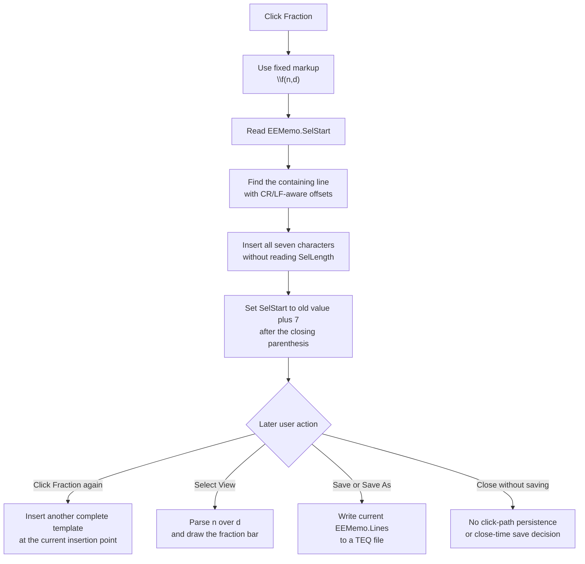

# Insert a numerator and denominator fraction template

> Analysis status: Complete. The recovered handler, the shared memo-insertion helper, and the formatted-text renderer establish the inserted markup, its editor effect, and its later interpretation.

## Control

| Property | Recovered value |
| --- | --- |
| Form | EquEditor |
| Form caption | Equation Editor |
| Component path | EquEditor.EETPanel.EEFractBtn |
| Control class | TSpeedButton |
| Caption | Not present in the recovered resource. |
| Hint | Fraction |
| Handler name | EEFractBtnClick |
| Handler address | 01464370 |
| Graph node | `resource:dfm:EquEditor/EquEditor.EETPanel.EEFractBtn` |
| Handler node | `function:01464370` |
| Graph layer | UI |

## What happens when clicked

`FUN_01464370` has one operation. It passes the fixed seven-character Unicode string `\f(n,d)` to the Equation Editor's shared memo-insertion helper.

The `\f` command is TINA formatted-text markup. The recovered renderer recognizes command character `f`, parses two comma-separated arguments, places the first argument above the second, and draws a horizontal line between them. Thus, `n` and `d` are literal placeholders for the numerator and denominator. The independent system-text Fraction button uses the same token and the same glyph bytes. The code and renderer establish this meaning; the hint and glyph only support it.

The click does not ask for values, select either placeholder, calculate a fraction, or open another dialog.

## Insertion, caret, and selection

The `.483`-owned shared helper `FUN_014641a0` edits `EquEditor.EEMemo`:

1. It reads the memo's zero-based absolute `SelStart`.
2. It walks `EEMemo.Lines`, counting two characters for each CR/LF boundary, to find the line that contains that position.
3. It converts the position to the one-based index required by the Delphi string-insertion function.
4. It inserts all seven characters into a local copy of the line and assigns the changed line back to `EEMemo.Lines`.
5. It sets `SelStart` to the old position plus seven.

For a normal empty selection, the caret ends immediately after the closing parenthesis. The helper does not move the caret to `n` or `d`. It does not read `SelLength`, selected text, or a replacement range, so it does not deliberately delete selected characters. If a nonempty selection exists, insertion starts at its `SelStart`. The recovered code does not establish whether the VCL line assignment and final `SetSelStart` call retain or clear the old selection length.

If a selection crosses lines, only the line that contains `SelStart` is changed. Text after that point, including the selected text, is preserved by the Delphi insertion function.

## Undo, modified, preview, and persistence state

The successful click changes the live memo line immediately. The handler and helper do not call an undo command, clear the undo buffer, set an application dirty flag, update the window title, or set a recovered `Modified` property. The underlying `TMemo.Lines` setter can have VCL-managed undo or modified-state effects, but those effects are not established by this recovered call path.

The click also does not parse the new token, invalidate the preview, switch from Edit to View, or redraw the equation. When the user later selects View, `FUN_01463d20` calls the Equation Editor render path. That path copies the current memo lines into the internal equation object and renders the formatted result. The fraction parser then treats `n` as the numerator and `d` as the denominator and draws the fraction bar.

The click does not write a file or update a caller-owned object. The separate Save and Save As command can later write the complete current `EEMemo.Lines` content to a `.teq` file. The form-close handler does not request a save. Therefore, the inserted token is durable only after an explicit save.

## Click and later-use flow

## Repeated clicks, guards, and errors

- The handler has no validation, confirmation, mode check, sender-state check, or intentional no-op branch. Each click attempts to insert the fixed, nonempty token.
- After a successful insertion, the new `SelStart` makes a repeated click insert a second complete token immediately after the first. There is no duplicate check or separator.
- The fixed token already contains the opening parenthesis, top-level comma, and closing parenthesis required by the recovered two-argument parser. Syntax errors caused by later manual edits are outside this click path.
- The Delphi insertion function clamps its one-based insertion position to the current line bounds and raises on a combined string-length overflow.
- The handler and helper have no local exception handler, message, retry, or rollback. An allocation, line-list, or memo-operation exception propagates through the Delphi runtime. A failure before line assignment leaves the memo unchanged. A failure after line assignment but before or during the final `SelStart` update can leave the token inserted without the requested caret move.
- Rendering errors cannot occur during this handler because it does not invoke the renderer. A later View action owns parse, layout, and drawing failures.

## Evidence

- [Fraction click handler `FUN_01464370`](../../../DecompiledSources/Tina16/functions/0000000001464370__FUN_01464370.c) passes the exact `\f(n,d)` literal to the shared insertion helper.
- [Shared Equation Editor insertion helper `FUN_014641a0`](../../../DecompiledSources/Tina16/functions/00000000014641A0__FUN_014641a0.c) maps absolute `SelStart` to a memo line, inserts the supplied text without reading `SelLength`, writes the line, and advances `SelStart` by the inserted length. Its canonical annotation belongs to `TIARA-diz.6.7.483`.
- [Delphi string insertion function `FUN_00416ea0`](../../../DecompiledSources/Tina16/functions/0000000000416EA0__FUN_00416ea0.c) inserts source text at a one-based string position while preserving the destination prefix and suffix.
- [View command `FUN_01463d20`](../../../DecompiledSources/Tina16/functions/0000000001463D20__FUN_01463d20.c) enters Equation Editor View mode and starts the later render path.
- [View layout and render entry `FUN_014635d0`](../../../DecompiledSources/Tina16/functions/00000000014635D0__FUN_014635d0.c) prepares the preview controls and calls the equation render coordinator.
- [Equation parse and render coordinator `FUN_01463140`](../../../DecompiledSources/Tina16/functions/0000000001463140__FUN_01463140.c) consumes the current memo text for the later preview.
- [Two-argument parser `FUN_01d12460`](../../../DecompiledSources/Tina16/functions/0000000001D12460__FUN_01d12460.c) finds the top-level comma and returns the two fraction arguments.
- [Formatted-text renderer `FUN_01d166e0`](../../../DecompiledSources/Tina16/functions/0000000001D166E0__FUN_01d166e0.c) recognizes the `f` command, positions its two arguments, and requests the dividing line.
- [Fraction-line helper `FUN_01d16380`](../../../DecompiledSources/Tina16/functions/0000000001D16380__FUN_01d16380.c) draws the horizontal line for the fraction.
- [Save and Save As handler `FUN_01463980`](../../../DecompiledSources/Tina16/functions/0000000001463980__FUN_01463980.c) is the later file-persistence path for the current memo lines.
- [Form-close handler `FUN_01464e40`](../../../DecompiledSources/Tina16/functions/0000000001464E40__FUN_01464e40.c) allows closing without a save decision.
- [Recovered form and control properties](../../../DecompiledSources/Tina16/resources/dfm/ui-evidence.json) bind `EEFractBtnClick` at `01464370` and provide the Fraction hint and embedded glyph.

## Direct call and ownership

- `function:014641a0` - inserts supplied equation markup into `EEMemo.Lines` at `SelStart` and advances `SelStart` by the inserted length. Bead `TIARA-diz.6.7.483` owns its canonical annotation, so this fragment does not duplicate it.
- This fragment owns only `FUN_01464370`. The Exponent and Index siblings have separate handlers and separate Beads.

## Resource and glyph evidence

- `EEFractBtn` is a 31 by 31 `TSpeedButton` on `EquEditor.EETPanel`. It has the hint **Fraction**, no caption, and no same-parent label candidate.
- Its 374-byte embedded Delphi BMP was extracted as a 21 by 21 PNG: [`0139_EquEditor_EquEditor_EETPanel_EEFractBtn_Glyph_Data.png`](../../../glyph/0139_EquEditor_EquEditor_EETPanel_EEFractBtn_Glyph_Data.png).
- The glyph shows `n` above `d` with a horizontal dividing line. The independent system-text Fraction control has identical glyph bytes and inserts the identical token.

## Analysis limits

- The source does not establish the memo's internal undo-buffer or `Modified` behavior after assignment through `EEMemo.Lines`.
- It does not establish the final `SelLength` after insertion into a nonzero selection. It establishes only that this path does not read or explicitly delete the selection and that it writes the new `SelStart` value.
- The renderer supports nested and other formatting commands. This article describes only the path needed for the fixed `\f(n,d)` template.
