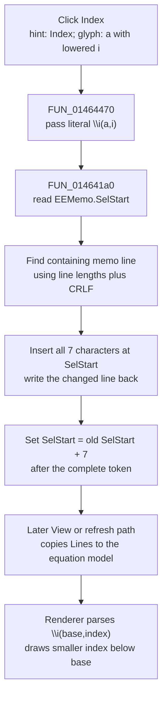

# Index

> Analysis status: Complete. The recovered button wrapper, shared memo-insertion helper, view-mode renderer, resource hint, and glyph support this explanation.

## Control

| Property | Recovered value |
| --- | --- |
| Form | EquEditor |
| Component path | EquEditor.EETPanel.EEIndxBtn |
| Control class | TSpeedButton |
| Caption | Not present in the recovered resource. |
| Hint | Index |
| Text | Not present in the recovered resource. |
| Handler name | EEIndxBtnClick |
| Handler address | 01464470 |
| Graph node | `resource:dfm:EquEditor/EquEditor.EETPanel.EEIndxBtn` |
| Handler node | `function:01464470` |
| Graph layer | UI |

## What happens when clicked

The button inserts the literal seven-character equation token `\i(a,i)` at the current `EEMemo.SelStart`. The token contains two editable placeholders: `a` is the base expression and `i` is its index. This is not inferred from the hint alone. The extracted glyph shows an `a` with a lowered `i`, and the formatted-text renderer has a dedicated `\i` branch. That branch parses two arguments, draws the first at the normal position, reduces the font for the second with the configured Index-size ratio, and draws the second below the base with the configured Index-overlap ratio.

`FUN_01464470` has no branch of its own. It passes `\i(a,i)` to the `.483`-owned shared insertion routine `FUN_014641a0`. That routine:

1. Reads the memo's zero-based `SelStart`.
2. Finds the containing `EEMemo.Lines` entry while counting two characters for each CRLF boundary.
3. Inserts the whole token into that line at the corresponding one-based string position.
4. Writes the changed line back to `EEMemo.Lines`.
5. Sets `SelStart` to its old value plus seven, immediately after the closing parenthesis.

The helper does not read `SelLength` and does not assign `SelText`. A selected range is therefore not wrapped or replaced: the token is inserted at the range's first character and the original selected text remains after it. The final setter moves `SelStart` after the new token, but the recovered code does not show the lower-level VCL setter's final `SelLength`. The routine does not deliberately select either placeholder. The user must move the caret back to replace `a` or `i`.

The click changes the memo text immediately, but it does not call the equation renderer, set an application document-dirty flag, save a file, or invoke an explicit Undo command or application Undo stack. The recovered path therefore does not prove whether the native memo keeps this programmatic line replacement as an undoable edit. The rendered equation consumes the changed `EEMemo.Lines` later. For example, the View-mode path calls `FUN_01463140`, which copies the memo lines into the equation model, parses them, lays them out, and redraws the rendered surface.

The Index button is shown by the recovered edit-mode helper and hidden in View mode. The handler itself does not check the current mode, focus, selection length, or text validity. Repeated clicks therefore insert another `\i(a,i)` at the newly advanced caret each time.

## Click flow

## Handler evidence

- Handler source: [FUN_01464470](../../../DecompiledSources/Tina16/functions/0000000001464470__FUN_01464470.c)
- Shared insertion source: [FUN_014641a0](../../../DecompiledSources/Tina16/functions/00000000014641A0__FUN_014641a0.c)
- View button handler: [FUN_01463d20](../../../DecompiledSources/Tina16/functions/0000000001463D20__FUN_01463d20.c)
- View-mode coordinator: [FUN_014635d0](../../../DecompiledSources/Tina16/functions/00000000014635D0__FUN_014635d0.c)
- Later render coordinator: [FUN_01463140](../../../DecompiledSources/Tina16/functions/0000000001463140__FUN_01463140.c)
- Index renderer branch: [FUN_01d166e0](../../../DecompiledSources/Tina16/functions/0000000001D166E0__FUN_01d166e0.c)
- Recovered role: Insert the index template `\i(a,i)` into the Equation Editor memo.
- Complexity: simple
- Distinct outgoing calls: 1

## Resource evidence

- Hint: `Index`.
- Extracted glyph: [`0144_EquEditor_EquEditor_EETPanel_EEIndxBtn_Glyph_Data.png`](../../../glyph/0144_EquEditor_EquEditor_EETPanel_EEIndxBtn_Glyph_Data.png). The 21 by 21 bitmap shows `a` with a lowered `i`.
- No caption, action, checked state, group state, or modal result is present for this control.

## Error and no-op boundaries

- There is no ordinary no-op branch. With a valid memo and caret, every invocation inserts one token.
- Neither the handler nor the shared helper validates the line index, the markup, or the selected text and neither catches exceptions. A string, memo-line, or VCL access failure propagates to the surrounding application handler.
- The line is written before the caret is updated. If the later caret update fails, the recovered order permits the text change to remain without the expected final caret position.
- No parser error can occur during this click because parsing is not called here. A syntax problem in the complete memo is handled only when a later render, export, or other consumer reads it.

## Analysis limits

- The recovered handler and shared helper prove text insertion and the final `SelStart` value. They do not prove the native Windows edit control's final nonzero selection length or internal Undo-buffer behavior.
- The renderer proves the two-argument index layout. It does not give semantic meaning to user text that replaces the `a` and `i` placeholders.
