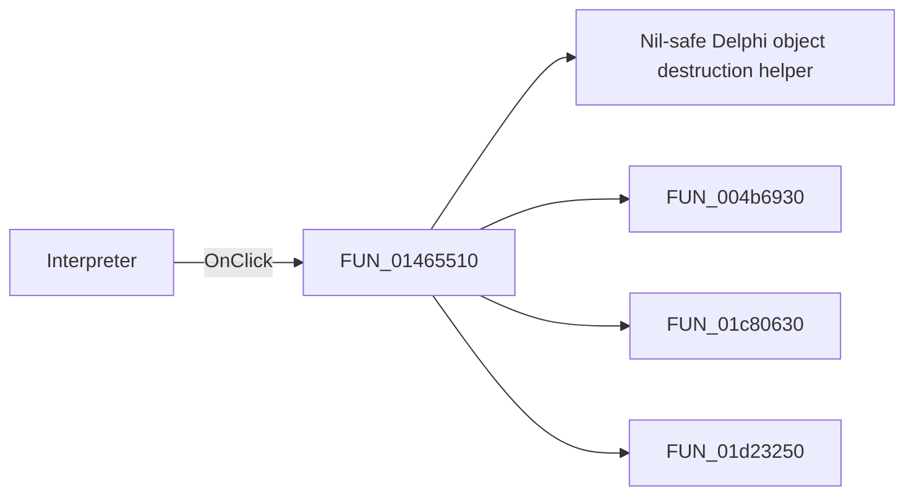

# Interpreter

> Analysis status: Pending individual source review.

## Control

| Property | Recovered value |
| --- | --- |
| Form | EquEditor |
| Component path | EquEditor.EETPanel.EEInterpreterBtn |
| Control class | TSpeedButton |
| Caption | Not present in the recovered resource. |
| Hint | Interpreter |
| Text | Not present in the recovered resource. |
| Handler name | EEInterpreterBtnClick |
| Handler address | 01465510 |
| Graph node | `resource:dfm:EquEditor/EquEditor.EETPanel.EEInterpreterBtn` |
| Handler node | `function:01465510` |
| Graph layer | UI |

## What happens when clicked

Pending individual analysis. An agent must read the recovered handler source and its relevant callees before it replaces this text.

## Click flow

## Handler evidence

- Source: [DecompiledSources/Tina16/functions/0000000001465510__FUN_01465510.c](../../../DecompiledSources/Tina16/functions/0000000001465510__FUN_01465510.c)
- Recovered role: Not present in the recovered resource.
- Current graph summary: Handles 1 Delphi UI event: EquEditor.EETPanel.EEInterpreterBtn.OnClick.
- Current graph behavior: Not present in the recovered resource.
- Current graph evidence: Not present in the recovered resource.
- Complexity: complex
- Distinct outgoing calls: 4

## Direct calls

- `function:00410f20` — Nil-safe Delphi object destruction helper
- `function:004b6930` — FUN_004b6930
- `function:01c80630` — Handles 1 Delphi UI event: SchematicEditor.MainMenu.mnTools.mnInterpreter.OnClick.
- `function:01d23250` — FUN_01d23250

## Resource evidence

- Kind: Not present in the recovered resource.
- Modal result: Not present in the recovered resource.
- Checked state: Not present in the recovered resource.
- List items: Not present in the recovered resource.
- Image reference: Not present in the recovered resource.
- Extracted glyph: [`0142_EquEditor_EquEditor_EETPanel_EEInterpreterBtn_Glyph_Data.png`](../../../glyph/0142_EquEditor_EquEditor_EETPanel_EEInterpreterBtn_Glyph_Data.png)

## Nearby label candidates

Nearby labels are layout candidates only. They are not proof of behavior.

- No same-parent label candidate is available.

## Analysis limits

- Do not infer behavior from the control class, caption, hint, glyph, or nearby label alone.
- Do not replace the pending status until the handler source and relevant call path provide enough evidence.
