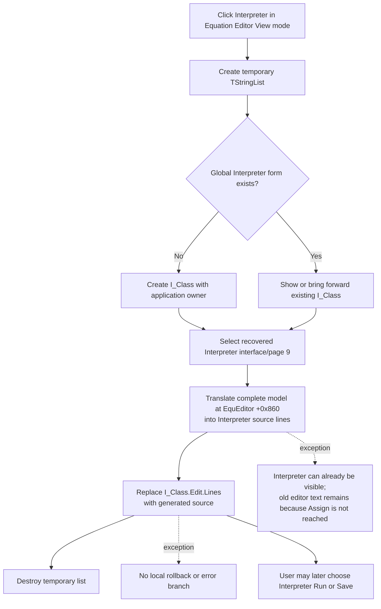

# Generate Interpreter source from the current equation

> Analysis status: Reviewed from recovered source, call-tree, form, and glyph evidence.

## Control

| Property | Recovered value |
| --- | --- |
| Form | `EquEditor` (`TEquEditor`) |
| Component path | `EquEditor.EETPanel.EEInterpreterBtn` |
| Control class | `TSpeedButton` |
| Hint | `Interpreter` |
| Handler name | `EEInterpreterBtnClick` |
| Handler address | `01465510` |
| Graph node | `resource:dfm:EquEditor/EquEditor.EETPanel.EEInterpreterBtn` |
| Handler node | `function:01465510` |
| Graph layer | UI |

The 42 by 21 bitmap contains a colored calculator and a gray disabled frame. This supports an interpreter or calculation command. The handler and its callees establish the more specific behavior: this button generates editable Interpreter source; it does not execute that source.

## What happens when clicked

[`FUN_01465510`](../../../DecompiledSources/Tina16/functions/0000000001465510__FUN_01465510.c) performs these operations in order:

1. It creates a temporary `TStringList` and adds one empty line to it.
2. It calls shared Interpreter launcher [`FUN_01c80630`](../../../DecompiledSources/Tina16/functions/0000000001C80630__FUN_01c80630.c). That function creates the global `I_Class` form when it does not exist, or shows the existing form, then selects recovered interface or page code `9`.
3. It passes the Equation Editor model at form offset `+0x860`, the temporary list, a copied global translation configuration, and Interpreter-owned settings to translator [`FUN_01d23250`](../../../DecompiledSources/Tina16/functions/0000000001D23250__FUN_01d23250.c).
4. After translation returns, it assigns the temporary list to `I_Class.Edit.Lines`. This replaces the complete source text in the Interpreter's `TSynEdit` control.
5. It destroys the temporary list on the normal completion path.

The shared launcher is also bound to the Schematic Editor's **Interpreter** menu command. That independent binding and the `I_Class` resource identify it as a reusable Interpreter-window launcher. This Equation Editor wrapper adds the equation-to-source translation and editor replacement.

## Equation input and synchronization

The click handler does not read `EEMemo.Text`, `EEMemo.Lines`, selected text, `SelStart`, `SelLength`, or the caret. It translates the complete equation model at `EquEditor +0x860`.

The Interpreter button is one of the two View-mode tools. When the user selects **View**, [`FUN_014635d0`](../../../DecompiledSources/Tina16/functions/00000000014635D0__FUN_014635d0.c) first calls the graphics coordinator [`FUN_01463140`](../../../DecompiledSources/Tina16/functions/0000000001463140__FUN_01463140.c). That coordinator assigns all current `EEMemo.Lines` to the same model at `+0x860`, parses and renders it, and then the View transition shows the Interpreter button. Therefore, the normal clickable path uses the whole equation that produced the current preview, not a selected memo range.

`EEInterpreterBtnClick` does not repeat this memo-to-model synchronization. A programmatic call while the button is hidden in Edit mode, or after another path changes the memo without rebuilding View, would translate the last model state rather than force a new parse.

## Generated program and execution boundary

`FUN_01d23250` is an equation-to-Interpreter source translator. It clears its internal generation collections, scans the model's source collection from the first line, and stops at the exact marker `@ Interpreter configuration`. It ignores empty lines and recognizes recovered structures such as `<fbegin>`/`<fend>`, `<abegin>`, and `Time shift:`. Its recursive translation path emits Interpreter program constructs, including function blocks, `Begin`/`End`, `If`/`Then`/`Else`, `Draw(...)`, `DegToRad(...)`, `Exp(...)`, and `draw_pref` assignments.

At the end, the translator clears the destination list, sends generated lines through [`FUN_01d23910`](../../../DecompiledSources/Tina16/functions/0000000001D23910__FUN_01d23910.c) with a preferred split position of 500 characters, and appends its generated declaration and support collections. The wrapper can advance past position 500 to a recovered token boundary. It is a generic shared formatting helper and remains evidence-only for this article.

The output is source text, not calculated equation results. Actual compilation or execution is a separate action on `I_Class`: menu Run handler [`FUN_017efc30`](../../../DecompiledSources/Tina16/functions/00000000017EFC30__FUN_017efc30.c) and toolbar Run handler [`FUN_017efdd0`](../../../DecompiledSources/Tina16/functions/00000000017EFDD0__FUN_017efdd0.c) call the Interpreter backend. `EEInterpreterBtnClick` calls neither Run handler nor their backend.

## Editor, result, and persistence state

- The successful click replaces all existing `I_Class.Edit.Lines`. It does not append to the current Interpreter source and has no unsaved-text prompt or overwrite confirmation.
- The handler does not explicitly preserve or set the Interpreter editor's selection, caret, scroll position, Undo stack, or modified flag. Their exact state after assigning `Lines` remains `TSynEdit` behavior.
- The handler does not update the Equation Editor memo, preview, mode, selection, Undo state, file name, title, or saved state.
- No compile status or error-result panel is updated. The `I_Class` resource contains `Editing commands` and `Successfully compiled` status controls, but this source-generation path does not write them.
- No `.ipr` Interpreter file, `.teq` equation file, INI value, registry value, or other persistent state is written. The generated program becomes durable only if the user later uses the Interpreter's separate Save command.

## Click flow

## Guards, failures, and partial state

- There is no empty-equation, selected-range, unchanged-output, existing-Interpreter-text, or valid-model guard in the wrapper.
- The Interpreter form is opened or shown before translation. If translation fails, the window can remain visible.
- Translation writes to the temporary list first. The visible Interpreter editor keeps its old text if translation raises before the final `Lines` assignment.
- The translator clears and rebuilds internal generation collections on the equation model. A failure can leave that private staging state partly rebuilt; there is no recovered rollback.
- If the final `Lines` assignment fails, the handler has no transaction, recovery, or error-message branch. The exact partial state then depends on the editor's implementation.
- The recovered straight-line handler destroys the temporary list only after a successful assignment. Local Delphi exception-finalization details are not visible in the decompiled function, so exceptional cleanup is not asserted.
- Repeated clicks rerun translation and replace the Interpreter editor again. There is no equality check or cached-output reuse.

## Evidence

- [Equation Editor Interpreter handler `FUN_01465510`](../../../DecompiledSources/Tina16/functions/0000000001465510__FUN_01465510.c) creates the temporary list, launches the Interpreter, passes form field `+0x860` to the translator, assigns the result to the Interpreter edit control, and destroys the list.
- [Shared Interpreter launcher `FUN_01c80630`](../../../DecompiledSources/Tina16/functions/0000000001C80630__FUN_01c80630.c) creates or shows the global Interpreter form and selects recovered code `9`. It is shared with the Schematic Editor Interpreter command and is not owned by this article.
- [Equation-to-Interpreter translator `FUN_01d23250`](../../../DecompiledSources/Tina16/functions/0000000001D23250__FUN_01d23250.c) scans the equation collection, recognizes structural markers, generates source into staging lists, clears the output list, formats it through a 500-character wrapper, and appends support sections.
- [View transition `FUN_014635d0`](../../../DecompiledSources/Tina16/functions/00000000014635D0__FUN_014635d0.c) renders before it shows the Interpreter button. Its canonical annotation belongs to `TIARA-diz.6.7.487`.
- [Graphics coordinator `FUN_01463140`](../../../DecompiledSources/Tina16/functions/0000000001463140__FUN_01463140.c) assigns all `EEMemo.Lines` to the model at `+0x860` before parsing and rendering. Its canonical annotation belongs to `TIARA-diz.6.7.472`.
- [Interpreter menu Run handler `FUN_017efc30`](../../../DecompiledSources/Tina16/functions/00000000017EFC30__FUN_017efc30.c) and [toolbar Run handler `FUN_017efdd0`](../../../DecompiledSources/Tina16/functions/00000000017EFDD0__FUN_017efdd0.c) prove that execution uses separate commands.
- [Recovered UI evidence](../../../DecompiledSources/Tina16/resources/dfm/ui-evidence.json) supplies the button hint, event binding, View-mode component relationship, Interpreter form and edit control, Run and Save controls, and status controls.
- [Extracted glyph](../../../glyph/0142_EquEditor_EquEditor_EETPanel_EEInterpreterBtn_Glyph_Data.png) provides the colored and disabled calculator frames. It corroborates the command category but does not establish the implementation.

## Annotation ownership and analysis limits

This Bead owns `FUN_01465510` and `FUN_01d23250`. The shared Interpreter launcher/page selector `FUN_01c80630`, generic line wrapper `FUN_01d23910`, View synchronization path, Interpreter Run handlers, VCL collection operations, and Delphi lifetime helpers remain evidence-only or keep their separate canonical ownership.

The recovered call proves that code `9` is selected after the Interpreter form is obtained. It does not expose a Delphi property name for that interface or page, so the article does not assign a more specific name. It also does not prove the exact editor caret, Undo, modified, or partial-assignment behavior after `Lines` replacement.
