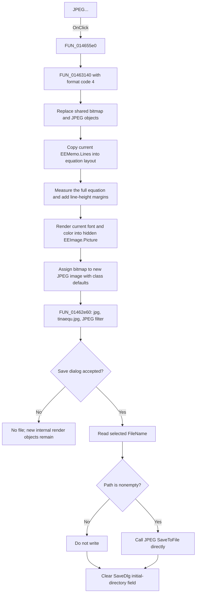

# JPEG...

> Analysis status: Complete. The recovered menu wrapper, shared graphics dispatcher, JPEG object setup, and Save dialog wrapper support this explanation.

## Control

| Property | Recovered value |
| --- | --- |
| Form | EquEditor |
| Component path | EquEditor.EEMenu.EEFileMnu.EEExportMnu.EEJPEGMnu |
| Control class | TMenuItem |
| Caption | JPEG... |
| Hint | Not present in the recovered resource. |
| Handler name | EEJPEGMnuClick |
| Handler address | 014655e0 |
| Graph node | `resource:dfm:EquEditor/EquEditor.EEMenu.EEFileMnu.EEExportMnu.EEJPEGMnu` |
| Handler node | `function:014655e0` |
| Graph layer | UI |

## What happens when clicked

`FUN_014655e0` calls the shared EquEditor graphics dispatcher `FUN_01463140` with format code `4`. This code selects JPEG export.

The dispatcher renders before it opens the Save dialog. It replaces the shared bitmap, metafile, and JPEG objects. It copies the current `EEMemo.Lines` into the equation-layout object and resets the cached layout bounds. It measures the complete equation, not the visible part of the scroll box, and creates this raster area:

- width = measured equation width + two current line heights;
- height = measured equation height + three current line heights.

The renderer starts one current line height from the left and top edges. It uses the current equation font and font color. It also selects a one-pixel or two-pixel drawing width from the current font size. The JPEG path does not set a crop rectangle, selected-only region, export scale, DPI, background color, or color conversion. No explicit background fill is visible in this path.

The rendered bitmap is assigned to the hidden `EquEditor.EEScrollBox.EEImage.Picture`. The dispatcher then assigns that bitmap to a newly constructed JPEG image. The JPEG constructor copies its class defaults into the image object. Neither the dispatcher nor `FUN_01462e60` sets a compression-quality number, progressive mode, grayscale mode, smoothing option, or another encoder option. The exact JPEG quality and compression parameters are therefore the recovered VCL JPEG class defaults, whose numeric values are not present as constants in these function sources.

`FUN_01462e60` configures `EquEditor.SaveDlg` as follows:

| Setting | Value |
| --- | --- |
| Default extension | `jpg` |
| Default file name | `tinaequ.jpg` |
| Filter | `JPEG file (*.jpg)\|*.jpg` |
| Initial directory | Seeded during EquEditor setup from the shared application path; this handler does not calculate a new folder. |

If the user accepts, the wrapper reads `SaveDlg.FileName`. When the path is nonempty, it passes the path directly to the JPEG image's one-argument virtual `SaveToFile` method. After the accepted branch, including an accepted dialog with an empty path, it clears the Save dialog's initial-directory field.

## Cancel, overwrite, and failure behavior

- Cancel skips the filename read and JPEG `SaveToFile`. It creates no output file and shows no cancel message.
- Rendering and JPEG object creation occur before the dialog. Cancel does not restore the previous hidden bitmap or shared JPEG object. The next export replaces these objects, and EquEditor cleanup destroys them.
- The recovered DFM does not serialize `SaveDlg.Options`, and this wrapper does not set those options. The application performs no separate file-existence check or overwrite question. Any native overwrite prompt is delegated to the Save dialog.
- After acceptance, the handler calls the JPEG writer directly. It uses no temporary file, backup, atomic rename, retry, returned-status check, rollback, or partial-file deletion path. If the VCL writer fails after it starts the output, this handler does not repair or remove a partial or replaced file.
- There is no local exception handler or error dialog. A dialog, allocation, render, encoder, path, or file-write exception propagates through the Delphi runtime.

## Empty editor behavior

There is no empty-content guard. The shared path still copies the memo lines, measures the equation layout, adds the line-height margins, constructs a JPEG image, and opens the Save dialog. It can therefore reach the encoder with a blank or margin-only raster. The handler does not warn that the editor is empty.

## State and persistence

- The command reads the current memo lines and equation formatting. It does not change the memo text, selection, caret, scroll position, equation model, or document filename.
- It recomputes layout caches and replaces the hidden preview bitmap and shared export objects before it knows the dialog result. There is no rollback on Cancel or write failure.
- Each click restores the fixed `tinaequ.jpg` default name and JPEG filter before it opens the dialog. The prior selected file name is not used as the next default name.
- An accepted dialog clears `SaveDlg.InitialDir`. Cancel leaves that field unchanged.
- A successful save writes only the selected JPEG file. No recovered INI, registry, project serializer, recent-file list, dirty flag, or undo operation is used.

## Click flow

## Source evidence

- JPEG menu wrapper: [FUN_014655e0](../../../DecompiledSources/Tina16/functions/00000000014655E0__FUN_014655e0.c)
- Shared graphics dispatcher: [FUN_01463140](../../../DecompiledSources/Tina16/functions/0000000001463140__FUN_01463140.c)
- JPEG Save dialog and writer: [FUN_01462e60](../../../DecompiledSources/Tina16/functions/0000000001462E60__FUN_01462e60.c)
- JPEG object construction: [FUN_00a09e20](../../../DecompiledSources/Tina16/functions/0000000000A09E20__FUN_00a09e20.c)
- Equation width measurement: [FUN_01d1b660](../../../DecompiledSources/Tina16/functions/0000000001D1B660__FUN_01d1b660.c)
- Equation height measurement: [FUN_01d1bfb0](../../../DecompiledSources/Tina16/functions/0000000001D1BFB0__FUN_01d1bfb0.c)
- Equation drawing: [FUN_01d1c9d0](../../../DecompiledSources/Tina16/functions/0000000001D1C9D0__FUN_01d1c9d0.c)
- Picture assignment and bitmap access: [FUN_00603cf0](../../../DecompiledSources/Tina16/functions/0000000000603CF0__FUN_00603cf0.c) and [FUN_00603c60](../../../DecompiledSources/Tina16/functions/0000000000603C60__FUN_00603c60.c)
- Default-name setter: [FUN_00724380](../../../DecompiledSources/Tina16/functions/0000000000724380__FUN_00724380.c)
- Accepted filename reader: [FUN_00724270](../../../DecompiledSources/Tina16/functions/0000000000724270__FUN_00724270.c)
- Dialog initial-directory setter: [FUN_00724420](../../../DecompiledSources/Tina16/functions/0000000000724420__FUN_00724420.c)
- EquEditor setup and shared-target cleanup: [FUN_01463690](../../../DecompiledSources/Tina16/functions/0000000001463690__FUN_01463690.c) and [FUN_01463c80](../../../DecompiledSources/Tina16/functions/0000000001463C80__FUN_01463c80.c)

## Analysis limits

- The recovered code proves the raster-size formulas but does not name a physical DPI or print scale.
- The VCL JPEG encoder is reached through virtual calls. Its exact quality value, subsampling, metadata, file-open sequence, and exception text are not direct graph edges in this export.
- The source does not establish `SaveDlg.Options`. It therefore does not prove whether the class-default dialog presents an overwrite prompt on this installation.
- `FUN_01463140` is shared by bitmap, JPEG, Windows Metafile, SVG, clipboard, and on-screen rendering. The bitmap control article owns its canonical function annotation. Generic image and equation-layout helpers remain evidence-only because other controls and forms also call them.
