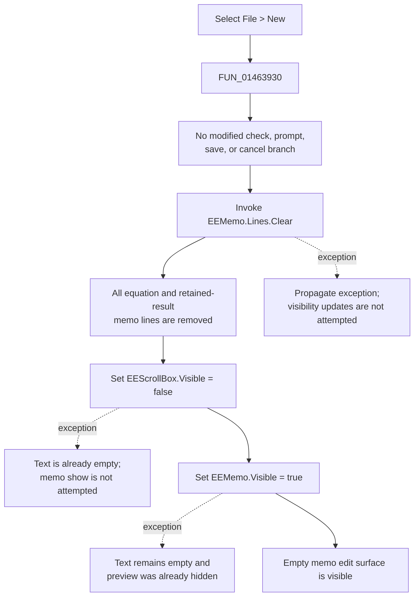

# Start an empty Equation Editor document

> Analysis status: Reviewed from recovered source and form resource evidence.

## Control

| Property | Recovered value |
| --- | --- |
| Form | `EquEditor` (`TEquEditor`) |
| Component path | `EquEditor.EEMenu.EEFileMnu.EENewMnu` |
| Menu path | **File > New** |
| Control class | `TMenuItem` |
| Caption | `&New` |
| Shortcut | Not present in the recovered resource. |
| Handler name | `EENewMnuClick` |
| Handler address | `01463930` |
| Graph node | `resource:dfm:EquEditor/EquEditor.EEMenu.EEFileMnu.EENewMnu` |
| Handler node | `function:01463930` |
| Graph layer | UI |

The resource has no hint, action, glyph, image, or nearby label. The behavior is established by the handler's data flow and by other Equation Editor functions that identify the same form fields.

## What happens when selected

`FUN_01463930` immediately obtains `EEMemo.Lines` from the `TMemo` at form offset `+0x750` and invokes the lines object's virtual `Clear` method. This removes every current memo line. The removed text can include an equation, opened `.teq` text, or result text retained by **Edit > Keep results**.

After the clear, the handler calls the VCL visibility setter `FUN_0064dbe0` twice:

1. it hides `EEScrollBox` at form offset `+0x758`, which contains the rendered equation preview; and
2. it shows `EEMemo` at form offset `+0x750`.

The completed command therefore presents an empty editable memo and removes the prior text from the live editor. `FUN_0064dbe0` compares the requested value with the control's current `Visible` byte, so either visibility update is a no-op when the control is already in that state.

## No unsaved-change decision

The handler has no modified-state test, confirmation dialog, Save call, or cancel branch. It clears the memo before it performs any other operation. A click can therefore discard current text without asking whether it must be saved.

The surrounding file commands confirm that this form does not use New to manage a current document path:

- **Open** independently executes `OpenDlg`, loads the accepted `.teq` path into `EEMemo.Lines`, and then renders the loaded content.
- **Save** and **Save As** share one handler. That handler always configures and executes `SaveDlg` with the proposed name `tinaequ.teq`; it does not consume a filename established by New.
- New does not access either dialog, assign an `Untitled` value, or change the form caption. The DFM caption remains `Equation Editor`.

The command also does not return a modal result or close the form. The Equation Editor close handler separately selects `caHide` and contains no save prompt.

## Text, result, and preview state

The `Lines.Clear` operation removes all text in the memo, including any accumulated result lines. It does not reset `KeepresultsMnu.Checked`; that session option remains as it was and applies to later result publication.

New hides the existing preview, but it does not call the recovered graphics coordinator, replace the render objects at form offset `+0x860`, or recalculate layout. A later switch to expression view calls the separate render path, which first assigns the then-current memo lines to the layout object. Thus the stale preview is not shown after New, but New itself does not destroy or rebuild its backing graphics objects.

The handler does not explicitly set the memo caret, selection, scroll position, focus, Undo state, or native `Modified` flag. Their exact post-clear values are VCL and Windows edit-control behavior and are not established by this application handler. No application document-dirty field is read or reset here.

New also does not install a blank template, placeholder, default font, equation mode, or file-format setting. Its initialized content is exactly an empty `EEMemo.Lines` collection.

The full edit-mode helper `FUN_01462ae0` also writes the form mode byte at `+0x858` and changes other mode-dependent controls. New does not call that helper and does not write the mode byte. The only proven mode-related effect of New is the memo/preview visibility pair; the handler does not explicitly synchronize the mode byte, toolbar selection, or other menu visibility.

## Command flow

## Repeated, error, and partial-state behavior

- The handler has no empty-content guard. Selecting New on an already empty memo invokes `Lines.Clear` again. If the edit surface is already active, the two visibility setters become state-preserving calls.
- There is no local exception handler or rollback. A `Lines.Clear` exception stops the command before either visibility request.
- The operations are ordered. If hiding the preview fails after the clear, the text is already lost. If showing the memo fails after a successful hide, both the cleared memo and preview can remain hidden.
- The handler does not report a success or failure result and does not repair partial state. Exceptions follow the application's normal Delphi exception path.
- The form resource supplies the memo and scroll box. The recovered handler has no null check for either object.

## Evidence

- [New handler `FUN_01463930`](../../../DecompiledSources/Tina16/functions/0000000001463930__FUN_01463930.c) reads the `Lines` object through form field `+0x750` and control field `+0x4d8`, invokes virtual slot `+0x90`, then requests visibility `false` for `+0x758` and `true` for `+0x750`.
- [`FUN_004b31e0`](../../../DecompiledSources/Tina16/functions/00000000004B31E0__FUN_004b31e0.c) uses the same `TStrings` virtual slot `+0x90` as the clear step before adding assigned strings through slot `+0x88`.
- [VCL visibility setter `FUN_0064dbe0`](../../../DecompiledSources/Tina16/functions/000000000064DBE0__FUN_0064dbe0.c) changes the control byte at `+0xa9` only when it differs and sends recovered VCL message `CM_VISIBLECHANGED` (`0xb00b`).
- [Edit-surface helper `FUN_01462ae0`](../../../DecompiledSources/Tina16/functions/0000000001462AE0__FUN_01462ae0.c) independently maps `+0x758` to the preview surface and `+0x750` to the memo by applying the same hidden/visible pair as part of the full edit-mode transition.
- [Preview helper `FUN_014635d0`](../../../DecompiledSources/Tina16/functions/00000000014635D0__FUN_014635d0.c) applies the inverse pair after rendering, which confirms the two surfaces' roles.
- [Open handler `FUN_01463b00`](../../../DecompiledSources/Tina16/functions/0000000001463B00__FUN_01463b00.c) loads an accepted `.teq` file into the same `EEMemo.Lines` object and calls the separate render coordinator.
- [Save/Save As handler `FUN_01463980`](../../../DecompiledSources/Tina16/functions/0000000001463980__FUN_01463980.c) opens `SaveDlg` with `tinaequ.teq` and writes the same lines collection; New does not call it or share a saved-path field.
- [Keep results handler and consumers](keepresultsmnu-430804395a.md) establish that retained Equation Editor results are memo lines and that the option's checked byte is separate from those lines.
- [Form close handler `FUN_01464e40`](../../../DecompiledSources/Tina16/functions/0000000001464E40__FUN_01464e40.c) sets the close action to `caHide` without a save decision.
- [Recovered UI evidence](../../../DecompiledSources/Tina16/resources/dfm/ui-evidence.json) supplies the menu hierarchy, `&New` caption, event binding, form caption, `TMemo`, and `TScrollBox` component identities.

## Direct calls

- `function:0064dbe0` - shared VCL visibility setter, invoked once for each surface.
- `EEMemo.Lines.Clear` - indirect virtual call; the graph cannot resolve this VMT dispatch to one function node.

## Persistence boundary

New changes only the live form controls. It does not write a `.teq` file, TINA settings, the registry, or another persistent store. The cleared content cannot be recovered through an application-owned New-command history in the recovered path.

## Annotation ownership

This Bead owns only `FUN_01463930`. The generic VCL visibility setter, `TStrings` virtual implementation, Open path, Save path, and graphics coordinator are evidence-only and keep separate canonical ownership.

## Analysis limits

- The recovered source proves that all memo lines are cleared, but it does not establish the exact native caret, selection, Undo, scroll, or `Modified` state after the VCL operation.
- The handler does not expose a current-file field. This analysis therefore does not infer a hidden filename or dirty-document model from the `&New` caption.
