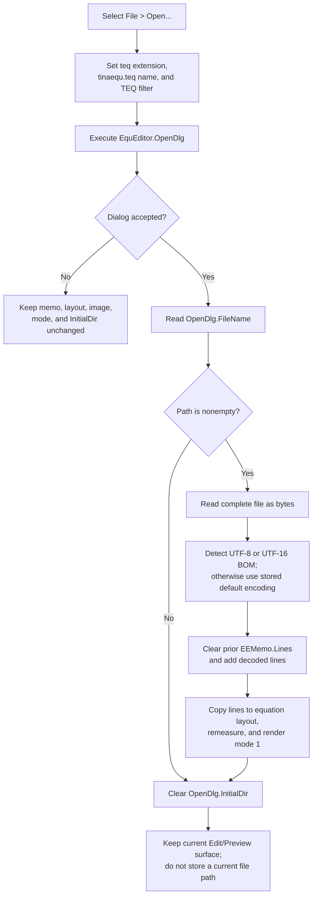

# Open and render a TINA equation text file

> Analysis status: Reviewed from recovered handler, form, VCL text-loading,
> encoding, and equation-rendering evidence.

## Control

| Property | Recovered value |
| --- | --- |
| Form | `EquEditor` (`TEquEditor`) |
| Component path | `EquEditor.EEMenu.EEFileMnu.EEOpenMnu` |
| Menu path | **File > Open...** |
| Control class | `TMenuItem` |
| Caption | `&Open...` |
| Shortcut | Not present in the recovered resource. |
| Handler name | `EEOpenMnuClick` |
| Handler address | `01463b00` |
| Graph node | `resource:dfm:EquEditor/EquEditor.EEMenu.EEFileMnu.EEOpenMnu` |
| Handler node | `function:01463b00` |
| Graph layer | UI |

The resource has no hint, action, image, glyph, or nearby label. The handler
and its data flow establish the behavior.

## What happens when selected

`FUN_01463b00` configures `EquEditor.OpenDlg` on every selection:

- `DefaultExt` becomes `teq`.
- `FileName` becomes `tinaequ.teq`.
- `Filter` becomes `Tina equation (*.teq)|*.teq`.

The handler does not set `InitialDir` before it executes the dialog. Therefore,
the recovered code does not establish which folder is initially shown. It also
does not set a custom dialog title. If the dialog is accepted, the handler gets
the resulting `FileName`. A nonempty path is passed to the one-argument
`LoadFromFile` method of `EEMemo.Lines`.

The load replaces all prior memo lines. It does not append the file. After a
successful nonempty load, the handler calls the shared equation graphics
coordinator with mode `1`. That coordinator copies the new `EEMemo.Lines` into
the equation-layout object, invalidates its cached dimensions, measures the
complete content, creates replacement graphics targets, assigns a newly sized
bitmap to `EEImage.Picture`, and renders the equation into it.

Open does not call the full Edit-mode or Preview-mode transition helper. It
does not change the form mode byte at `+0x858`, and it does not change the
visibility of `EEMemo` or `EEScrollBox`. The current surface stays selected,
but the backing equation image is rebuilt from the loaded lines.

## File format and decoding

The `.teq` file is loaded as plain text into a `TStrings` line collection. The
Open path does not deserialize a separate equation-document object or validate
an extension after dialog acceptance. The recovered line loader opens the
selected file as a read-only stream and reads the complete stream before it
changes the line collection.

The no-encoding overload uses this order:

1. UTF-8 when a UTF-8 byte-order mark is present.
2. UTF-16 little-endian when that byte-order mark is present.
3. UTF-16 big-endian when that byte-order mark is present.
4. Otherwise, the line collection's stored default encoding.

The decoder skips a detected byte-order mark. It produces one UnicodeString.
The final setter clears the existing lines, splits the decoded text at line
endings, and adds the new lines. An empty file is therefore a successful load
that clears the Equation Editor text.

The later layout and render path interprets the loaded text as equation source.
The Open handler has no separate syntax-check result, invalid-equation dialog,
or success flag. It proceeds directly from line replacement to layout
measurement and rendering.

## No unsaved-change or current-file policy

The handler does not inspect a modified flag and does not ask whether the
current text must be saved. It has no Save call and no prompt result branch.
An accepted nonempty file can therefore replace unsaved memo text immediately.

Open also does not establish a persistent current document:

- It does not copy the accepted path to a form field or `SaveDlg`.
- It does not change the `Equation Editor` form caption.
- It does not add a recent-file entry.
- It does not write a `.teq` file, `TINA.INI`, the registry, or another store.
- A later Save or Save As selection independently resets its Save dialog name
  to `tinaequ.teq` and asks for a path.
- A later Open selection resets `OpenDlg.FileName` to `tinaequ.teq` before the
  dialog executes again.

After any accepted dialog result, including an accepted empty path, the handler
sets `OpenDlg.InitialDir` to an empty string. It does this after the load and
render work. Cancel does not perform this reset.

The handler does not explicitly change the memo selection, caret, scroll
position, Undo state, or native `Modified` property. The exact native state
after `Lines.LoadFromFile` is not established by this application handler. It
also does not reset `KeepresultsMnu.Checked`, formatting settings, or the form
mode byte.

## Command flow

## Cancel, repeated, error, and partial-state behavior

- Cancel does not get a path, load a file, rebuild the layout, or clear
  `InitialDir`. The dialog defaults were already changed before cancellation.
- An accepted empty path does not load or render. It only reaches the accepted
  branch's `InitialDir` reset.
- Reopening the same file repeats the complete replacement and graphics
  rebuild. There is no unchanged-file test or render cache guard in the
  handler.
- The handler has no local exception handler, error message, retry, or
  rollback. File-open, read, allocation, decoding, line-change, measurement,
  and rendering exceptions use the normal Delphi application exception path.
- The loader reads and decodes the complete file before it calls the final line
  setter. An exception before that setter leaves the old memo lines in place.
- The final setter clears before it adds decoded lines. An exception during an
  add or notification can leave a cleared or partly replaced collection.
- Rendering starts only after the line replacement succeeds. A later render
  exception can leave the new memo text in place while replacement graphics or
  the displayed image are incomplete. The old text is not restored.
- `InitialDir` is cleared after the load and render. An exception before that
  final call can leave the dialog's previous `InitialDir` value in place.
- The recovered code does not null-check the DFM-created dialog, memo, line
  collection, image, or equation-layout object.

## Evidence

- [Open handler `FUN_01463b00`](../../../DecompiledSources/Tina16/functions/0000000001463B00__FUN_01463b00.c)
  sets the three dialog properties, gates the file load on accepted and
  nonempty results, calls the graphics coordinator with mode `1`, and clears
  `InitialDir` only at the end of the accepted branch.
- [`FUN_00724380`](../../../DecompiledSources/Tina16/functions/0000000000724380__FUN_00724380.c)
  assigns the dialog file-name field at offset `+0x108`.
- [`FUN_00724270`](../../../DecompiledSources/Tina16/functions/0000000000724270__FUN_00724270.c)
  gets the current or accepted dialog file name.
- [`FUN_00724420`](../../../DecompiledSources/Tina16/functions/0000000000724420__FUN_00724420.c)
  writes the dialog initial-directory field at offset `+0xf0`; the Open
  handler supplies an empty string.
- [`FUN_004b43e0`](../../../DecompiledSources/Tina16/functions/00000000004B43E0__FUN_004b43e0.c)
  opens the selected file stream and dispatches the line-stream load.
- [`FUN_004b4500`](../../../DecompiledSources/Tina16/functions/00000000004B4500__FUN_004b4500.c)
  reads the complete stream, detects encoding, decodes the bytes, and calls
  the final line setter inside the collection update boundary.
- [`FUN_00458f20`](../../../DecompiledSources/Tina16/functions/0000000000458F20__FUN_00458f20.c)
  detects the three supported byte-order marks and returns the number of bytes
  to skip.
- [`FUN_004b4c80`](../../../DecompiledSources/Tina16/functions/00000000004B4C80__FUN_004b4c80.c)
  proves the clear-then-add line replacement order.
- [Graphics coordinator `FUN_01463140`](../../../DecompiledSources/Tina16/functions/0000000001463140__FUN_01463140.c)
  copies `EEMemo.Lines` to the equation-layout object and performs the mode-1
  measure and render path. Its canonical annotation belongs to `.472`.
- [Preview-mode helper `FUN_014635d0`](../../../DecompiledSources/Tina16/functions/00000000014635D0__FUN_014635d0.c)
  separately performs the render plus memo/preview visibility and mode changes
  that Open does not call.
- [Save and Save As handler `FUN_01463980`](../../../DecompiledSources/Tina16/functions/0000000001463980__FUN_01463980.c)
  independently resets `SaveDlg` and saves `EEMemo.Lines`; Open does not give
  it a current path.
- [Recovered UI evidence](../../../DecompiledSources/Tina16/resources/dfm/ui-evidence.json)
  identifies the menu binding, `TOpenDialog`, `TMemo`, and Equation Editor
  component hierarchy.

## Graph neighborhood

The graph contains the resource trigger edge and six direct call edges from
`FUN_01463b00`:

- `function:00414480` - Delphi UnicodeString finalization.
- `function:00414ad0` - Delphi UnicodeString assignment, used for the dialog
  extension and filter.
- `function:00724270` - dialog `FileName` getter.
- `function:00724380` - dialog `FileName` setter.
- `function:00724420` - dialog `InitialDir` setter.
- `function:01463140` - shared equation graphics coordinator.

The graph cannot resolve the virtual `OpenDlg.Execute` and
`EEMemo.Lines.LoadFromFile` calls to direct function edges. Their receiver
objects, VMT slots, and downstream implementations establish their roles.

## Annotation ownership

This Bead owns only `FUN_01463b00`. Generic VCL dialog and `TStrings` helpers
remain evidence-only. The graphics coordinator keeps its canonical `.472`
annotation, and the Save handlers keep separate `.479` and `.480` ownership.

## Analysis limits

- The recovered Open path proves plain-text line loading and equation layout
  rebuilding. It does not expose a separate `.teq` schema or a complete syntax
  validation result.
- The handler does not set a folder before `Execute`. This analysis does not
  infer the operating-system dialog's initial folder from its caption or file
  name.
- The native memo's exact selection, caret, Undo, scroll, and `Modified` state
  after programmatic line replacement is outside the recovered handler.
