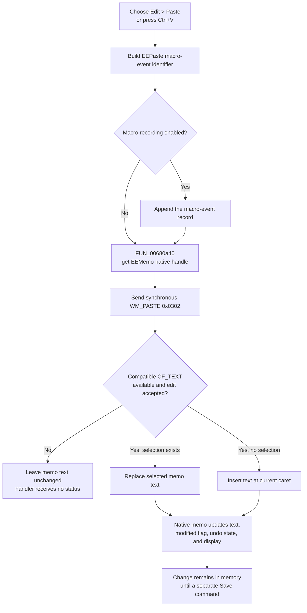

# Paste text into the Equation Editor memo

> Analysis status: Reviewed from the recovered Equation Editor resources, Paste handler, native VCL edit wrapper, adjacent Copy and Cut handlers, macro-event recorder, save path, close path, and Win32 edit-control behavior.

## Control

| Property | Recovered value |
| --- | --- |
| Form | EquEditor |
| Form caption | Equation Editor |
| Component path | EquEditor.EEMenu.EEEditMnu.EEPasteMnu |
| Control class | TMenuItem |
| Caption | &Paste |
| Shortcut | Ctrl+V (`ShortCut = 16470`) |
| Target | EquEditor.EEMemo (`TMemo`) |
| Handler name | EEPasteMnuClick |
| Handler address | 01465000 |
| Graph node | `resource:dfm:EquEditor/EquEditor.EEMenu.EEEditMnu.EEPasteMnu` |
| Handler node | `function:01465000` |
| Graph layer | UI |

The resource has no hint, action, image reference, or glyph for this menu item.

## What happens when Paste is selected

[`FUN_01465000`](../../../DecompiledSources/Tina16/functions/0000000001465000__FUN_01465000.c) always targets `EquEditor.EEMemo`, the form's multiline text editor.

The handler performs these steps:

1. It builds an `EEPaste` macro-event identifier from command class `0x406`, the form context value at `+0x6b8`, and the command name. It sends that identifier to the optional macro-event recorder.
2. It passes the form field at `+0x750`, mapped to `EEMemo`, to the shared VCL Paste-from-Clipboard wrapper [`FUN_00680a40`](../../../DecompiledSources/Tina16/functions/0000000000680A40__FUN_00680a40.c).
3. The wrapper ensures that the memo has a native window handle and synchronously sends `WM_PASTE` (`0x0302`) with zero `wParam` and `lParam` values.
4. The handler finalizes its temporary Unicode macro-event string after the native message returns.

There is no application equation parser, conversion routine, preview renderer, validation call, or document serializer in this path. The native edit control performs the text operation.

## Clipboard formats and conversion

Microsoft documents `WM_PASTE` as inserting clipboard data at the edit control's caret only when `CF_TEXT` data is available. Windows can synthesize `CF_TEXT` from `CF_UNICODETEXT` or `CF_OEMTEXT`, so compatible Unicode or OEM clipboard text can still satisfy that request. See the official [`WM_PASTE` message](https://learn.microsoft.com/en-us/windows/win32/dataxchg/wm-paste) and [synthesized clipboard formats](https://learn.microsoft.com/en-us/windows/win32/dataxchg/clipboard-formats) documentation.

This handler does not open or enumerate the clipboard. It does not select a preferred text format, register a format, decode bytes, or report a conversion result. It also has no reader for the Equation Editor toolbar's registered `Tina &text` format. A clipboard item that contains only that private format is not proven to be accepted by this menu path. A compatible native text representation must also be available.

The result is plain memo text. The path does not paste a bitmap, metafile, equation tree, file, HTML document, or RTF document.

## Selection, caret, modified state, and undo

The Windows edit control owns the insertion operation:

- If `EEMemo` has a selected range, the pasted text replaces that range.
- If the selection is empty, the text is inserted at the current caret position.
- The application handler does not read, change, save, or restore `SelStart` or `SelLength`.
- A successful text change sets the edit control's native modification flag. The handler does not query or clear that flag. Microsoft documents this native state under [edit-control text operations](https://learn.microsoft.com/en-us/windows/win32/controls/edit-controls-text-operations#modifying-text).
- The successful edit enters the native control's undo state. The handler does not query, clear, or replay that state. The recovered `EEUndoMnu` resource is hidden and has no `OnClick` binding, so an Equation Editor menu-driven undo path is not proven.

No EquEditor-specific dirty-document field is written by this handler. The native edit flag and undo state are control state, not proof of application-level persistence or save tracking.

## Copy and Cut interoperability

The three Edit menu commands use the same `EEMemo` control and adjacent VCL wrappers:

| Command | Recovered behavior |
| --- | --- |
| Copy | [`FUN_01464f00`](../../../DecompiledSources/Tina16/functions/0000000001464F00__FUN_01464f00.c) copies the current selection. If the selection is empty, it first selects the complete memo. |
| Cut | [`FUN_01464e50`](../../../DecompiledSources/Tina16/functions/0000000001464E50__FUN_01464e50.c) cuts only the current selection. It has no select-all fallback. |
| Paste | `FUN_01465000` consumes compatible native text and replaces the current selection or inserts it at the caret. It does not change the clipboard. |

Text produced by Copy or Cut is therefore compatible with Paste. Paste does not call either sibling handler and does not apply Copy's select-all rule.

## Paste flow

## Persistence and view boundaries

- Paste changes only the live `EEMemo` text and its native edit state.
- The separate Save handler [`FUN_01463980`](../../../DecompiledSources/Tina16/functions/0000000001463980__FUN_01463980.c) writes `EEMemo.Lines` to a selected `.teq` file. Paste does not call it and does not remember a path.
- The recovered form-close handler [`FUN_01464e40`](../../../DecompiledSources/Tina16/functions/0000000001464E40__FUN_01464e40.c) sets `TCloseAction` to `caHide`. It does not check the modified state or save. The hidden form can retain the live memo while its object exists, but this path provides no disk persistence or prompt before later destruction or application exit.
- Paste does not call the equation preview or interpreter path. The memo repaints as a native edit control, but an immediate graphical equation rebuild is not proven.
- The recovered `EEMemo.OnKeyDown` handler [`FUN_01464580`](../../../DecompiledSources/Tina16/functions/0000000001464580__FUN_01464580.c) is empty. It adds no Paste validation, shortcut policy, or modified-state logic.

## No-op and error boundaries

- If no compatible text format is available, `WM_PASTE` does not insert text. The wrapper and handler receive no result that distinguishes this no-op.
- An empty compatible text value adds no characters. The recovered application code has no separate empty-text branch.
- Native edit-control rules can reject a change, for example because the control is read-only or has reached its text limit. No such guard or error branch appears in this handler.
- The handler has no clipboard-busy message, retry, status update, exception handler, rollback, or partial-insertion recovery.
- Macro-event construction and recording occur before `WM_PASTE`. If either step raises an exception, Paste is not sent. If the native paste then fails or does nothing, the macro event can already exist.
- The local macro-event string is finalized only after the paste wrapper returns on the normal path. No local cleanup guard is visible in the decompiled function.

## Evidence

- [Equation Editor Paste handler `FUN_01465000`](../../../DecompiledSources/Tina16/functions/0000000001465000__FUN_01465000.c) records `EEPaste` and passes form field `+0x750` to the shared Paste wrapper.
- [Canonical VCL Paste wrapper `FUN_00680a40`](../../../DecompiledSources/Tina16/functions/0000000000680A40__FUN_00680a40.c) gets the native edit handle and sends message `0x0302`, `WM_PASTE`.
- [Macro-event formatter `FUN_01aee720`](../../../DecompiledSources/Tina16/functions/0000000001AEE720__FUN_01aee720.c) and [optional macro-event recorder `FUN_01aed550`](../../../DecompiledSources/Tina16/functions/0000000001AED550__FUN_01aed550.c) establish the event-recording order.
- [Copy handler `FUN_01464f00`](../../../DecompiledSources/Tina16/functions/0000000001464F00__FUN_01464f00.c) and [Cut handler `FUN_01464e50`](../../../DecompiledSources/Tina16/functions/0000000001464E50__FUN_01464e50.c) show that all three commands use the same memo field.
- [Recovered Delphi resource evidence](../../../DecompiledSources/Tina16/resources/dfm/ui-evidence.json) identifies the menu caption, Ctrl+V shortcut, `EEPasteMnuClick` binding, and `EEMemo` as a `TMemo`.

## Direct calls

- `FUN_01aee720` builds the macro-event identifier.
- `FUN_01aed550` conditionally records the macro event.
- `FUN_00680a40` sends native `WM_PASTE` to `EEMemo`.
- `FUN_00414480` finalizes the temporary Unicode string.

## Analysis limits

- The precise native representation that the Delphi Unicode `TMemo` requests is below the recovered application handler. The direct Win32 contract and the system's synthesized text formats establish compatible plain-text behavior, not an application-specific encoding policy.
- The recovered handler does not expose a paste result, the exact resulting caret index, or a partial-insertion count.
- `TIARA-diz.6.7.143` owns the canonical VCL Copy, Cut, and Paste wrapper annotations. The Copy and Cut control articles own their unique handlers. This article owns only the Equation Editor Paste menu handler.
